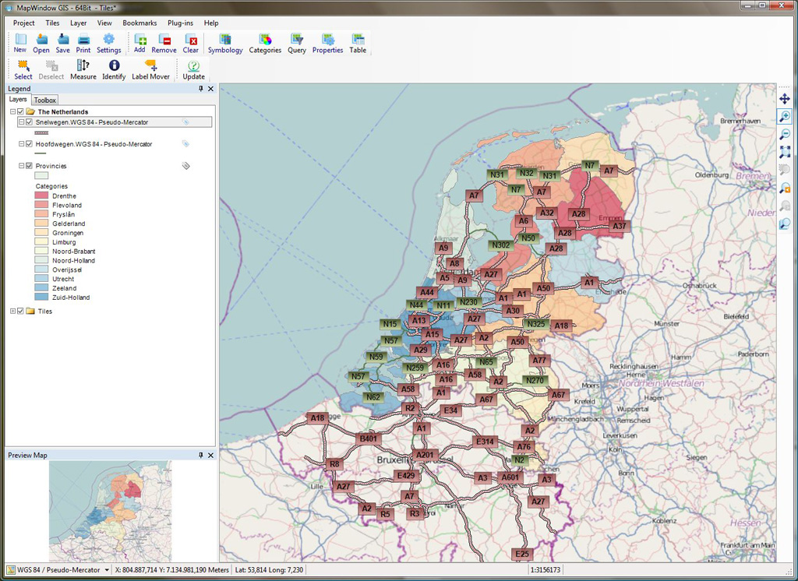

:Author: Paul Meems, TopX Geo-ICT The Netherlands (RST conversion)
:Reviewer: Cameron Shorter, LISAsoft
:Product: MapWindow GIS 4.8.6
:Version: osgeo-live5.5
:License: Creative Commons Attribution-ShareAlike 3.0 Unported  (CC BY-SA 3.0)

 
MapWindow GIS
================================================================================

Настольная ГИС
~~~~~~~~~~~~~~~~~~~~~~~~~~~~~~~~~~~~~~~~~~~~~~~~~~~~~~~~~~~~~~~~~~~~~~~~~~~~~~~~

MapWindow GIS — это ГИС-клиент с открытым исходным кодом под Windows, в котором
можно визуализировать, организовывать, редактировать и анализировать данные, а
также составлять карты, пригодные для печати. Он включает мощные аналитические функции
через интеграцию с GEOS и GDAL/OGR. MapWindow легко встраивается как в продукты,
основанные на Microsoft Office (в том числе MS Excel и MS Access), так и в программы, 
написанные на VB6, C++, C#, VB.NET и Delphi, так как базируется на элементах управления ActiveX.

.. note:: MapWindow может быть запущен после установки под Microsoft Windows.
Установочные файлы включены в полную ISO-версию `OSGeo-Live <http://live.osgeo.org>`_
или могут быть загружены с http://mapwindow4.codeplex.com/releases.
   

Базовые функции
--------------------------------------------------------------------------------

* Дружественный графический интерфейс пользователя:

    * идентификация/выбор пространственных объектов;
    * редактирование/просмотр/поиск значений атрибутов;
    * перепроецирование на лету;
    * компоновка для печати;
    * подписывание пространственных объектов;
    * изменение символики отображения векторных данных и растров;
    * и многое другое...

* Лёгкость просмотра данных многих векторных и растровых форматов:

    * большинство векторных форматов, включая shape-файлы ESRI, форматы MapInfo, SDTS и GML;
    * растровые форматы, такие, как цифровые модели рельефа, аэрофотоснимки и снимки Landsat;
    * тайловые сервисы, например, OpenStreetMap или ArcGIS Online.

* Создание, редактирование и экспорт пространственных данных, используя:

    * инструменты оцифровки для shape-файлов;
    * плагин геопривязки;
    * инструменты GPS для импорта и экспорта данных в формате GPX; средства конвертации GPS-данных других форматов в GPX, прямых операций загрузки/выгрузки в/из GPS.

* Пространственный анализ с использованием плагинов:

    * картографическая алгебра;
    * анализ рельефа;
    * гидрологическое моделирование (TauDEM);
    * сетевой анализ;
    * и многое другое.

* Расширяемая архитектура, основанная на плагинах:

    * Механизм плагинов позволяет легко расширять функциональность MapWindow. Плагины можно писать на любом языке .NET, используя профессиональную версию Visual Studio, свободный SharpDevelop или Visual Studio Express.
 
* Элемент управления ActiveX:

    * Используется элемент управления ActiveX, написанный на C++. Этот элемент управления можно использовать в собственных приложениях, написанных на таких языках, как VB6, C++, C#, VB.NET и Delphi, и в продуктах из состава MS Office — MS Access и MS Excel.

Реализованные стандарты
~~~~~~~~~~~~~~~~~~~~~~~~~~~~~~~~~~~~~~~~~~~~~~~~~~~~~~~~~~~~~~~~~~~~~~~~~~~~~~~~

* Стандарты OGC: 
    * WMS (v1.1, v1.3)
    * WFS v1.1 (с помощью отдельного плагина)
    * Web Map Tile Service (WMTS)
    * GML    

Дополнительная информация
~~~~~~~~~~~~~~~~~~~~~~~~~~~~~~~~~~~~~~~~~~~~~~~~~~~~~~~~~~~~~~~~~~~~~~~~~~~~~~~~

**Веб-сайт:** http://www.mapwindow.org

**Licence:** `MPL версия 1.1 <http://www.mozilla.org/MPL/1.1/>`_

**Версия ПО:** 4.8.6

**Поддерживаемые платформы:** Windows

**Интерфейсы API:** Visual Basic 6, VBA (MS Access, MS Excel), C++, .NET (C#, VB.NET)

**Поддержка сообществом:** http://www.mapwindow.org/apps/wiki/doku.php?id=forums

**Коммерческая поддержка:** http://www.mapwindow.nl, http://www.mapwindow.in/, http://www.mapwindow.org/pages/donate.php

Начало работы
~~~~~~~~~~~~~~~~~~~~~~~~~~~~~~~~~~~~~~~~~~~~~~~~~~~~~~~~~~~~~~~~~~~~~~~~~~~~~~~~

* :doc:`Введение <../quickstart/mapwindow_quickstart>`
