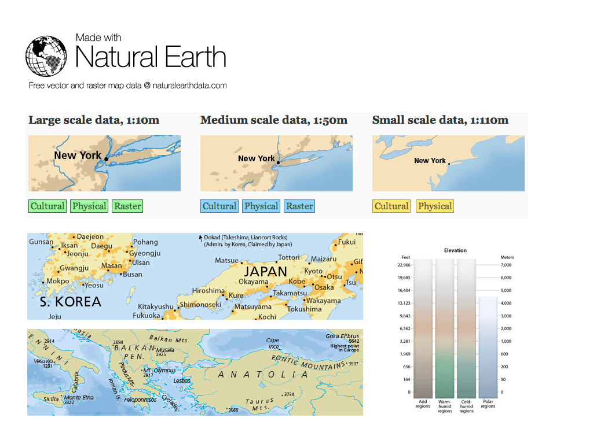

:Author: OSGeo-Live
:Reviewer: Cameron Shorter, LISAsoft
:Version: osgeo-live5.5
:License: Creative Commons Attribution 3.0 Unported (CC BY 3.0)

.. image:: ../../images/project_logos/logo-naturalearth.png
  :scale: 100 %
  :alt: project logo
  :align: right
  :target: http://www.naturalearthdata.com/

Natural Earth
================================================================================

Картографические данные
~~~~~~~~~~~~~~~~~~~~~~~~~~~~~~~~~~~~~~~~~~~~~~~~~~~~~~~~~~~~~~~~~~~~~~~~~~~~~~~~

Данные **Natural Earth** предоставляют картографам полноценное решение
для создания мелкомасштабных карт мирового, регионального и государственного
масштабов (от 1:110 000 00 до 1:50 000 000 и 1:10 000 000). Включены как социально-
экономические данные (например, административные границы), так и физические
(природные); векторные данные идеально сочетаются с растровыми.    

Данные **Natural Earth** решают известную проблему, с которой знакомы многие
картографы: наличие данных для создания качественных мелкомасштабных карт,
причём данных с соответствующей детальностью.

Основные особенности
--------------------------------------------------------------------------------

* Векторные данные включают названия и другие атрибуты.
* Большие полигоны разрезаны для более эффективной обработки данных (например, батиметрические данные).
* Векторные данные, "дружественные к проекциям": адаптированы для перепроецирования с учётом меридиана 180 градусов; все линии содержат достаточно точек для плавного изгиба в конических проекциях, но не настолько много, чтобы сильно замедлять обработку.
* Растровые данные включают светотеневую отмывку рельефа и гипсометрические карты (сделанные методом "поперечного смешивания" цветов). Они созданы на основе свежих цифровых моделей рельефа NASA SRTM Plus и с учётом привязки векторных данных Natural Earth.
* Данные оптимизированы для использования в веб-картографических приложениях, например, Google или Yahoo, причём имеют встроенные в атрибуты уровни масштабирования для отображения на различных масштабах.   

Наборы данных
--------------------------------------------------------------------------------

Векторные данные культурной тематики включают:
  административные границы государств, границы спорных территорий, штатов и
провинций (1-й порядок), а также густонаселённые районы (города). Автомобильные и
железные дороги, районы заселения, парки и охраняемые природные территории, а 
также водные объекты закрывают список.  

Векторные данные природной тематики включают:
  береговые линии, границы суши и океанов, небольшие острова, рифы, полигоны и точки
природных территорий, реки, озёра, ледники, районы антарктического шельфа, батиметрические
данные, географическую координатную сетку.      

Растровые данные включают:
  светотеневую отмывку рельефа и гипсометрические карты (сделанные методом "поперечного
смешивания" цветов); карты растительного покрова, полученные по данным космосъёмки; 
карты возможной "идеализированной" (максимально ненарушенной) природной среды; 
рельеф океанского дна и батиметрию. Дополнительно включены: растительный покров, карты 
"отмывки" рельефа, океанографические карты, водотоки и озёра.     
   

Дополнительная информация 
--------------------------------------------------------------------------------

**Веб-сайт:** http://naturalearthdata.com

**Лицензия:** None, the data is public domain.

**Версия ПО:** 1.4

**Форматы данных:** SHP и TIF+TFW

**Система координат:** WGS84.

**Поддержка:** http://naturalearthdata.com/forums/

