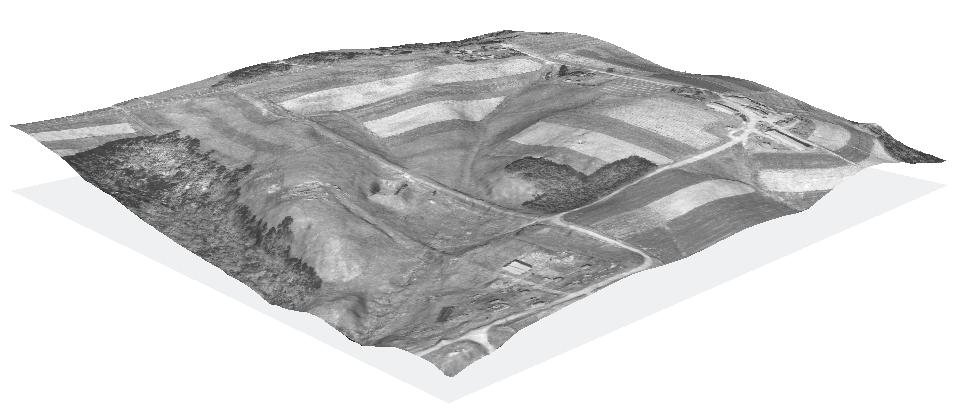

:Author: Hamish Bowman
:Reviewer: Cameron Shorter, LISAsoft
:Version: osgeo-live5.5
:License: Creative Commons Attribution 3.0 Unported (CC BY 3.0)

.. image:: ../../images/logos/OSGeo_compass_with_text_square.png 
  :scale: 90 %
  :alt: project logo
  :align: right
  :target: http://wiki.osgeo.org/wiki/Category:Education

Образовательный набор данных OSGeo по Северной Каролине (США)
================================================================================

Данные
~~~~~~~~~~~~~~~~~~~~~~~~~~~~~~~~~~~~~~~~~~~~~~~~~~~~~~~~~~~~~~~~~~~~~~~~~~~~~~~~

.. Comment: следующий текст любезно предоставлен Helena Mitasova и Markus Neteler

Набор данных NC — полная коллекция растровых, векторных данных и космоаэроснимков
на территорию отдельных участков штата Северная Каролина (США), подготовленных на 
основе публичных источников данных этого штата, местных правительственных агенств
и Global Land Cover Facility (GLCF).      

Набор данных включает участки столицы Северной Каролины г. Роли и его окрестности.    

Данные представлены в виде трёх иерархических уровней:

* весь штат Северная Каролина с растровыми данными разрешением 500 м;

* юго-западная территория Wake County с растровыми данными разрешением 10-30 м; и

* небольшой участок в сельской местности с растровыми данными разрешением 1-3 м (см. изображение).

Особенности
--------------------------------------------------------------------------------

* Растровые, векторные и KML-данные локального и регионального уровня имеют полный набор метаданных и специально подобраны, чтобы покрыть потребности преподавателей вводных ГИС-курсов и предоставить примеры справочных страниц и учебных пособий.

* Лицензия Creative Commons обозначает, что данные могут быть используемы, распространяемы и модифицируемы кем угодно. Без обычных юридических обременений, характерных для многих общедоступных геоданных, этот набор идеально подходит для использования в учебном процессе.

Наборы данных:
--------------------------------------------------------------------------------

Векторные данные культурной тематики включают:
  политические границы, дороги, автобусные остановки, пожарные станции, участки переписи населения и многое другое.

Векторные данные физической тематики включают:
  измерения поверхности LiDAR, изогипсы, водотоки, осадки и многое другое.

Растровые данные включают:
  цифровые модели рельефа, данные по землепользованию и растительному покрову, космоснимки LANDSAT 7 и многое другое.

Дополнительная информация
--------------------------------------------------------------------------------

**Веб-сайт:** http://www.grassbook.org/data_menu3rd.php

**Лицензия:** `Creative Commons Attribution-ShareAlike 3.0 Unported (CC BY-SA 3.0) <http://creativecommons.org/licenses/by-sa/3.0/>`_

**Версия данных:** 2008

**Форматы данных:** GeoTIFF, Shapefiles, KML

**Координатная система:** NC State Plane (Lambert Conformal Conic), NAD83

**Поддержка:** http://lists.osgeo.org/mailman/listinfo/geodata

