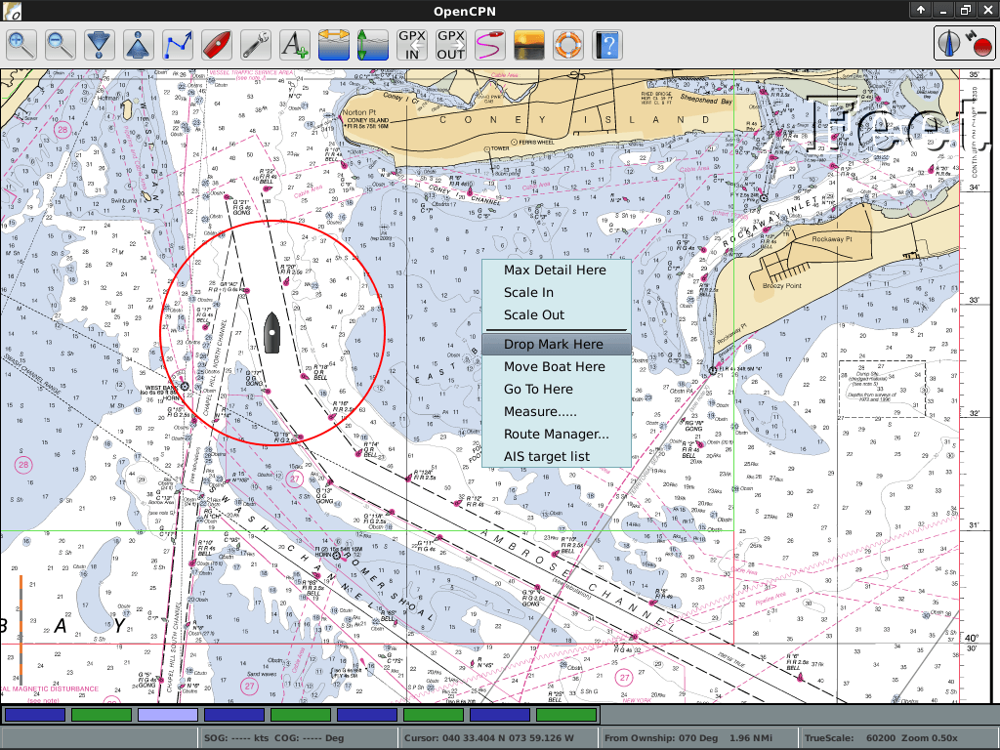

:Author: Dave Register
:Author: Hamish Bowman
:Reviewer: Cameron Shorter, LISAsoft
:Version: osgeo-live5.5
:License: Creative Commons Attribution-ShareAlike 3.0 Unported  (CC BY-SA 3.0)

OpenCPN
================================================================================

Морская GPS-навигация
~~~~~~~~~~~~~~~~~~~~~~~~~~~~~~~~~~~~~~~~~~~~~~~~~~~~~~~~~~~~~~~~~~~~~~~~~~~~~~~~
**OpenCPN** — свободное программное обеспечение для морской навигации
на судах всех типов и размеров, а также для планирования маршрутов. Она
была разработана командой практикующих моряков, использующих программу
в реальных условиях для тестирования и улучшения.      

OpenCPN предоставляет пользователю информацию о текущем местоположении
судна, его скорости и курсе, совмещённую с точными навигационными картами и
прогнозными схемами приливов и течений. Информация, полученная по стандартным
радиолиниям — положение судна и курсы других судов — также может быть
отображена.

Так как принимающее информацию судно движется, новые карты выбираются и 
отображаются пользователем в заданном разрешении и детальности. Кроме того,
пользователь может самостоятельно вводить маршруты и путевые точки, позволяя
использовать внешний автопилот для точного следования по курсу.
 

Базовые функции
--------------------------------------------------------------------------------

OpenCPN поддерживает:

* растры BSB, C-MAP (CM93/2) и векторные карты S-57 ENC; 
* декодирование AIS;  
* GPS-сервисы NMEA или `gpsd <http://gpsd.berlios.de>`_; 
* путевые точки / навигация с автопилотом;
* создание неограниченного числа маршрутов / путевых меток;
* "Quilted"-графики; 
* поддержку многих языков;
* кроссплатформенность;
* наложение метеоданных в формате GRIB.

Дополнительная информация
--------------------------------------------------------------------------------

**Веб-сайт:** http://www.opencpn.org

**Лицензия:** GNU General Public License (GPL) version 2

**Версия ПО:** 2.5.0

**Поддерживаемые платформы:** GNU/Linux, Mac OSX, MS Windows

**Поддержка:** http://www.cruisersforum.com/forums/f134

Начало работы
--------------------------------------------------------------------------------

* :doc:`Введение <../quickstart/opencpn_quickstart>`

