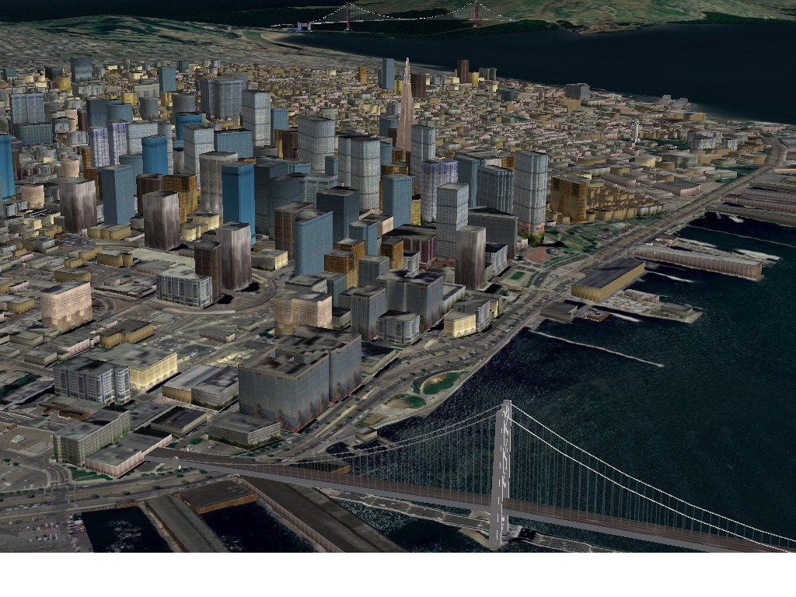

:Author: Pirmin Kalberer
:Reviewer: Cameron Shorter, LISAsoft
:Version: osgeo-live5.5
:License: Creative Commons Attribution 3.0 Unported (CC BY 3.0)

.. image:: ../../images/project_logos/logo-osgearth.gif
  :scale: 100 %
  :alt: логотип проекта
  :align: right
  :target: http://osgearth.org/

osgEarth
================================================================================

Инструмент визуализации земной поверхности
~~~~~~~~~~~~~~~~~~~~~~~~~~~~~~~~~~~~~~~~~~~~~~~~~~~~~~~~~~~~~~~~~~~~~~~~~~~~~~~~

**osgEarth** — это масштабируемый набор инструментов визуализации земной
поверхности для OpenSceneGraph_ (OSG), набора высокопроизводительных
приложений для 3D моделирования с открытым исходным кодом. Достаточно
создать простой файл XML, указать в нем пути к изображениям,
векторным данным и данным о высотах, загрузить его в ваше любимое
приложение OSG — и всё!

osgEarth поддерживает все типы данных и поставляется с большим
количеством примеров, которые помогут вам быстро разобраться, что к
чему.

.. _OpenSceneGraph: http://www.openscenegraph.org/

Базовые функции
--------------------------------------------------------------------------------

**osgEarth** позволяет легко создавать масштабируемые модели
  поверхности:

* создание модели местности — либо в автономном режиме, либо
  динамически;
* загрузка всей земной поверхности без написания кода;
* наложение растровых слоёв для получения картинки высокого разрешения;
* комбинирование растровых слоёв, данных о высоте и векторных данных
  "на лету";
* кеширование для увеличения производительности;
* прозрачность для эффекта мульти-текстурирования.

Также osgEarth умеет:

* накладывать векторные ГИС-данные на поверхность;
* перепроецировать данные между разными системами координат;
* размещать дополнительные модели на поверхности по координатам;
* выполнять быстрый тест на пересечение;
* добавлять новые данные в существующие базы VPB без их перестройки;
* предоставлять доступ к тайлам поверхности для невизуальных процессовю

Что можно визуализировать:

* растры GeoTIFF и цифровые модели рельефа (DEM) (плюс
  множество других форматов);
* векторные данных, например shape-файлы ESRI;
* OGC-совместимые веб-сервисы (например, WMS_);
* слои ГИС, опубликованные при помощи MapServer_ или `ESRI ArcGIS Server`_;
* онлайн карты OpenStreetMap_, `ArcGIS Online`_ или `NASA OnEarth`_.

.. _WMS: http://www.opengeospatial.org
.. _MapServer: http://mapserver.org
.. _`ESRI ArcGIS Server`: http://www.esri.com/software/arcgis/arcgisserver/
.. _OpenStreetMap: http://openstreetmap.org
.. _`ArcGIS Online`: http://resources.esri.com/arcgisonlineservices/
.. _`NASA OnEarth`: http://onearth.jpl.nasa.gov

Дополнительная информация
--------------------------------------------------------------------------------

**Веб-сайт:** http://osgearth.org/

**Лицензия:** `LGPL <http://www.gnu.org/copyleft/lesser.html>`_

**Версия ПО:** 2.0

**Поддерживаемые платформы:** Linux, Mac, Windows

**Интерфейсы API:** C++

**Коммерческая поддержка:** http://osgearth.org/#ProfessionalServices

Начало работы
--------------------------------------------------------------------------------

* :doc:`Введение <../quickstart/osgearth_quickstart>`
