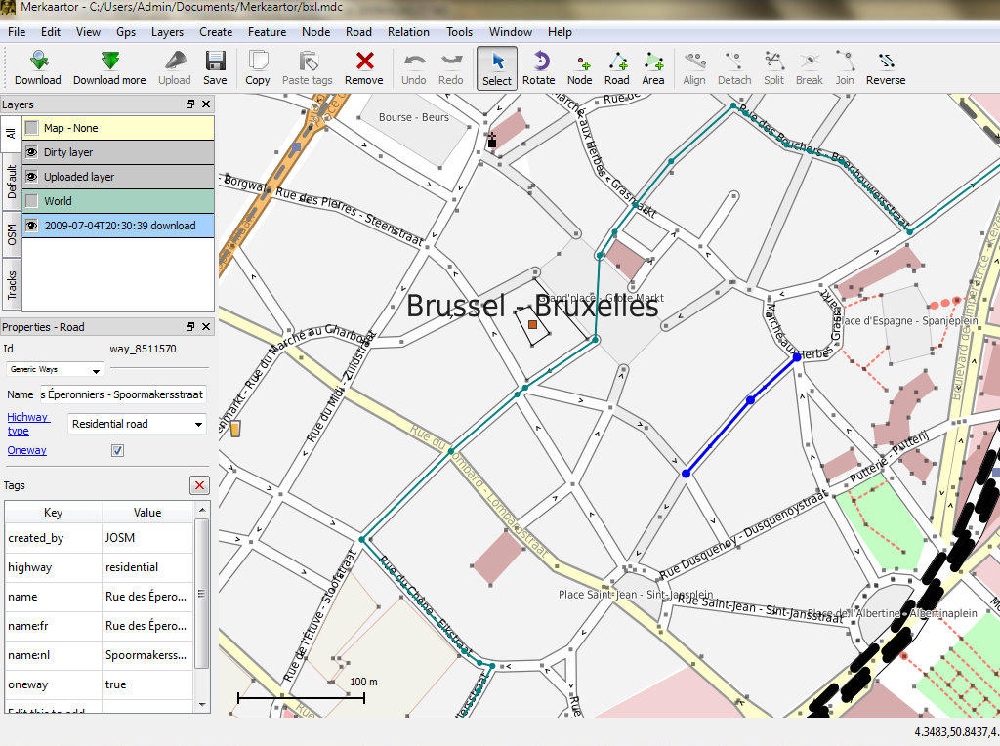

:Автор: Hamish Bowman
:Проверил: Cameron Shorter, LISAsoft
:Версия: osgeo-live5.5
:Лицензия: Creative Commons Attribution 3.0 Unported (CC BY 3.0)

.. image:: ../../images/project_logos/logo-osm.png
  :scale: 100 %
  :alt: Логотип проекта
  :align: right
  :target: http://www.osm.org/

OpenStreetMap
================================================================================

Картографические данные
~~~~~~~~~~~~~~~~~~~~~~~~~~~~~~~~~~~~~~~~~~~~~~~~~~~~~~~~~~~~~~~~~~~~~~~~~~~~~~~~

OpenStreetMap — краудсорсинговая карта мира, которая стала одним из самых подробных и доступных источников картографических данных локального масштаба. Исходные картографические данные созданы и поддерживаются сотнями волонтеров по всему миру способом, похожим на википедию .

Основной видимый аспект — это веб-карта, расположенная по адресу http://osm.org, однако просмотр, импорт и редактирование карт возможен во многих приложениях, таких как Quantum GIS, OpenLayers, ArcGIS, а также в приложениях, ориентированных на работу с OSM.

"Сердце" проекта — данные, которые доступны каждому для редактирования, просмотра и самостоятельного рендеринга. По-существу, OSM сосредоточен на данных, карты с широким набором возможностей, напротив, остаются в стороне.

Дистрибутив OSGeo-Live содержит фрагмент данных, охватывающий один конкретный город, который используется для примеров некоторыми приложениями.

Основные возможности
--------------------------------------------------------------------------------

* Векторные элементы тегируются именем и другими атрибутами
* Извлечение данных на определённую местность
* Данные хранятся в географических координатах (широта/долгота) на эллипсоиде WGS84. Основные элементы: узлы, последовательности узлов; мета-элементы: в совокупности позволяют хранить точки, полилинии и площадные объекты
* Обширная атрибутивная информация, более подробная, чем в любых других источниках
* Глобальное хранилище локальных сведений

Наборы данных, включённые в OSGeo-Live
--------------------------------------------------------------------------------

Nottingham.osm.bz2:
 Большой фрагмент данных на территорию города Ноттингем в формате XML, сжатый при помощи *bzip2*.

Nottingham_CBD.osm.bz2:
 Меньший фрагмент, покрывающий территорию центрального делового района Ноттингема.

Дополнительная информация
--------------------------------------------------------------------------------

**Веб-сайт:** http://www.osm.org

**Лицензия:** CC-By-SA, Open Data Commons Open Database License (ODbL)

**Версия данных:** Постоянно обновляемая БД

**Формат данных:** XML

**Система координат:** WGS84

**Поддержка:** http://wiki.osm.org

