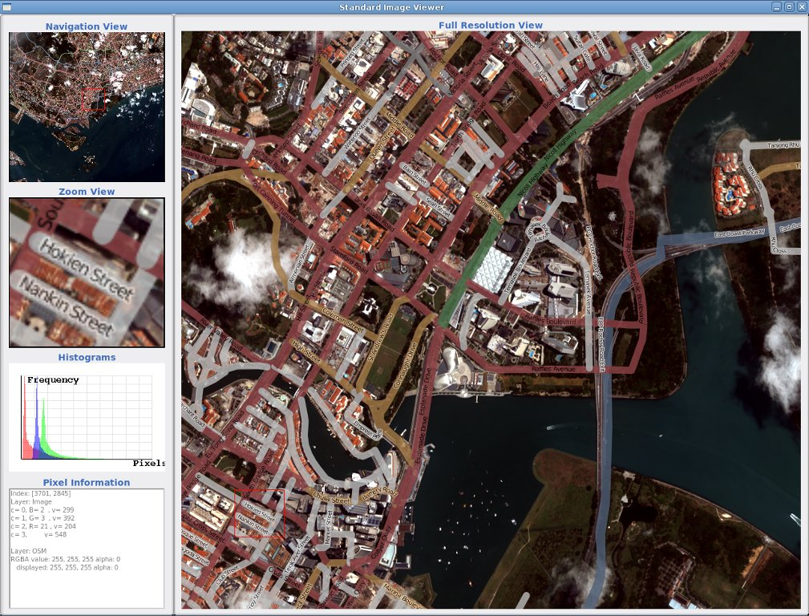

:Author: OSGeo-Live
:Reviewer: Cameron Shorter, LISAsoft
:Version: osgeo-live5.5
:License: Creative Commons Attribution 3.0 Unported (CC BY 3.0)

OTB
================================================================================

Обработка изображений
~~~~~~~~~~~~~~~~~~~~~~~~~~~~~~~~~~~~~~~~~~~~~~~~~~~~~~~~~~~~~~~~~~~~~~~~~~~~~~~~

ORFEO Toolbox (OTB) — это высокопроизводительная библиотека обработки изображений.
В основном используется для обработки данных дистанционного зондирования,
полученных при помощи радаров, спутников и аэрофотосъемки. OTB предоставляет
инструменты для обработки оптических и радарных изображений (трёхмерная перспектива,
сегментация, классификация, анализ изменений, анализ поверхности, поиск объектов,
взаимодополнение оптического и радарного изображений).

OTB был создан Французским Космическим Агентством (CNES) в рамках методологической
части программы ORFEO и активно разрабатывается с 2006 года. Он основан на
библиотеке анализа медицинских изображений ITK и имеет открытый код.

Базовые функции
--------------------------------------------------------------------------------

* доступ к данным: операции чтения/записи оптимизированны для большинства
  форматов используемых в ДЗЗ (включая Jpeg2000), предусмотрен доступ к
  метаданным и визуализация;
* орторектификация и перепроецирование;
* калибровка;
* сшивка изображений;
* фильтры: размытие, шумоподавление, улучшение контраста...;
* извлечение объектов;
* детектирование объектов;
* сегментация изображений;
* классификация: K-means, SVM, случайные поля Маркова;
* объектно-ориентированный анализ изображений;
* геопространственный анализ;
* создание стереопар;
* анализ данных SAR;
* анализ изменений.

Дополнительная информация
--------------------------------------------------------------------------------

**Веб-сайт:** http://www.orfeo-toolbox.org/

**Лицензия:** `CeCILL <http://www.cecill.info/licences.en.html>`_ (CeCILL совместима с GPL и учитывает особенности французского
  законодательства)

**Версия ПО:** 3.14 (выпущена в июле 2012)

**Поддерживаемые платформы:** Linux, Mac, Windows

**Интерфейсы API:** C++ (доступны привязки к Java и Python)

**Коммерческая поддержка:** http://www.osgeo.org/search_profile

Начало работы
--------------------------------------------------------------------------------

* :doc:`Введение <../quickstart/otb_quickstart>`

