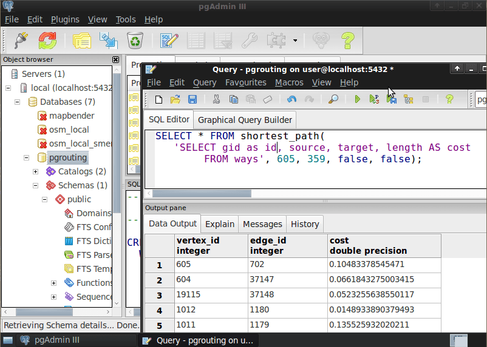

:Автор: Daniel Kastl
:Проверил: Cameron Shorter, LISAsoft
:Версия: osgeo-live5.5
:Лицензия: Creative Commons Attribution 3.0 Unported (CC BY 3.0)

pgRouting
================================================================================

Инструменты ГИС
~~~~~~~~~~~~~~~~~~~~~~~~~~~~~~~~~~~~~~~~~~~~~~~~~~~~~~~~~~~~~~~~~~~~~~~~~~~~~~~~

**PgRouting** расширяет возможности пространственных баз данных :doc:`PostGIS <postgis_overview>`/`PostgreSQL <http://www.postgresql.org>`_ функциями пространственной маршрутизации.

Преимущества использования баз данных при решении задач маршрутизации:

* Данные могут быть изменены при помощи множества клиентов, например, :doc:`Quantum GIS <qgis_overview>` или :doc:`uDig <udig_overview>` через JDBC, ODBC или напрямую при помощи PL/pgSQL. Клиенты могут быть как десктопными, так и мобильными.
* Изменения данных моментально отражаются роутинговым движком. Нет необходимости в предварительной обработке.
* Значение стоимости могут быть рассчитаны динамически при помощи SQL в зависимости от значений нескольких полей таблицы.

Базовые функции
--------------------------------------------------------------------------------

PgRouting предоставляет следующие возможности:

* Поиск кратчайшего пути алгоритмом Дейкстры: роутинговый алгоритм без эвристики
* Поиск кратчайшего пути алгоритмом A* (A-star): роутинговый алгоритм для больших наборов данных (с эвристикой)
* Поиск кратчайшего пути алгоритмом падающей звезды (Shooting-Star): маршрутизация с ограничениями поворотов (с эвристикой)
* Задача коммивояжёра (TSP)
* Расстояние до точки от всех ребер графа (Isolines)

.. Implemented Standards
   ---------------------

.. * OGC standards compliant

Дополнительная информация
--------------------------------------------------------------------------------

**Веб-сайт:** http://www.pgrouting.org

**Лицензия:**  `GPL версия 2  <http://www.gnu.org/licenses/gpl-2.0.html>`_

**Версия ПО:** 1.05

**Поддерживаемые платформы:** Linux, Windows, Mac

**Интерфейсы API:** SQL

**Коммерческая поддержка:** http://www.pgrouting.org

Начало работы
--------------------------------------------------------------------------------

* :doc:`Введение <../quickstart/pgrouting_quickstart>`

