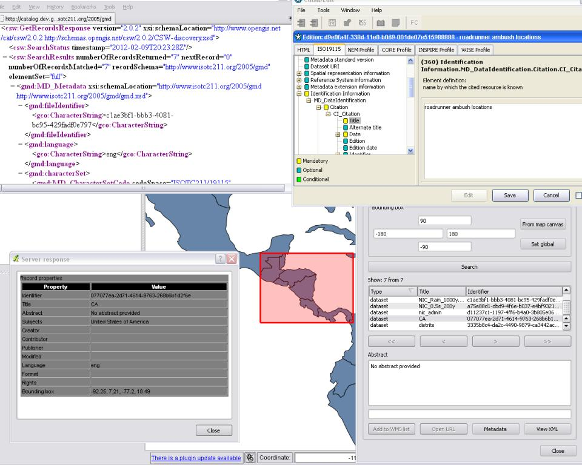

:Author: OSGeo-Live
:Author: Tom Kralidis, Angelos Tzotsos
:Reviewer: Cameron Shorter, LISAsoft
:Version: osgeo-live6.0
:License: Creative Commons

.. image:: ../../images/project_logos/logo-pycsw.png
  :scale: 80 %
  :alt: Лого проекта
  :align: right
  :target: http://pycsw.org/

pycsw
================================================================================

Каталог метаданных
~~~~~~~~~~~~~~~~~~~~~~~~~~~~~~~~~~~~~~~~~~~~~~~~~~~~~~~~~~~~~~~~~~~~~~~~~~~~~~~~

**pycsw** позволяет пользователям публиковать каталог описаний наборов данных
(метаданных) в сети Интернет, используя стандартизированные интерфейсы и форматы,
что позволяет клиентам каталога запрашивать и обновлять эту информацию. 
pycsw легко настроить для работы с веб-сервером Apache, описание метаданных в формате
XML хранится в базе данных.

Метаданные — это «данные о данных», они содержат такую информацию, как дата
создания, автор, заголовок, охват и т.п. Метаданные обычно хранятся в виде файлов формата 
XML в соответствии с международными стандартами (ISO 19115, ISO 19139 
и FGDC CSDGM).

**pycsw** являеется реализацией :doc:`OGC Catalogue Services for the Web (CSW)
standard<../standards/csw_overview>` на языке `Python`_. Стандарт CSW определяет
общие интерфейсы для поиска, просмотра и получения метаданных пространственных
данных, веб-сервисов и сопутствующих ресурсов.

pycsw имеет открытый исходный код, распространяется под лицензией MIT и работает
на всех основных платформах (Windows, Linux, Mac OS X).

Базовые функции
--------------------------------------------------------------------------------

* проходит все тесты OGC CITE CSW (103/103);
* реализован INSPIRE Discovery Services 3.0;
* реализован ISO Metadata Application Profile 1.0.0;
* реализован FGDC CSDGM Application Profile for CSW 2.0;
* поддержка моделей метаданных ISO, Dublin Core, DIF, FGDC;
* простая настройка;
* поддержка транзакций (CSW-T);
* гибкая конфигурация репозитория;
* распределённый поиск по каталогам;
* проверка схемы XML в реальном времени;
* расширяемая модульная архитектура;
* легковесность (Python + CGI).

Реализованные стандарты
--------------------------------------------------------------------------------

Стандарты OGC:

* CSW   2.0.2
* Filter  1.1.0
* OWS Common  1.0.0
* GML   3.1.1

Стандарты метаданных:

* Dublin Core   1.1
* SOAP  1.2
* ISO 19115   2003
* ISO 19139   2007
* ISO 19119   2005
* NASA DIF  9.7
* FGDC CSDGM  1998

Дополнительная информация
--------------------------------------------------------------------------------

**Веб-сайт:** http://pycsw.org

**Лицензия:** `MIT`_

**Версия ПО:** 1.2.0

**Поддерживаемые платформы:** Windows, Linux, Mac

**Интерфейсы API:** Python

**Поддержка:** http://pycsw.org/docs/support.html

.. _`Python`: http://www.python.org/
.. _`MIT`: http://pycsw.org/docs/license.html#license

Начало работы
--------------------------------------------------------------------------------

* :doc:`Введение <../quickstart/pycsw_quickstart>`
