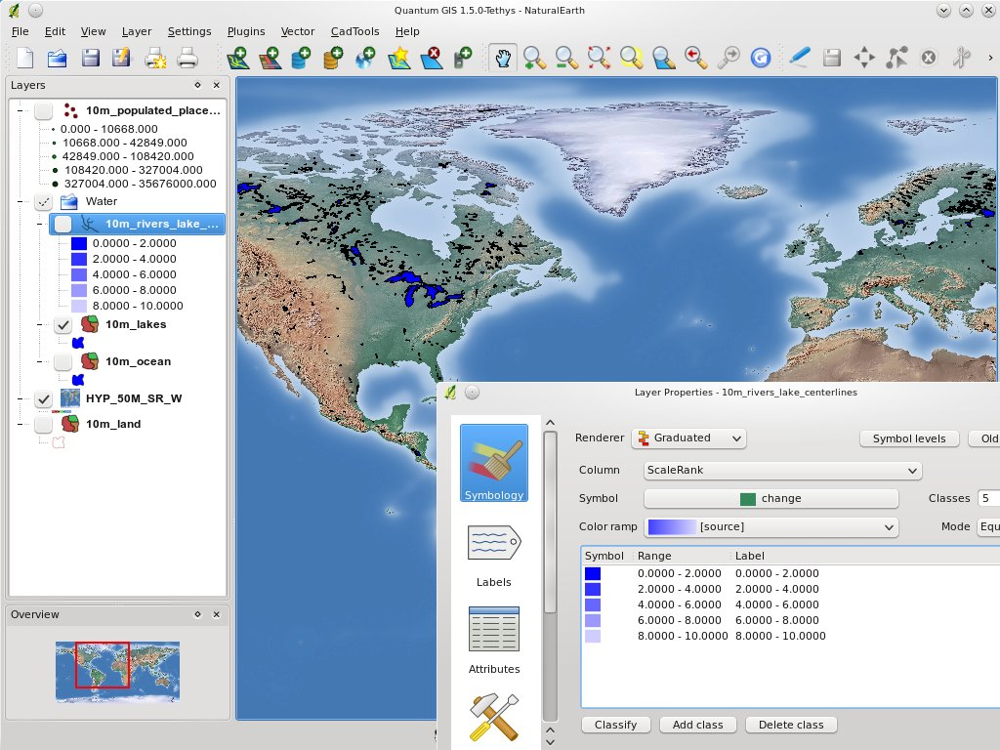

:Author: OSGeo-Live
:Reviewer: Cameron Shorter, LISAsoft
:Version: osgeo-live6.0
:License: Creative Commons Attribution 3.0 Unported (CC BY 3.0)

.. image:: ../../images/logos/OSGeo_project.png
  :scale: 100 %
  :alt: Проект OSGeo
  :align: right
  :target: http://www.osgeo.org

QGIS Server
================================================================================

Веб-сервис
~~~~~~~~~~~~~~~~~~~~~~~~~~~~~~~~~~~~~~~~~~~~~~~~~~~~~~~~~~~~~~~~~~~~~~~~~~~~~~~~

QGIS Server реализует WMS-сервис, используя те же библиотеки, что и настольное приложение Quantum GIS (QGIS).
Карты и шаблоны для печати, созданные в настольной ГИС QGIS, могут быть опубликованы в веб простым копированием файла проекта в директорию сервера. В результате веб-карты выглядят так же, как и в настольном приложении.
QGIS Server обычно работает как CGI/FastCGI модуль веб-сервера Apache.

Базовые функции
--------------------------------------------------------------------------------

* Реализация WMS
* Встроенный генератор PDF
* Создание карт в QGIS в стиле WYSIWYG 
* Расширенная картографическая символика
* Поддержка стилей в формате SLD

Реализованные стандарты
--------------------------------------------------------------------------------

* OGC Web Map Service (WMS) 1.3.0
* OGC Styled Layer Descriptor (SLD) 1.0

Дополнительная информация
--------------------------------------------------------------------------------

**Веб-сайт:** http://www.qgis.org/

**Лицензия:** `GPL версия 2 <http://www.gnu.org/licenses/gpl-2.0.html>`_

**Версия ПО:** 1.8.0

**Поддерживаемые платформы:** Windows, Linux

**Коммерческая поддержка:** http://www.sourcepole.com/

Начало работы
--------------------------------------------------------------------------------

* :doc:`Введение <../quickstart/qgis_mapserver_quickstart>`

