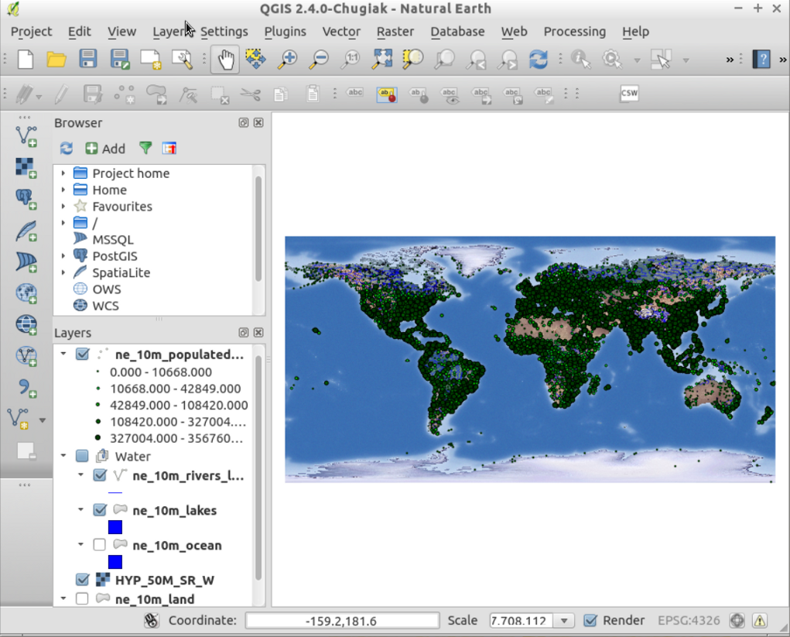

:Author: OSGeo-Live
:Reviewer: Cameron Shorter, LISAsoft
:Version: osgeo-live6.0draft
:License: Creative Commons Attribution 3.0 Unported (CC BY 3.0)

.. image:: ../../images/logos/OSGeo_project.png
  :scale: 100 %
  :alt: Проект OSGeo
  :align: right
  :target: http://www.osgeo.org

Quantum GIS (QGIS)
================================================================================

Настольная ГИС
~~~~~~~~~~~~~~~~~~~~~~~~~~~~~~~~~~~~~~~~~~~~~~~~~~~~~~~~~~~~~~~~~~~~~~~~~~~~~~~~

Quantum GIS (QGIS) — это дружественная к пользователю ГИС с открытым исходным
кодом, позволяющая управлять геоданными, отображать, редактировать и 
анализировать их, а также создавать макеты карт. Благодаря интеграции с GRASS, 
эта ГИС обладает мощным аналитическим функционалом. 

QGIS работает в Linux, Unix, Mac OSX и Windows, поддерживает множество векторных, растровых форматов, 
а также различные базы данных.

Базовые функции
--------------------------------------------------------------------------------

* Дружественный интерфейс пользователя:

    * идентификация/выбор объектов;
    * редактирование/просмотр/поиск атрибутов;
    * перепроецирование «на лету»;
    * компоновщик карт;
    * подписывание объектов;
    * изменение символики векторных и растровых слоёв;
    * добавление координатной сетки;
    * и многое другое...

* Поддержка множества векторных и растровых форматов:

    * таблицы PostgreSQL;
    * большинство векторных форматов, включая shape-файлы ESRI, MapInfo, SDTS и GML;
    * растровые форматы такие как цифровые модели рельефа, аэрофотосъемка или
      данные Landsat;
    * базы данных GRASS;
    * онлайн данные, поставляемые по протоколам OGC WMS или WFS.

* Создание, редактирование и экспорт пространственных данных с использованием:

    * инструментов оцифровки GRASS и shape-файлов;
    * модуля привязки растров;
    * инструментов GPS для импорта и экспорта в формат GPX, преобразования
      других форматов GPS в GPX или загрузки/выгрузки прямо в устройство/из устройства.

* Пространственный анализ с использованием модулей fTools или GRASS:

    * растровая алгебра;
    * морфометрический анализ;
    * гидрологическое моделирование;
    * сетевой анализ;
    * и многое другое...

* Публикация данных в Интернет
* Расширяемая модульная архитектура

Поддерживаемые стандарты
--------------------------------------------------------------------------------

* соответствует стандартам OGC (WMS, WFS(модуль))

Дополнительная информация
--------------------------------------------------------------------------------

**Веб-сайт:** http://www.qgis.org

**Лицензия:** `GPL <http://www.gnu.org/licenses/gpl.html>`_

**Версия ПО:** 1.8.0

**Поддерживаемые платформы:** Windows, Linux, Mac, Unix

**Некоммерческая поддержка:** http://qgis.org/en/community.html

**Коммерческая поддержка:** http://qgis.org/en/commercial-support.html

Начало работы
--------------------------------------------------------------------------------

* :doc:`Введение <../quickstart/qgis_quickstart>`
