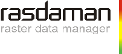
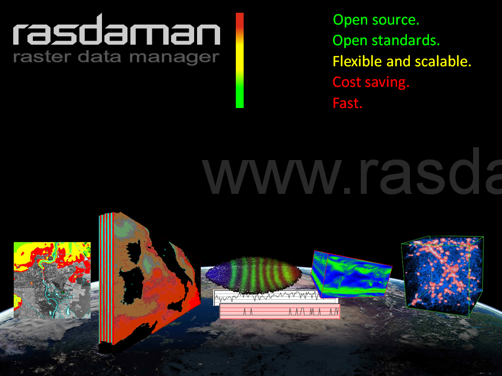

:Автор: Peter Baumann
:Автор: Jinsongdi Yu
:Автор: Dimitar Misev
:Автор: Michael Owonibi
:Проверил: Cameron Shorter, LISAsoft
:Версия: osgeo-live6.0
:Лицензия: Creative Commons Attribution 3.0 Unported (CC BY 3.0)

.. image:: ../../images/logos/OSGeo_incubation.png
  :scale: 100
  :alt: OSGeo Incubation Project
  :align: right
  :target: http://www.osgeo.org

Rasdaman
================================================================================

Многомерная растровая база данных
~~~~~~~~~~~~~~~~~~~~~~~~~~~~~~~~~~~~~~~~~~~~~~~~~~~~~~~~~~~~~~~~~~~~~~~~~~~~~~~~

Rasdaman расширяет стандартные реляционные базы данных возможностями хранения и поиска многомерных растровых данных (например, массивов) неограниченного объёма, с использованием SQL-подобного растрового языка запросов с высокоэффективной оптимизацией на стороне сервера. Данные хранятся в СУБД PostgreSQL, благодаря чему достигается плотная информационная интеграция. Драйвер rasdaman является частью библиотеки GDAL (Geospatial Data Abstraction Library), в бета-версии доступна интеграция с MapServer. Интерфейсы доступа включают OGC WCS, WCPS, WPS, а также C++ и Java API, в дополнение к растровому языку запросов rasdaman.

Технология **rasdaman** стабильна и отработана, её история разработки насчитывает более 10 лет; французский Национальный Институт географии использует **rasdaman** в создании карт воздушных масс, занимающих десятки терабайт. В 2007 году на конференции, посвящённой принципам систем баз данных, при поддержке Ассоциации вычислительной техники, эксперт по растровым базам данных Rona Machlin охарактеризовала rasdaman как "наиболее полную реализацию подобной системы".

Базовые функции
--------------------------------------------------------------------------------

    * истинная многомерность — от 1D через 2D до 3D, 4D и т.д.;
    * мощный и гибкий язык запросов для таких задач, как визуализация, классификация, свёртывание, аггрегация и многие другие геопространственные функции;
    * пространственная индексация и адаптивный тайлинг для быстрого доступа к данным;
    * стриминг тайлов для масштабируемости и высокой производительности на современном аппаратном обеспечении;
    * многопользовательская поддержка посредством мультиплексирования сервера;
    * полная информационная интеграция растровых данных с любыми другими геоданными в СУБД PostgreSQL.

Реализованные стандарты
--------------------------------------------------------------------------------

    * OGC WCS 2.0, WCPS 1.0, WPS 1.0

Дополнительная информация
--------------------------------------------------------------------------------

**Веб-сайт:** http://rasdaman.eecs.jacobs-university.de/trac/rasdaman

**Лицензия:** 

* клиенты и петаскоп: `LGPL <http://www.gnu.org/copyleft/lesser.html>`_
* движок сервера: `GPL версия 3 <http://www.gnu.org/licenses/gpl.html>`_

**Версия ПО:** 8.3.1

**Поддерживаемые платформы:** Linux, Mac, Solaris

**Интерфейсы API:** rasql, C++, Java; OGC-based WCS, WCPS, WCS-T, и WPS интерфейсы

**Поддержка:**  www.rasdaman.com

Начало работы
--------------------------------------------------------------------------------

* :doc:`Введение <../quickstart/rasdaman_quickstart>`

