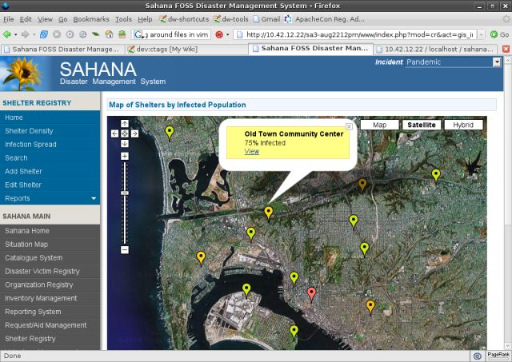

:Автор: Gavin Treadgold
:Проверил: Cameron Shorter, LISAsoft
:Версия: osgeo-live5.5
:Лицензия: Creative Commons Attribution 3.0 Unported (CC BY 3.0)

Sahana Eden
================================================================================

Платформа для кризисного управления при стихийных бедствиях
~~~~~~~~~~~~~~~~~~~~~~~~~~~~~~~~~~~~~~~~~~~~~~~~~~~~~~~~~~~~~~~~~~~~~~~~~~~~~~~~

Sahana Eden — это семейство приложений, призванных помочь вам помогать другим. Они предоставляют веб-реализацию взаимосвязанных инструментов для решения общих задач координации во время стихийных бедствий, включая поиск пропавших людей, распределение помощи, управление волонтёрами и эффективное взаимодействие между правительственными группами, добровольцами (общественными организациями) и собственно пострадавшими.

Доступны решения для кризисного управления, спасательных операций, планирования, гуманитарного и экологического секторов. Свобода и открытость дает простоту настройки и расширения. Sahana Eden способна интегрироваться с другими решениями, предоставляющими интерфейс заявок/управления крауд-соурсинговыми данными, например, Ushahidi.

Проект Sahana был инициирован волонтерами из сообщества разработки FOSS Шри-Ланки, чтобы помочь согражданам, пострадавшим от цунами в декабре 2004 года. Система официально использовалась правительством Шри-Ланки и была выпущена как открытое и свободное ПО. В дальнейшем, при спонсорской поддержке Шведского Интернационального Агентства Разработки, IBM, и Национальной Научной Организации США, она была доработана и переписана в виде набора стандартных инструментов для кризисного управления. С тех пор система использовалась десятками правительственных и общественных организаций.

Базовые функции
--------------------------------------------------------------------------------

* Картографирование (Mapping) — контроль за ситуацией и геопространственный анализ.
* Управление запросами (Requests Management) — отслеживание запросов о помощи и сопоставление их с теми, кто способен такую помощь оказать.
* Управление волонтёрами (Volunteer Management) с учётом их навыков, доступности и размещения.
* Реестр пропавших людей (Missing Persons Registry) — учёт и поиск пропавших людей.
* Идентификация жертв стихийных бедствий (Disaster Victim Identification).
* Реестр укрытий (Shelter Registry) — отслеживание размещения, вместимости и распределение пострадавших в укрытия.
* Управление медицинскими учреждениями (Hospital Management System) - медучреждения могут предоставлять информацию о ресурсах и потребностях.
* Реестр организаций (Organization Registry) — "кто, где и чем занимается". Помогает организациям координировать свою деятельность.
* Система заявок (Ticketing) — главный журнал сообщений для обработки входящих отчетов и запросов.
* Сообщения (Messaging) — приём и отправка предупреждений через Email и SMS.
* Библиотека документов (Document Library) — библиотека цифровых ресурсов, таких, как фотографии и офисные документы.
* Интеграция с Ushahidi (Ushahidi Integration) — возможность интеграции данных из Ushahidi.

Демонстрация
--------------------------------------------------------------------------------

* `Демонстрация Sahana Eden <http://demo.eden.sahanafoundation.org/>`_

Дополнительная информация
--------------------------------------------------------------------------------

**Веб-сайт:** http://eden.sahanafoundation.org/

**Лицензия:** `MIT <http://opensource.org/licenses/mit-license.php>`_

**Версия ПО:** 0.5.5

**Поддерживаемые платформы:** GNU/Linux, Mac OS X, Microsoft Windows

**Интерфейсы API:** Web, Python

**Поддержка:** `Страница поддержки <http://www.sahanafoundation.org/support>`_, `Списки рассылок <http://wiki.sahanafoundation.org/doku.php?id=community:mailing_lists>`_, `Чат <http://www.sahanafoundation.org/chat>`_.

Начало работы
--------------------------------------------------------------------------------

* :doc:`Введение <../quickstart/sahana_quickstart>`
