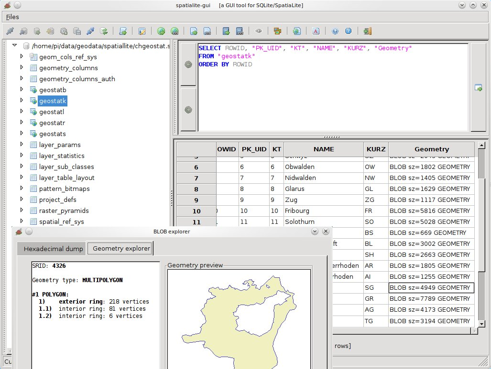

:Author: Pirmin Kalberer
:Reviewer: Cameron Shorter, LISAsoft
:Version: osgeo-live6.0
:License: Creative Commons Attribution 3.0 Unported (CC BY 3.0)

.. image:: ../../images/project_logos/logo-spatialite.png
  :scale: 50 %
  :alt: Лого проекта
  :align: right
  :target: http://www.gaia-gis.it/spatialite/

SpatiaLite
================================================================================

Пространственная база данных
~~~~~~~~~~~~~~~~~~~~~~~~~~~~~~~~~~~~~~~~~~~~~~~~~~~~~~~~~~~~~~~~~~~~~~~~~~~~~~~~

SpatiaLite — это система управления базами данных (СУБД) SQLite_ с дополнительными
пространственными функциями.

SQLite — популярная СУБД, простая, надёжная, легкая в использовании и нетребовательная
к ресурсам. Каждая база SQLite является файлом; его можно копировать, сжимать,
отправлять по локальной сети или через WEB без дополнительных усилий.

Эти файлы также платформонезависимы; одна и та же база данных будет работать
в Windows, Linux, MacOS и т.д.

.. _SQLite: http://www.sqlite.org/

Базовые функции
--------------------------------------------------------------------------------

Расширение SpatiaLite позволяет SQLite работать с пространственными данными,
отвечающими спецификациям OGC.

* поддерживаются стандартные форматы WKT и WKB;
* реализованы такие пространственные функции SQL. как AsText(), GeomFromText(),
  Area(), PointN() и другие;
* реализован полный набор функций OpenGIS с использованием библиотеки GEOS,
  включая такие функции пространственного анализа, как Overlaps(), Touches(),
  Union(), Buffer() и другие;
* полная поддержка пространственных метаданных в соответствии со спецификациями OpenGIS;
* поддержка альтернативных форматов записи геометрии - EWKT, GML, KML и GeoJSON;
* импорт и экспорт shape-файлов;
* поддерживается преобразование координат с использованием библиотеки PROJ.4
  и набора параметров EPSG;
* преобразование кодовых страниц с использованием библиотеки GNU libiconv
* реализован полноценный пространственный индекс на базе индекса RTree SQLite;
* модуль VirtualShape позволяет SQLite работать с shape-файлами как с виртуальными
  таблицами;
* возможность выполнять запросы SQL к внешним shape-файлам без предварительного
  импорта или конвертации;
* модуль VirtualText позволяет SQLite работать с файлами CSV/TxtTab как с
  виртуальными таблицами;
* модуль VirtualXL позволяет SQLite работать с файлами XLS как с виртуальными
  таблицами;
* возможность выполнять запросы SQL к внешним файлам CSV/TxtTab или таблицам
  Excel без предварительного импорта или конвертации;
* инструменты с графическим интерфейсом позволяют выполнять все эти действия
  наиболее простым и понятным способом.

Дополнительная информация
--------------------------------------------------------------------------------

**Веб-сайт:** http://www.gaia-gis.it/gaia-sins/

**Лицензия:** `MPL v1.1 <http://www.mozilla.org/MPL/1.1/>`_ и `GPL v3 <http://www.gnu.org/licenses/gpl.html>`_

**Версия ПО:** spatialite 3.1.0a / librasterlite 1.1 / spatialite-gui 1.5.0 / spatialite-gis 1.0.0

**Поддерживаемые платформы:** Linux, Mac, Windows

**Интерфейсы API:** C

Начало работы
--------------------------------------------------------------------------------

* :doc:`Введение <../quickstart/spatialite_quickstart>`
