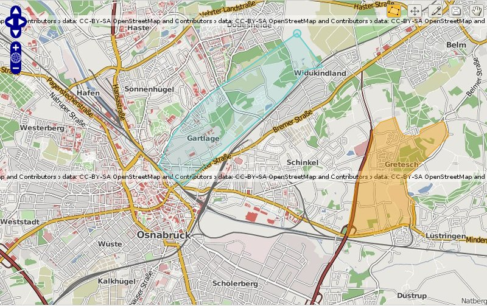

:Author: OSGeo-Live
:Reviewer: Cameron Shorter, LISAsoft
:Version: osgeo-live6.0
:License: Creative Commons Attribution 3.0 Unported (CC BY 3.0)

.. image:: ../../images/logos/OSGeo_project.png
  :scale: 100 %
  :alt: OSGeo Project
  :align: right
  :target: http://www.osgeo.org

TinyOWS
================================================================================

Web Feature Service
~~~~~~~~~~~~~~~~~~~~~~~~~~~~~~~~~~~~~~~~~~~~~~~~~~~~~~~~~~~~~~~~~~~~~~~~~~~~~~~~

TinyOWS — это легковесный и простой в развёртывании высокопроизводительный WFS-сервер
с поддержкой режима редактирования (WFS-T) и интерфейсов CGI и FastCGI. Для
хранения данных используется :doc:`PostGIS <postgis_overview>`.

TinyOWS обычно используется в связке с :doc:`MapServer <mapserver_overview>` для создания 
WFS-T и WFS сервисов, которые могут быть использованы в различных клиентских приложениях, таких, как
:doc:`QGIS <qgis_overview>` или :doc:`OpenLayers <openlayers_overview>`.
Используется во многих организациях по всему миру, включая государственные
учреждения. TinyOWS строго реализует стандарты WFS 1.0 и 1.1, а также
успешно проходит все юнит-тесты OGC CITE (~ 1000 юнит-тестов).

Ключевые особенности
--------------------------------------------------------------------------------

* Web Feature Service (WFS-T) - WFS с поддержкой редактирования
* Интерфейсы CGI и FastCGI
* Использование PostGIS в качестве хранилища данных
* Выходные форматы - GML 2.1.2, 3.1.1 и GeoJson 1.0
* Конфигурирование с помощью map-файла MapServer, что позволяет
  использовать один конфигурационный файл как для TinyOWS, так и
  для MapServer

Поддерживаемые стандарты
--------------------------------------------------------------------------------
* WFS 1.0 и WFS 1.1: профили Basic и Transactionnal
* FE 1.0.0 и FE 1.1.0
* GML 2.1.2 и 3.1.1 Simple Profile (SF-0)

Детали
--------------------------------------------------------------------------------

**Веб-сайт:** http://mapserver.org/trunk/tinyows/

**Лицензия:** `MIT <http://opensource.org/licenses/mit-license.php>`_

**Версия ПО:** 1.0.0

**Поддерживаемые платформы:** Linux, Unix, Mac, Windows

**интерфейсы API:** CGI/FastCGI

**Поддержка:** http://lists.osgeo.org/mailman/listinfo/mapserver-users

Начало работы
--------------------------------------------------------------------------------

* :doc:`Введение <../quickstart/tinyows_quickstart>`

