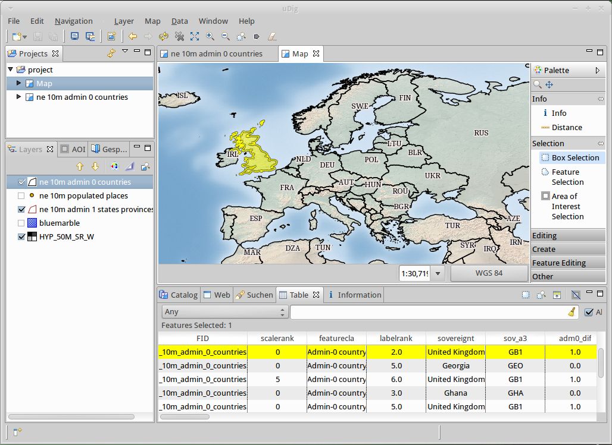

:Author: OSGeo-Live
:Reviewer: Cameron Shorter, LISAsoft
:Version: osgeo-live5.5
:License: Creative Commons Attribution 3.0 Unported (CC BY 3.0)

.. image:: ../../images/project_logos/logo-uDig.png
  :scale: 30
  :alt: Логотип udig
  :align: right
  :target: http://udig.refractions.net/

uDig
================================================================================

Настольная ГИС
~~~~~~~~~~~~~~~~~~~~~~~~~~~~~~~~~~~~~~~~~~~~~~~~~~~~~~~~~~~~~~~~~~~~~~~~~~~~~~~~

**uDig**, "удобная настольная интернет-ГИС", представляет собой программу для редактирования/просмотра пространственных данных с открытым исходным кодом и с особым акцентом на стандарты OpenGIS для интернет-ГИС, например, WMS/WFS.

uDig — это:

* **Удобная** — предоставление знакомой графической среды для пользователей ГИС.
* **Настольная** — нативно запускается под Windows, Mac OS X и Linux.
* **Интернет-ориентированная**  — много стандартных и де-факто геопространственных веб-сервисов.
* **Полноценная** — обеспечивает основу, на которой могут быть построены сложные аналитические возможности, с последующей возможностью переноса их в основное приложение.

Для разработчиков uDig предоставляет общую Java-платформу для создания пространственных приложений с открытыми компонентами (компоненты с открытым исходным кодом). Веб-сайт предоставляет наборы понятных руководств от разработки простейших инструментов и до создания собственных приложений.

Базовые функции
--------------------------------------------------------------------------------

* Настольный клиент с интеграцией Drag-and-Drop, проводника файлов и веб-браузера.
* Интеграция с имеющейся инфраструктурой: ArcSDE, Oracle, DB2 и др.
* Работа с локальными файлами: shapefile, jpeg, png, tiff и др.
* Работа с расширенными пространственными форматами: ECW, MrSID, JPEG 2000.
* Поддержка стандартных веб-сервисов WMS (:doc:`GeoServer <geoserver_overview>`, протестировано с MapServer).
* Интеграция опыта работы с веб и встроенного браузера с поддержкой OGC-сервисов, а также возможность добавлять ссылки на отображаемую карту.
* Управление SLD для отрисовки и публикации карт, используя те же установки, что и в популярных WMS.
* Глубокая интеграция стандартов, позволяющая приложению переключаться между соответствующими службами для отображения, взаимодействия и редактирования.
* Печать и генерация PDF.
* Для разработчиков:
  
  * Сборка приложений на Java, используя :doc:`GeoTools <geotools_overview>`, `JTS Topology Suite (JTS) <http://tsusiatsoftware.net/jts/main.html>`_.
  * Продвинутая система плагинов, предоставляемая платформой Eclipse.
  * Использование нативных виджетов.

Реализованные стандарты
--------------------------------------------------------------------------------

* OGC Web Map Server (WMS)
* OGC Web Feature Server (WFS)
* OGC Web Feature Server Transactional (WFS-T)
* OGC Simple Features for SQL (SFQL)
* Web Map Server Cache (WMS-C)
* OGC Style Layer Descriptor (SLD)

Дополнительная информация
--------------------------------------------------------------------------------

**Веб-сайт:** http://udig.refractions.net/

**Лицензия:** `LGPL версия 2 <http://www.gnu.org/copyleft/lesser.html>`_

**Версия ПО:** 1.2.2

**Поддерживаемые платформы:** Windows, Linux, Mac

**Интерфейсы API:** GeoTools, ImageIO-Ext, Java Advanced Imaging, Eclipse Rich Client Platform, Eclipse Modelling Framework

**Поддержка:** http://udig.refractions.net/users/

**Разработчики:** http://udig.refractions.net/developers/

Начало работы
--------------------------------------------------------------------------------

* :doc:`Введение <../quickstart/udig_quickstart>`

