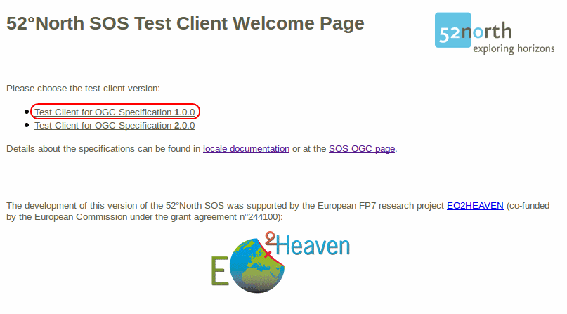

:Author: Eike Hinderk Jürrens (e.h.juerrens@52north.org)
:Reviewer: TBD
:Version: osgeo-live6.0
:License: Creative Commons Attribution-ShareAlike 3.0 Unported  (CC BY-SA 3.0)

.. image:: ../../images/project_logos/logo_52North_160.png
  :scale: 100 %
  :alt: 52°North - exploring horizons - logo
  :align: right
  :target: http://52north.org/sos
  
********************************************************************************
Начало работы с 52°North SOS
********************************************************************************

Введение
================================================================================

52°North SOS является веб-сервисом, который позволяет собирать пространственные данные с сенсоров и давать к ним доступ (включая метаданные и данные наблюдений).

1) Чтобы запустить 52°North SOS, выберите :menuselection:`Geospatial --> Web Services --> 52North --> Start 52North SOS`	 или перейдите по `ссылке <http://localhost:8080/52nSOS/>`_. Если сервис недоступен, попробуйте запустить контейнер сервлетов Tomcat, следуя шагам, описанным в конце этого документа.

2) Связанный браузер откроет страницу приглашения тестового клиентского приложения 52°North SOS (см. Рис. 1). Пожалуйста выберите версию спецификации, которую вы хотели бы использовать, например, 1.0.0:

**Рис. 1**: Стартовой страницы тестового клиентского приложения 52°North SOS

3) Тестовый клиент может быть использован для отправки запросов к сервису используя простую форму. В выпадающем списке можно выбрать один из предопределенных запросов, адаптированных к выбранной на предыдущем шаге версии сервиса.

.. image:: ../../images/screenshots/1024x768/52n_sos_test_client_v1.0.0_GetCapabilities.png
  :scale: 100 %
  :alt: пример стартовой страницы тестового клиентского приложения версии 1.0.0 52°North SOS
  :align: center
  
**Рис. 2**: Тестовый клиент 52°North SOS версия спецификации 1.0.0 
  
4) Для начала работы с SOS выберите запрос GetCapabilities_allSections.xml из списка, который находится рядом с примерами запросов "Request Examples" (см. [1] на Рис. 2).
  
5) Нажмите кнопку "отправить" **Send button** ([2] на Рис. 2) и запрос будет отправлен в 52°North SOS. В результате будет возвращен документ XML (см. Рис. 3), который будет описывать возможности (capabilities) сервиса SOS (метаданные сервиса, такие как, ключевые слова или провайдер, доступные операции и фильтры, содержащиеся данные наблюдений и т.д.). Чтобы увидеть содержимое ответа сервиса в оригинальном виде, откройте исходный код страницы (Ctrl+U).

.. image:: ../../images/screenshots/1024x768/52n_sos_response.png
  :scale: 70 %
  :alt: пример результата ответа - GetCapabilities 52°North SOS в XML
  :align: center
  
**Рис. 3**: 52°North SOS — ответ GetCapabilities в XML
  
6) Чтобы создавать свои собственные запросы, вам понадобятся `capabilities <http://localhost:8080/52nSOS/sos?REQUEST=GetCapabilities&SERVICE=SOS&ACCEPTVERSIONS=1.0.0>`_  сервиса 52°North SOS (версия спецификации 1.0.0). При использовании информации из "capabilities" особенно важна секция "содержание" (contents), где можно донастроить уже существующие запросы. Просто выберите запрос "GetObservation" (GetObs...) из выпадающего списка, и используйте его как шаблон для получения своих наборов данных.

Дополнительная информация
================================================================================

Подробную информацию о сервисе 52°North SOS и/или сообществе 52°North Sensor Web можно найти по следующим ссылкам:

* Обзор 52°North :doc:`SOS <../overview/52nSOS_overview>`,
* Список рассылки 52°North Sensor Web: swe@52north.org, 
* Форум сообщества 52°North `Sensor Web <http://sensorweb.forum.52north.org/>`_, 
* Клиент для 52°North `SOS <http://sensorweb.demo.52north.org/SOSclient/>`_,
* Официальная страница 52°North `SOS <http://52north.org/communities/sensorweb/sos/>`_, or 
* Веб-сайт сообщества `52°North Sensor Web <http://52north.org/communities/sensorweb/>`_.

* Если сервис SOS недоступен, проверьте, запущен ли контейнер сервлетов Tomcat, используя следующие команды:

::

  user@osgeolive:~$ sudo /etc/init.d/tomcat6 status
  * Tomcat servlet engine is running with pid 1234          <-- Tomcat запущен
  [...]
  * Tomcat servlet engine is not running.                   <-- Tomcat не запущен, запустите:
  user@osgeolive:~$ sudo /etc/init.d/tomcat6 start
  * Starting Tomcat servlet engine tomcat6           [ OK ] <-- Tomcat запущен
  
**Листинг 1:** Статус сервиса Tomcat и его запуск (пароль для sudo: user)

* Разработка этой версии 52°North SOS была поддержана исследовательским Европейским проектом FP7 `EO2HEAVEN <http://www.eo2heaven.org/>`_ (софинансирование Европейской Комиссией, грант n°244100):

