:Author: Ian Turton
:Author: Frank Gasdorf
:Version: osgeo-live5.0draft
:License: Creative Commons Attribution-ShareAlike 3.0 Unported  (CC BY-SA 3.0)
:Thanks: geoserver-user list

.. |GS| replace:: GeoServer
.. |UG| replace:: uDig 

.. image:: ../../images/project_logos/logo-GeoServer.png
  :alt: Логотип проекта
  :align: right

********************************************************************************
Начало работы с GeoServer
********************************************************************************

GeoServer — это приложение, написанное на языке Java, обслуживающее карты и
данные для их отображения в сторонних клиентах.

Эта глава описывает пути решения следующих задач:

  * добавление векторных и растровых данных в GeoServer;
  * применение стилей оформления объектов для их отображения на карте;
  * тестирование отображения объектов в виде карт;
  * ознакомление с клиентами, которые могут отобразить ваши карты.

Запуск |GS|
================================================================================

#. Выберите пункт |osgeolive-appmenupath-geoserver| в меню.
#. Приложению потребуется некоторое время для запуска.
#. Перейдите на веб-страницу http://localhost:8082/geoserver/web 

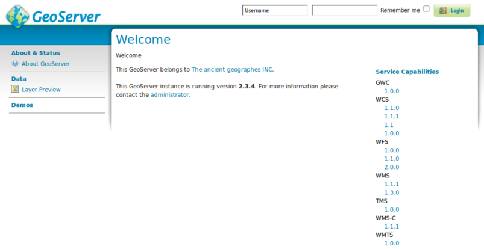

Первый просмотр
================================================================================

При первом открытии страницы |GS| вы увидите форму ввода сверху экрана, вы должны войти, используя имя пользователя *admin* и пароль *geoserver*. После этого вы увидите *admin page*. 

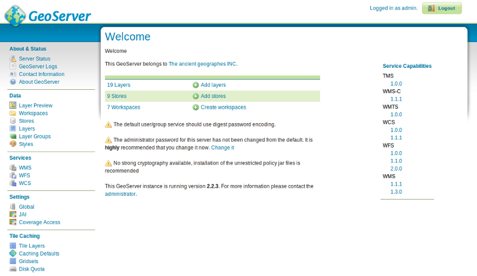

Пункт **Layer Preview**, расположенный слева сверху в меню *Data*, позволяет сделать предварительный просмотр всех слоёв, загруженных на сервер. 

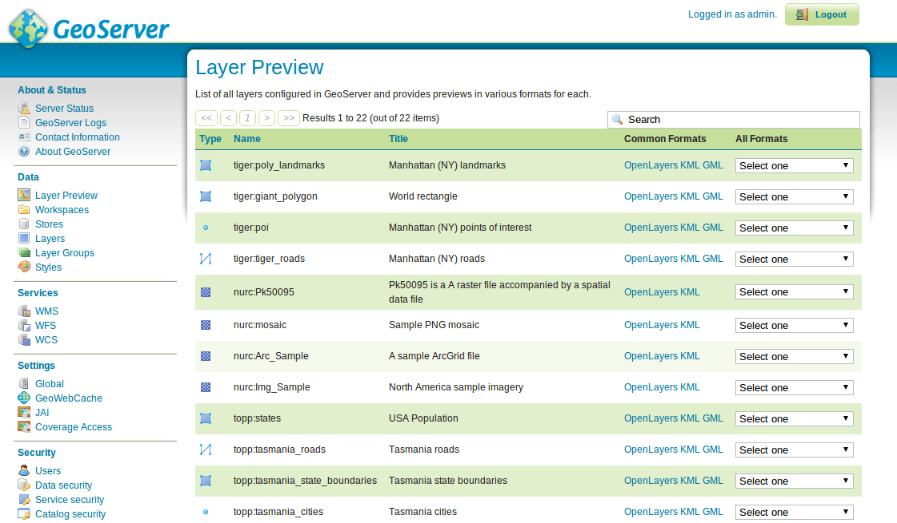

Перейдите к нижней части страницы и нажмите на ссылку **OpenLayers** в строке **tiger-ny**, после этого откроется новое окно предварительного просмотра некоторых выборочных данных. 

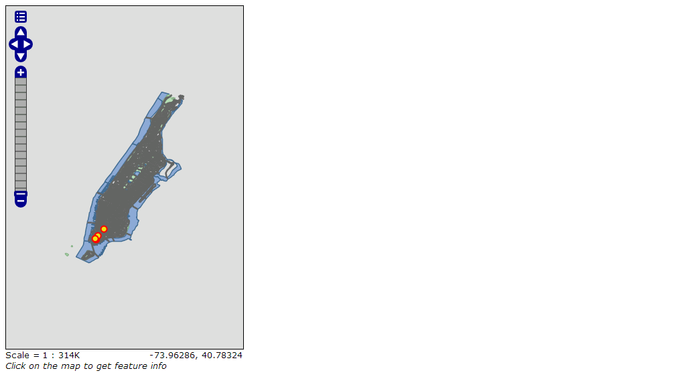

Вы можете менять масштаб карты тремя разными способами:

        * Щёлкать по шкале увеличения слева на экране, чем выше — тем больше увеличение.

        * Используя колесо мыши (если таковое имеется), прокрутка от себя приводит к увеличению масштаба, а к себе — к уменьшению.

        * Созданием бокса в окне карты с зажатой клавишей Shift — это приблизит выбранную боксом область (настолько, насколько позволит экстент).


#. Поэкспериментируйте с этим видом и посмотрите другие примеры. 


Загрузка данных
================================================================================

.. Note::
    Вы не сможете произвести следующие действия, если вы работаете с файловой системой, смонтированной только для чтения (например с DVD-диска). Вам понадобится установить GeoServer с DVD на жесткий диск или создать систему, поддерживающую USB-накопители.

В этом примере мы будем использовать набор данных :doc:`Natural Earth <../overview/naturalearth_overview>` который включён в OSGeo-Live (:file:`/usr/local/share/data/natural_earth/`).

Нам необходимо создать хранилище для наших данных. С начальной страницы |GS| перейдите к *Stores* и затем выберите "Add new Store". Вы увидите такую страницу:

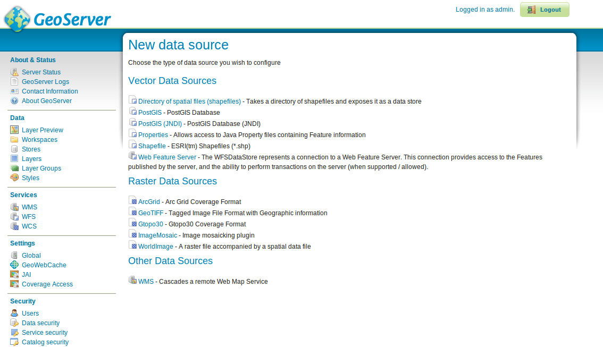

Выберите :guilabel:`Directory of spatial files`:

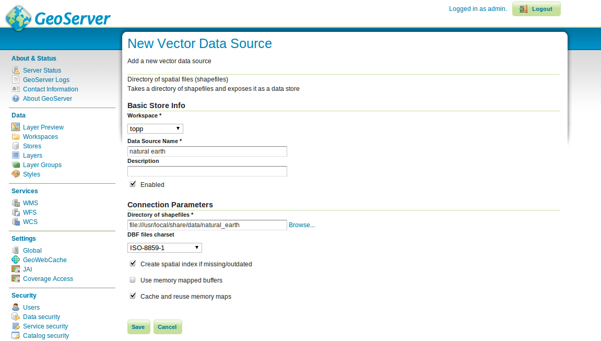

Напишите имя для хранилища данных, например, *Natural Earth*, и заполните URL к папке с данными в этой форме :file:`/usr/local/share/data/natural_earth/`. 

Вы можете использовать кнопку поиска, чтобы найти папку, если ваши данные где-то ещё. Нажмите :guilabel:`save`.

.. image:: ../../images/screenshots/800x600/geoserver-naturalearth.png
    :align: center 
    :scale: 70 %
    :alt: Хранилище данных Natural Earth

Нажмите :guilabel:`publish` для одного из слоёв, чтобы завершить добавление данных. Вы перейдёте на страницу *Layers*:

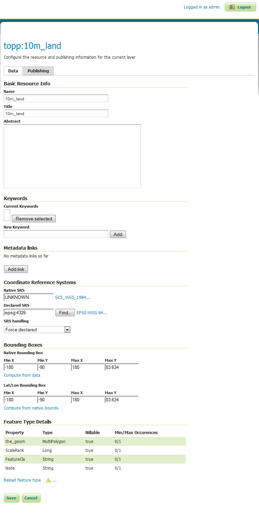

Пролистнув страницу вниз, вы увидите, что |GS| заполнил много полей для вас. Когда вы достигнете :guilabel:`Coordinate Reference System`, вы увидите надпись UNKNOWN под формой *Native SRS*. Вам следует заполнить форму (*declared SRS*) чтобы убедиться в том, что |GS| получил данные. Для нашего примера напечатайте в форме EPSG:4326, можете проверить правильность введённого по адресу `http://prj2epsg.org/search <http://prj2epsg.org/search>`_ в строке, которую увидите при нажатии ссылки рядом с "UNKNOWN". Затем нажмите :guilabel:`Compute from data` и :guilabel:`Compute from native bounds`, чтобы заполнить ограничивающие прямоугольники. Наконец, нажмите :guilabel:`save` — так вы опубликуете свой первый слой.

.. note::
    Если вы посмотрите на слой на странице предварительного просмотра, то он будет выглядеть не очень красиво, это всего лишь стиль по умолчанию. В следующем разделе мы увидим, как создавать более красивые стили.

Вы можете  следовать теми же шагами при работе с другими слоями, используя кнопку :guilabel:`Add a new resource` на странице слоев. Выберите хранилище *natural earth* из списка для возврата к странице хранилищ.

Стилизация
--------------------------------------------------------------------------------

При создании стилей для набора данных |GS| использует стандарт OGC :doc:`Styled Layer Descriptors (SLD) <../standards/sld_overview>`. Он представлен XML-файлами, описывающими правила, которые используются для применения способов отображения данных.

Для начала стилизуем наборы данных Land и Ocean. Вы можете создавать SLD-файлы, используя простой текстовый редактор, но иногда проще использовать графический редактор. Для этого существует ряд программ, вам может понравиться |UG|, поскольку он позволяет открывать шейп-файлы и применять стили, используя графический интерфейс, а также в нём представлен простой редактор XML.

Использование |UG| для создания простых стилей
````````````````````````````````````````````````````````````````

.. note:: Детальное описание использования |UG| смотрите здесь: :doc:`Начало работы с uDig<../quickstart/udig_quickstart>`

Для начала откроем |UG| и добавим шейп-файлы (используя кнопку *add data* в верхнем левом углу). Перенесём слои "10m_land"
и "10m_ocean" в окно карты. |UG| автоматически применил стиль (поэтому мы можем видеть данные). 

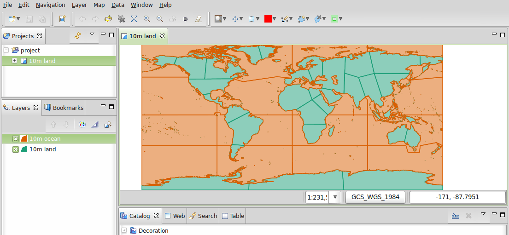

Очевидно, что оранжевый океан выглядит немного странно. В списке слоёв :ref:`Layer list <Layer_list>` выберите кнопку стилей (она похожа на палитру красок). 

.. _Layer_list:
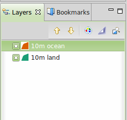

Откроется :ref:`Style Pane <Style_Pane>` — в простом окне можео выбрать приятный голубой цвет для океанов нажатием на цветные прямоугольники в окне заливки и выбором необходимого цвета простым щелчком. Также можно повысить непрозрачность заливки до 100%, чтобы она выглядела лучше. Для границ также можно выбрать голубой цвет.

.. _Style_Pane:
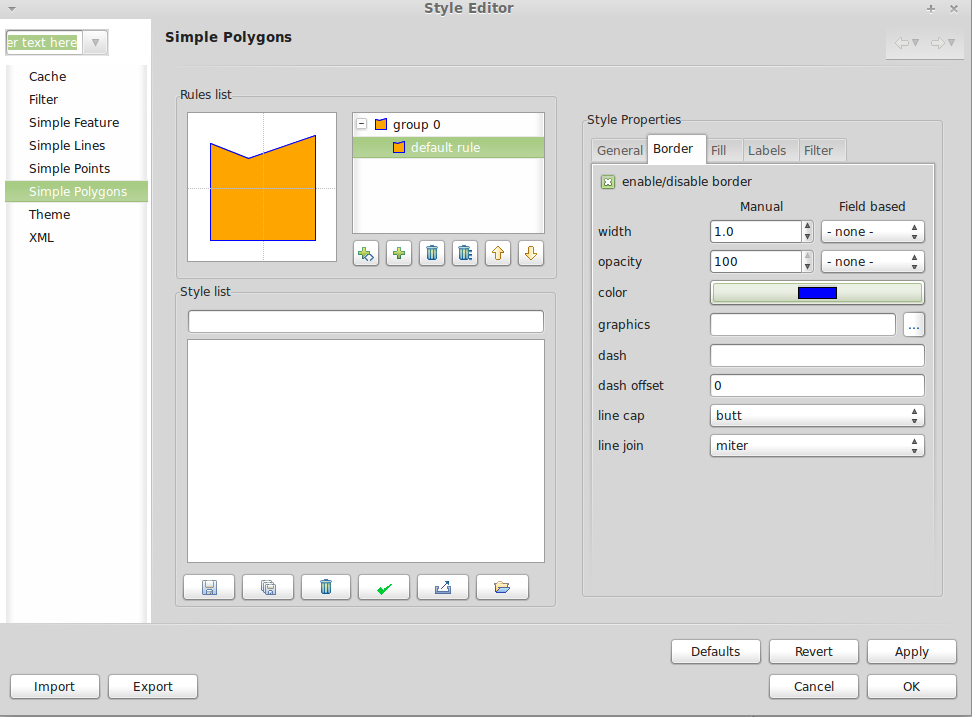

Когда все сделано, нажмите ``OK``, и |UG| покажет изменения.

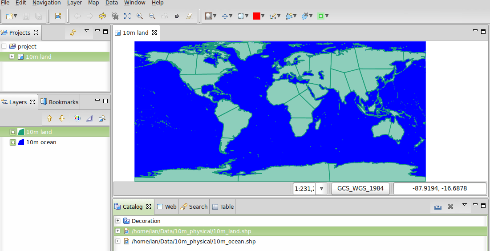

Теперь давайте изменим цвет суши с зелёного на более правдоподобный и повторим все шаги по изменению цвета в слое *land*. Если ни один из цветов по умолчанию вам не приглянулся, можно открыть ``define custom colors``, чтобы создать свой цвет.

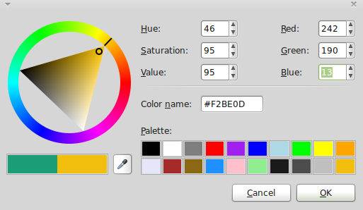

В результате получаем красивую базовую карту мира.

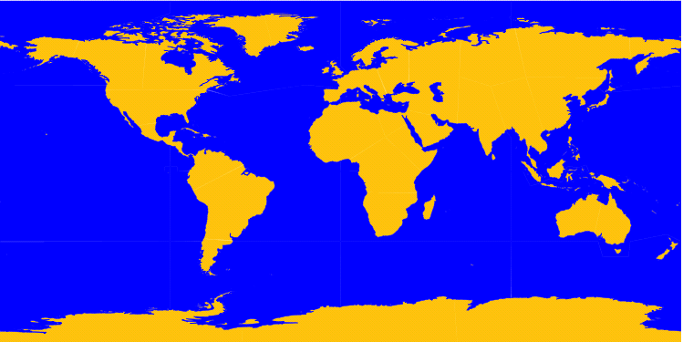

Добавление стиля в |GS|
````````````````````````

Теперь необходимо перенести эти стили в |GS| — в окне стилей есть кнопка *export*, позволяющая сохранить SLD-файл, который определяет наш стиль. Как только мы сохранили два стиля, можно перейти к странице |GS| *admin page* и выбрать ``Styles`` (снизу секции ``Data``). Затем выбираем ``Add New Style``, снизу страницы появится форма загрузки и кнопка поиска. Нажатие на неё позволяет произвести поиск только что сохранённых файлов на жёстком диске. Как только нужные файлы найдены, жмём *upload* (находится рядом с кнопкой поиска), и копия файла появляется в редакторе. Если щёлкнуть по кнопке *validate*, то подсвеченные линии покажут, где есть ошибки, но можно также безопасно её проигнорировать (или удалить ненужные строки).


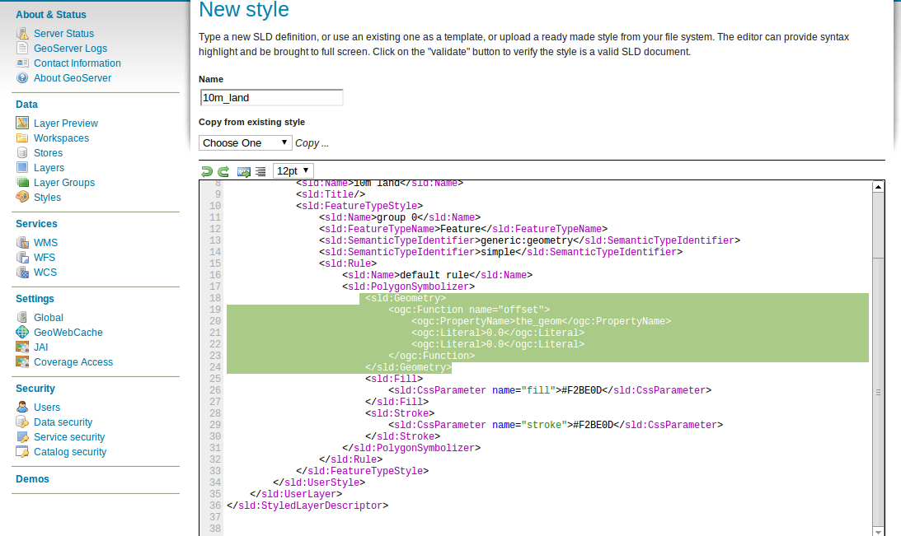


Добавление стиля в слой
--------------------------------------------------------------------------------

Нажмите :guilabel:`Layers` в левом меню окна |GS|. Нажмите на название слоя (т.е. *10m_land*), затем выберите вкладку :guilabel:`Publishing` и замените :guilabel:`Default Style` на стиль, загруженный ранее. Теперь перейдите к странице *Layer Preview*, чтобы проверить, что все выглядит хорошо.

.. note:: Здесь находятся примеры стилей для всех слоёв Natural Earth.

.. TBD (needs more memory)
Добавление растра
==============================

Каталог Natural Earth содержит вложенный каталог :file:`HYP_50M_SR_W`, в котором находится растровое изображение. Вы можете загрузить его напрямую в |GS|, перейдя к странице stores и выбрав :menuselection:`New Stores --> World Image` и написав :file:`/home/user/data/natural_earth/HYP_50M_SR_W/HYP_50M_SR_W.tif` в форме ввода :guilabel:`URL`.

 .. image:: ../../images/screenshots/800x600/geoserver-raster.png
        :align: center
        :scale: 70 %
        :alt: Добавление растра

Нажмите :guilabel:`Save`, вы перейдёте к *New Layers Chooser*, затем опубликуйте слой и нажмите :guilabel:`Save`, чтобы закончить добавление растра. Если вы перейдете к странице *Layers Preview*, то увидите новое изображение.


Клиенты для просмотра WMS-слоев
================================================================================

Существует широкий выбор клиентов для использования :doc:`WMS<../standards/wms_overview>`, получаемого из |GS|. Здесь приведён перечень некоторых из них.

    * :doc:`uDig <../overview/udig_overview>`

    * :doc:`OpenLayers <../overview/openlayers_overview>`

    * :doc:`Atlas Styler <../overview/atlasstyler_overview>`

    * :doc:`MapBender <../overview/mapbender_overview>`


