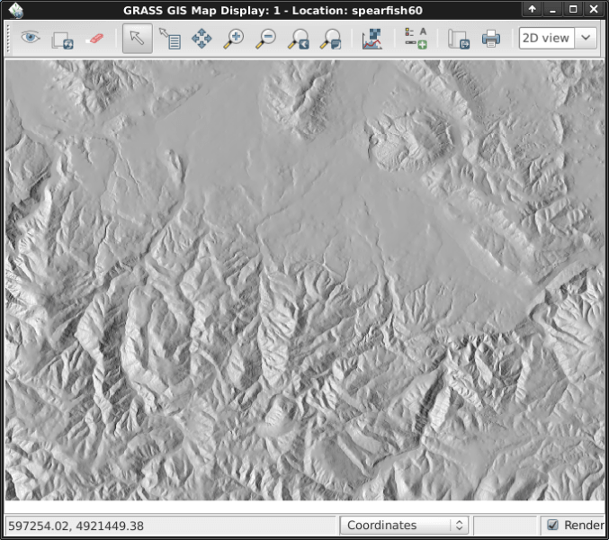

:Author: Hamish Bowman
:Version: osgeo-live6.0
:License: Creative Commons Attribution-ShareAlike 3.0 Unported  (CC BY-SA 3.0)
:Copyright: 2011 by The OSGeo Foundation

.. image:: ../../images/project_logos/logo-GRASS.png
  :scale: 100 %
  :alt: project logo
  :align: right
  :target: http://grass.osgeo.org

********************************************************************************
Начало работы с GRASS
********************************************************************************

Запуск
================================================================================

Чтобы запустить GRASS, щёлкните по иконке на рабочем слое.
В появившемся окне "Welcome to GRASS" выберите в качестве *области* 
или **Spearfish**, или **nc_basic_spm**, затем выберите *набор* "user1" 
и нажмите [Start Grass]. Примеры, приведённые в этом пособии, были
созданы с использованием набора данных Spearfish, и с некоторыми 
незначительными корректировками могут быть применены к набору
данных NC.        

.. image:: ../../images/screenshots/800x600/grass-startup.png
  :scale: 40 %
  :alt: screenshot
  :align: right

Итак, должен запуститься интерфейс `wxGUI <../../grass/wxGUI.html>`_.

.. tip::  Если у вас нетбук с небольшим экраном (с разрешением 800x600), 
 окно запуска может оказаться немного сжатым и кнопка [Start GRASS] 
 будет скрыта под списками областей и наборов. Если это произойдёт, 
 то нужно перетащить край окна, чтобы сделать его немного шире. 
 Возможно, придётся переместить окно в верхнюю часть экрана, чтобы 
 освободить место (нажмите клавишу Alt и, удерживая левую кнопку мыши, 
 перетащите окно). 

Отображение данных
~~~~~~~~~~~~~~~~~~~~~~~~~~~~~~~~~~~~~~~~~~~~~~~~~~~~~~~~~~~~~~~~~~~~~~~~~~~~~~~~

.. image:: ../../images/screenshots/800x600/grass-layerman.png
  :scale: 50 %
  :alt: screenshot
  :align: left

После запуска сессии GRASS выведем на экран растры "`elevation.10m`" 
или "`elevation`" из набора PERMANENT (в зависимости от выбранной 
области). Для этого перейдите в окно *GIS Layer Manager* и щёлкните на
по кнопке с шахматным рисунком со знаком "+". Затем выберите имя 
растровой карты из выпадающего списка ("*map to be displayed*"), 
нажмите [Ok].

Таким же образом добавим векторную карту "`roads`" (или "`roadsmajor`")
из набора PERMANENT, для этого нажмите на по кнопке со знаком "+" и 
изогнутой линией в виде буквы "V".

Если нужно, щёлкните с списке слоёв на имени растра и выберите
"Zoom to selected map(s)".

Теперь вы должны видеть растр и векторную карту на экране.

Построение профиля поверхности
~~~~~~~~~~~~~~~~~~~~~~~~~~~~~~~~~~~~~~~~~~~~~~~~~~~~~~~~~~~~~~~~~~~~~~~~~~~~~~~~

.. image:: ../../images/screenshots/800x600/grass-profile.png
  :scale: 50 %
  :alt: screenshot
  :align: right

Вернёмся в окну *GIS Layer Manager*. Выберите в списке слоёв 
растр `elevation`. Затем в окне *Map Display* справа от кнопок
изменения масштаба на панели нажмите кнопку с
с шахматным рисунком и линией. Выберите **Profile surface map**.
Если список не появится автоматически, выберите снова слой растра
с рельефом и нажмите [Ok]. Вторая кнопка слева позволяет задать
линию профиля, нажмите её и затем отметьте несколько точек в окне
карты. Затем вернитесь к окну профиля и нажмите на кнопку с глазом,
чтобы создать график профиля. Теперь нажмите кнопку *I/O* справа, 
чтобы закрыть окно с профилем.             

Создание произвольной поверхности
~~~~~~~~~~~~~~~~~~~~~~~~~~~~~~~~~~~~~~~~~~~~~~~~~~~~~~~~~~~~~~~~~~~~~~~~~~~~~~~~

Давайте создадим новую карту. Вначале зададим вычислительный регион с
охватом по умолчанию с помощью :menuselection:`Settings --> Region --> Set region`,
задайте "Set from default region" и нажмите [Run]. Затем выберите
:menuselection:`Raster --> Generate surfaces --> Fractal surface` из меню
(внизу списка); задайте имя нового растра; настройте какие-либо ещё 
параметры по желанию на вкладке "Optional" (умолчальные значения вполне
подойдут); нажмите [Run]. Теперь вы можете закрыть окно модуля *r.surf.fractal*.  

.. image:: ../../images/screenshots/800x600/grass-fractal.png
  :scale: 50 %
  :alt: screenshot
  :align: right

Настройка цветов
~~~~~~~~~~~~~~~~~~~~~~~~~~~~~~~~~~~~~~~~~~~~~~~~~~~~~~~~~~~~~~~~~~~~~~~~~~~~~~~~

Теперь вы можете видеть новый растр в списке слоёв вместе с растром
рельефа, с тем отличием, что создан он был в вашем рабочем наборе 
"user1". Вы можете снять галочку со слоя рельефа, чтобы два растра
не накладывались друг на друга. Нажмите на кнопку с глазом, чтобы
увидеть вашу новую карту, если она не отрисовалась автоматически.

Если цвета растра вас не устраивают, можно их изменить. Выберите
в слоях растр фрактальной поверхности, в меню
`Raster` выберите  :menuselection:`Manage colors --> Color tables`.
На вкладке "Colors" кликните на выпадающий список для опции
"Type of color table", выберите одну цветовую шкалу из этого списка.
"srtm" будет хорошим выбором в нашем случае. Выбрав цвета, запустите
модуль кнопкой [Run] и закройте окно модуля.

Цвета растра должны обновиться автоматически. Если этого не произошло,
значит, вы изменили метаданные карты в это время, и придётся полностью
очистить экранный кэш. Для полной перерисовки экрана нажмите небольшую 
кнопку обновления рядом с кнопкой в виде глаза. Теперь вы должны увидеть
растр в новых цветах.   
  
Создание растра светотеневой отмывки рельефа
~~~~~~~~~~~~~~~~~~~~~~~~~~~~~~~~~~~~~~~~~~~~~~~~~~~~~~~~~~~~~~~~~~~~~~~~~~~~~~~~

Следующим упражнением будет создание растра светотеневой отмывки 
рельефа. Начнём с проверки, что вычислительный регион
задан по нужному растру (`elevation`) в наборе PERMANENT. Чтобы сделать
это, убедитесь, что растр открыт в списке слоёв в главном окне, щёлкните
правой кнопкой мыши по имени слоя и выберите "Set computation region
from selected map(s)". В меню `Raster` выберите 
:menuselection:`Terrain analysis --> Shaded relief` (этот пункт в меню
примерно посередине списка), должно появиться окно модуля.
Выберите в качестве входной карты наш растр и нажмите [Run].
Теперь добавьте новый растр *elevation.shade@user1* в список слоёв
и деактивируйте все другие растровые слои.

Водотоки и бассейны
~~~~~~~~~~~~~~~~~~~~~~~~~~~~~~~~~~~~~~~~~~~~~~~~~~~~~~~~~~~~~~~~~~~~~~~~~~~~~~~~

Откройте растр `elevation` @PERMANENT и в меню `Raster` выберите
:menuselection:`Hydrologic modeling --> Watershed analysis`. Запустится
интерфейс модуля ``r.watershed``. Установите растр `elevation` как 
входной, на вкладке 'Input options' задайте минимальную площадь
водосборного бассейна *threshold* в 10000 ячеек, затем на вкладке 
'Output options' введите "elev.basins" для растра бассейнов и "elev.streams"
для растра водотоков. В конце нажмите [Run].

Вернитесь к окну `Layer Manager`и убедитесь, что две новых растра
есть в списке слоёв и что только они отображаются в окне карты. Щёлкните
правой кнопкой мыши по слою "elev.basins" и выберите "Change opacity level".
Выставьте уровень 50%, экран автоматически обновится. Перетащите слой
вниз в списке слоёв (так, как раньше растр теневой отмывки), если вы хотите,
чтобы он отображался позади других слоёв, и поставьте галочку, чтобы
растр отображался в фоне.

.. image:: ../../images/screenshots/800x600/grass-watersheds.png
  :scale: 50 %
  :alt: screenshot
  :align: left

В окне `GIS Layer Manager` щёлкните по второй кнопке справа в верхнем ряду
`Add a grid layer`. Задайте размер сетки в 0:03 (3 минуты) в формате D:M:S, 
затем на вкладке "Optional" выберите "Draw geographic grid", нажмите [Ok] и 
обновите экран. 

Чтобы добавить масштабную шкалу на экран, перейдите в окно карты и 
нажмите кнопку "Add map elements" справа от кнопки "Profile tool", выберите
"Add scalebar and north arrow". Отметьте галочкой кнопку ``show``, прочитайте
инструкции по размещению и затем кликните [Ok]. Масштабная шкала должна
появиться в верхнем левом углу экрана. Перетащите её в нижнюю левую часть
экрана. Из того же меню на панели инструментов выберите "Add legend" и в 
окне инструкций щёлкните по кнопке *Set Options*, чтобы задать имя растра, для
которого мы хотим создать легенду. После выбора один раз кликните [Ok], затем
ещё раз [Ok]. Перетащите вашу новую легенду на правую сторону карты.    

Теперь вы, наверное, можете подумать, что шрифты выглядят немного неэстетично.
Это легко поправимо: в меню главного окна выберите 
:menuselection:`Settings --> Preferences` и на вкладке *Map Display* нажмите
кнопку [Set font], выберите один из имеющихся шрифтов (например, DroidSans),
нажмите [Apply] в окне *Preferences*. Вы должны будете полностью обновить 
экран, чтобы увидеть изменения, для этого нажмите кнопку перерисовки возле
кнопки с глазом в окне `Map Display`. Теперь шрифты должны выглядеть намного
привлекательней.

Модули для работы с векторными данными
~~~~~~~~~~~~~~~~~~~~~~~~~~~~~~~~~~~~~~~~~~~~~~~~~~~~~~~~~~~~~~~~~~~~~~~~~~~~~~~~

Описанные выше задачи касались только нескольких растровых модулей. Из этого
можно было бы решить, что GRASS чисто растровая ГИС. Но это не так: векторный
"движок" и модули для работы с векторными данными являются не менее
функциональными. GRASS поддерживает полностью топологическую векторную
модель данных, которая позволяет проводить все основные виды анализа.  

.. image:: ../../images/screenshots/1024x768/grass-vectattrib.png
  :scale: 30 %
  :alt: screenshot
  :align: right

Продолжим работать с водосборными бассейнами, выделенными ранее. Теперь
конвертируем их в векторные полигоны. В меню *Raster* выберите
:menuselection:`Map type conversions --> Raster to vector`. В появившемся 
диалоге модуля `r.to.vect` выберите ``basins@user1`` как входную карту,
задайте имя выходной карты, например, ``basins_areas`` (имена векторных карт
должны быть SQL-совместимыми); выставьте тип `area`. На вкладке *Attributes*
поставьте галочку в графе, чтобы использовать значения растра как номера 
категорий векторных данных, т.к. они будут соответствовать значениям сегментов
растровых водотоков, созданных ранее. Затем нажмите [Run]. Когда новая векторная
карта отобразится на экране, вы можете изменить уровень прозрачности слоя (правой
кнопкой мыши по имени слоя). Если щёлкнуть правой кнопкой мыши по слою 
``basins_areas`` в списке слоёв, то можно выключить отображение центроидов в
полигонах через снятие галочки в `Properties` на вкладке `Selection`. 

Далее назначим некоторые атрибуты получившимся полигонам, например, посчитаем
среднюю высоту поверхности в каждой долине. В меню *Vector* выберите 
:menuselection:`Update attributes --> Update area attributes from raster` и запустите
модуль ``v.rast.stats``. Используйте векторную карту ``basin_areas`` в качестве входных
полигональных данных и растр `elevation` для вычисления по нему статистики. Задайте
префикс колонки ``ele``, нажмите [Run], закройте окно модуля, когда тот закончит свою
работу. Вы можете посмотреть значения в окне `Map Display`, используя пятую кнопку с
левого края: после того, как убедитесь, что наш полигональный слой выделен в списке
слоёв, щёлкните несколько раз по разным полигонам в окне карты.       

Вы можете "раскрасить" полигоны по значениям средних высот бассейнов, используя 
модуль ``v.colors``. В меню *Vector* выберите :menuselection:`Manage colors --> Color tables`.
Укажите ``basin_areas`` как входную векторную карту, атрибутивное поле ``ele_mean`` как
поле, содержащее числовой диапазон и на вкладке `Colors` укажите копировать цвета
с растровой карты `elevation`. После запуска модуля нажмите правой кнопкой мыши 
на слое ``basin_areas`` в списке слоёв и выберите `Properties`. На вкладке `Colors` 
установите галочку напротив опции "получать цвета из таблицы атрибутов". После того, 
как вы нажмёте [Apply], вы сможете увидеть смену цветов в окне карты.

Теперь подробнее рассмотрим таблицу атрибутов и "построитель запросов" (SQL builder).
В окне `Layer Manager` щёлкните по кнопке с таблицей (вторая слева в нижнем ряду).
Откроется отдельное окно с таблицей атрибутов. Теперь сделаем простой запрос для того,
чтобы найти бассейны без больших вариаций в них. Там, где написано 
``SELECT * FROM basin_areas WHERE``, укажите ``ele_stddev`` из выпадающего списка, затем
в текстовом поле справа введите ``< 50`` и нажмите [Apply]. Вы заметите, что число 
выбранных записей в строке информации в нижней части окна сократилось, и что все
строки с большими значениями *std. dev.* теперь исчезли из отображаемой таблицы.      
Щёлкните правой кнопкой мыши по таблице с укажите ``Select all``. Заново щёлкните
правой кнопкой мыши по таблице и выберите ``Highlight selected features``. Вы можете
увидеть на экране, например, зоны затопления в бассейнах и плоские вершины гор.  

3D-визуализация
~~~~~~~~~~~~~~~~~~~~~~~~~~~~~~~~~~~~~~~~~~~~~~~~~~~~~~~~~~~~~~~~~~~~~~~~~~~~~~~~

.. image:: ../../images/screenshots/1024x768/grass-nviz.png
  :scale: 30 %
  :alt: screenshot
  :align: right

Запустите программу 3D-визуализации NVIZ из меню :menuselection:`File --> NVIZ`.
Выберите растр `elevation` в качестве поверхности. Когда экран обновится, максимизируйте
окно. Далее выберите :menuselection:`Visualize --> Raster Surfaces` из меню сверху и 
задайте разрешение (*fine resolution*) "1", затем перемещайте "кружок" позиционирования
и слайдер высоты для получения разных видов.

Чтобы наложить космоснимок или аэрофото поверх цифровой модели рельефа, в
разделе **Raster Surfaces** щёлкните по выпадающему меню **Surface Attributes** и
укажите "color". Выберите "New Map", чтобы наложить растр на рельеф. В области
Spearfish хорошим выбором будет растр "`spot.image`" в наборе PERMANENT; в области 
*North Carolina* можно выбрать, например, "`lsat7_2002_50`" в наборе PERMANENT.
В конце, щёлкните "Accept", затем вернитесь в главное окно NVIZ и нажмите кнопку "Draw" 
(слева сверху, под меню *File*).

Что ещё можно попробовать?
~~~~~~~~~~~~~~~~~~~~~~~~~~~~~~~~~~~~~~~~~~~~~~~~~~~~~~~~~~~~~~~~~~~~~~~~~~~~~~~~

Хотя это и описывается здесь, вам может быть интересно поэкспериментировать
с новым графическим компоновщиком карт (*Cartographic Composer*) и объектно-
ориентированным графическим моделлером (*Graphical Modeling Tool*). Вы найдёте
кнопки для их запуска в нижнем ряду иконок в окне `Layer Manager`. Дальнейшие
детали могут быть найдены на странице помощи `wxGUI <../../grass/wxGUI.html>`_.

Новый интерфейс написан на Python, и если вы поклонник этого языка
программирования, то вам доступно много полезных инструментов. В нижней части
окна `Layer Manager` нажмите на вкладку `Python shell` и наберите ``help(grass.core)``,
чтобы посмотреть список функций, доступных в главной Python-библиотеке GRASS. Кроме
базовых функций, доступны также библиотеки `array` (NumPy), `db` (базы данных), 
`raster` и `vector`. Для продвинутого использования поддерживается также 
`Pythons CTypes`, что позволяет программистам на Python получать доступ к обширным
С-библиотекам. 

Выключение GRASS и командная строка
~~~~~~~~~~~~~~~~~~~~~~~~~~~~~~~~~~~~~~~~~~~~~~~~~~~~~~~~~~~~~~~~~~~~~~~~~~~~~~~~

Когда вы закончили с примерами, выйдите из интерфейса GRASS через меню
:menuselection:`File --> Exit GUI`. До того, как вы закроете сессию GRASS в терминале,
попробуйте запуск модулей из командной строки, например, наберите "``g.manual --help``",
на выходе вы увидите список опций этого модуля. Командная строка GRASS — это то, где
проявляется настоящая мощь этой ГИС. GRASS спроектирована, чтобы все команды могли
соединяться друг с другом для создания скриптов, особенно в задачах массовой обработки
данных. Поддерживаются скриптовые языки (особенно популярны Bourne Shell и Python), 
а также множество приёмов, чтобы сделать создание скриптов более лёгким и эффективным. 
С помощью встроенных средств вы можете создать новый модуль GRASS всего лишь за 5 минут
написания кода, и всё это вместе с мощным парсером, графическим интерфейсом и образцом
для справочной страницы.             

Команда "``g.manual -i``" запустит веб-браузер с главной страницей справки. Когда закончите,
закройте браузер и наберите "exit" (или нажмите Ctrl+d) в приглашении командной строки, чтобы
завершить сессию GRASS.   

Подробности
================================================================================
* Посетите официальный сайт GRASS `http://grass.osgeo.org <http://grass.osgeo.org>`_.
* Посетите вики GRASS `http://grass.osgeo.org/wiki <http://grass.osgeo.org/wiki>`_.
* Больше материалов и обзоров могут быть найдены `здесь <http://grass.osgeo.org/wiki/GRASS_Help#Getting_Started>`_.
* `Обзор модулей GRASS <http://grass.osgeo.org/gdp/grassmanuals/grass64_module_list.pdf>`_, включая расположение модулей в меню (`HTML-версия <http://grass.osgeo.org/gdp/grassmanuals/grass64_module_list.html>`_).
* Если более чем 400 встроенных модулей GRASS недостаточно для решения ваших задач, обратите внимание на модули, написанные и поддерживаемые членами сообщества `http://grass.osgeo.org/wiki/AddOns <http://grass.osgeo.org/wiki/AddOns>`_.
