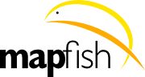

:Author: Eric Lemoine, Bruno Binet
:Version: osgeo-live4.0
:License: Creative Commons Attribution-ShareAlike 3.0 Unported  (CC BY-SA 3.0)

********************************************************************************
Начало работы с MapFish
********************************************************************************

MapFish — это полнофункциональный и гибкий фреймворк для создания
картографических Web-приложений, отличающийся высокой
производительностью и качеством разработки.

Данное "введение" содержит описание следующих операций:

* запуск простейшего приложения на базе MapFish, установленного на Live DVD;
* установка MapFish;
* создание приложения на базе MapFish.

Запуск простейшего приложения
================================================================================

Для запуска простейшего приложения щёлкните мышью по ссылке MapFish,
расположенной на рабочем столе. После чего откроется вкладка FireFox, в которой
будет загружено приложение, развёрнутое при помощи веб-сервера Apache
на базе модуля mod_wsgi (http://localhost/mapfishsample/osgeolive/wsgi/).

Данное демонстрационное приложение содержит следующие возможности:
поддержка запросов, редактирование, поиск и печать.
Чтобы просмотреть REST протокол MapFish в действии, откройте Firebug
и изучите запросы/ответы, которыми обменивается браузер и Web-сервис
на базе MapFish.

Установка MapFish
================================================================================

Для установки MapFish скачайте скрипт установки и выполните следующие команды в
терминале (командной строке)::

    $ wget http://www.mapfish.org/downloads/go-mapfish-framework-2.2.py

    $ python go-mapfish-framework-2.2.py --no-site-packages venv

Последняя команда создаёт виртуальное окружение Python в каталоге ``venv``,
скачивает MapFish с зависимостями и устанавливает их в виртуальное
окружение.

Для активации виртуального окружения и проверки корректности установки
MapFish выполните следующие команды::

    $ source venv/bin/activate

    (venv) $ paster create --list-templates

В результате выполнения последней команды в консоли должен появиться следующий список::

    Available templates:
    basic_package:   A basic setuptools-enabled package
    mapfish:         MapFish application template
    mapfish_client:  MapFish client plugin template
    paste_deploy:    A web application deployed through paste.deploy
    pylons:          Pylons application template
    pylons_minimal:  Pylons minimal application template

Хорошо, фреймворк успешно установлен. Теперь можно переходить
к следующему разделу, в котором будет рассмотрено создание нового
приложения.

Создание приложения на базе MapFish
================================================================================

После активации виртуального окружения Python можно сгенерировать своё
первое MapFish-приложение. Назовём его, например, MyMapFishApp::

    (venv) $ paster create -t mapfish MyMapFishApp sqlalchemy=true

Затем следует установить JavaScript библиотеки в приложение::

    (venv) $ paster create --no-interactive -t mapfish_client MyMapFishApp

Выше приведённые команды создадут MapFish-приложение в каталоге
``MyMapFishApp``.

После этого приложение может быть запущено при помощи следующих
команд::

    (venv) $ cd MyMapFishApp
    (venv) $ paster serve development.ini

В браузере перейдите по адресу http://localhost:5000 - откроется
минимальное приложение, включающее карту с двумя `OSM слоями
<http://www.openstreetmap.org/>`_, панель инструментов, расположенную
над картой и дерево слоёв.

Это далеко не всё, на что способен MapFish. В частности, с его помощью
можно создавать RESTFul Web-сервисы, позволяющие создавать, получать,
обновлять и удалять объекты. Посетите страницу
http://mapfish.org/doc/2.2/quickstart.html, чтобы узнать, как
создавать такие Web-сервисы, и http://mapfish.org, чтобы узнать больше о
MapFish.
