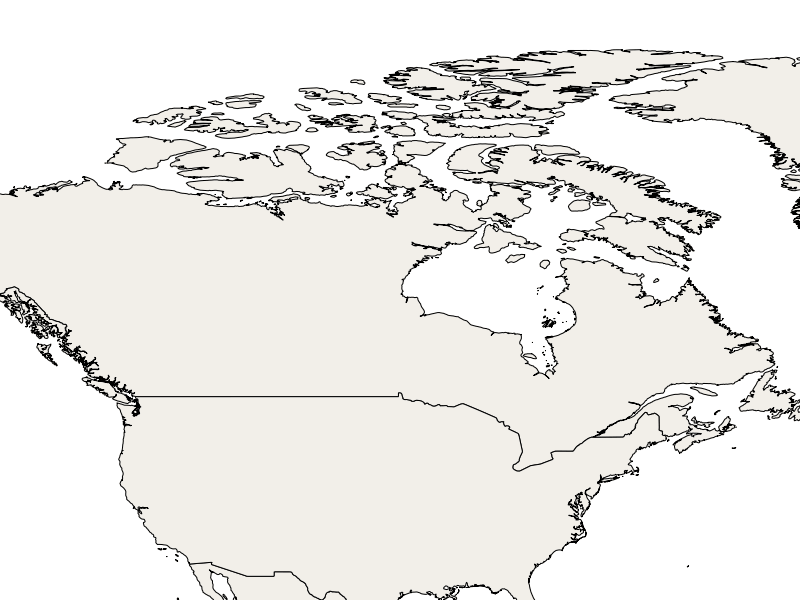
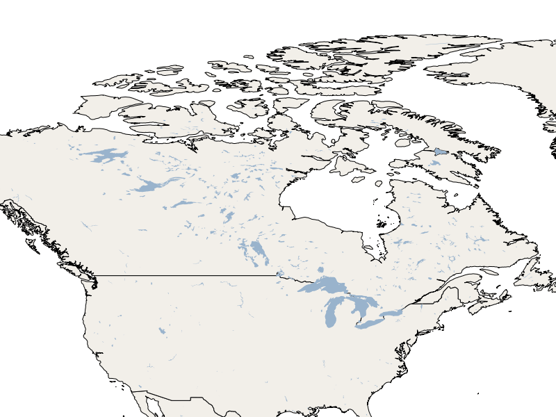
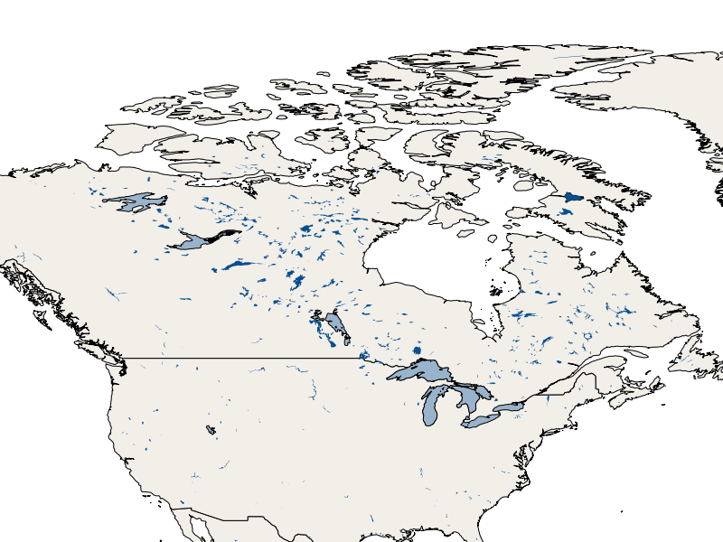

:Author: OSGeo-Live
:Author: Alan Boudreault, Steve Lime
:Translator: David Mateos
:Version: osgeo-live5.5
:License: Creative Commons Attribution-ShareAlike 3.0 Unported  (CC BY-SA 3.0)

.. image:: ../../images/project_logos/logo-mapserver-new.png
  :scale: 65 %
  :alt: Project logo
  :align: right
  :target: http://mapserver.org/

.. image:: ../../images/logos/OSGeo_project.png
  :scale: 100 %
  :alt: OSGeo Project
  :align: right
  :target: http://www.osgeo.org

================================================================================
Введение в MapServer
================================================================================

MapServer — это серверное приложение `с открытым исходным кодом <http://www.opensource.org>`_, 
позволяющее публиковать векторные и растровые данные согласно
`стандартам OGC <http://www.opengeospatial.org/standards>`_, таким, как
`WMS <http://www.opengeospatial.org/standards/wms>`_ и `WFS
<http://www.opengeospatial.org/standards/wfs>`_.

Данное "введение" содержит описание следующих операций:

  * :ref:`mapserver-quickstart-configure-with-mapfile-en`
  * :ref:`mapserver-quickstart-wms-request-en`
  * :ref:`mapserver-quickstart-add-new-layer-en`
  * :ref:`mapserver-quickstart-styling-a-layer-en`

.. _mapserver-quickstart-configure-with-mapfile-en:

Конфигурирование MapServer с использованием map-файла
=====================================================

.. note:: **Что я узнаю ?** В данном разделе вы узнаете, что такое map-файл и научитесь использовать его для публикации shape-файлов в качестве WMS-сервиса.

Что такое map-файл ?
--------------------------------------------------------------------------------

`map-файл <http://mapserver.org/mapfile/index.html>`_ — это основной механизм
конфигурирования MapServer, с его помощью настраивается список доступных
на сервере слоёв, а также их визуальное оформление (цвет, символика,
подписи и т.д.). 

Создание своего первого map-файла
--------------------------------------------------------------------------------

#. Откройте любой текстовый редактор (по умолчанию на данном Live DVD используется Mousepad: :menuselection:`Applications --> Accessories --> Mousepad`).
#. Создайте файл "mapserver_quickstart.map" в своей домашней директории :file:`/home/user/mapserver_quickstart.map` 

Вставьте в него следующий фрагмент::

 MAP
   NAME "MAPSERVER QUICKSTART"
   EXTENT -137 29 -53 88
   UNITS DD
   SHAPEPATH "/home/user/data/natural_earth/"
   SIZE 800 600

   IMAGETYPE PNG24

   PROJECTION
     "init=epsg:4326"
   END

   WEB
     METADATA
       ows_enable_request "*"
     END
   END

   LAYER
     NAME "Admin Countries"
     STATUS ON
     TYPE POLYGON
     DATA "10m_admin_0_countries"
     CLASS
       STYLE
         COLOR 246 241 223
         OUTLINECOLOR 0 0 0
       END
     END
   END

 END

.. note::

   В данном примере используется набор данных Natural Earth, который присутствует на Live DVD в файле: :file:`~/data/natural_earth` (сокращённый вариант для :file:`/usr/local/share/data/natural_earth`)

Каждый раздел в map-файле начинается с его имени (например, **MAP**)
и заканчивается ключевым словом **END**. Содержимое map-файла представляет собой
глобальный раздел **MAP**, внутри которого располагаются другие разделы, в 
частности, разделы **LAYER**, содержащие описание опубликованных слоёв.
В нашем примере мы определили только один слой.

Давайте взглянём на некоторые разделы и их свойства, определённые в нашем map-файле:
 * EXTENT : ограничивающий прямоугольник, используемый в данной конфигурации.
 * LAYER : порядок доступа и свойства отображения конкретного слоя. Позже будет добавлен ещё один слой.
 * SHAPEPATH : путь до каталога, в котором расположены файловые источники данных (например, shape-файлы или растровые изображения).

Если взглянуть поближе на раздел **LAYER** нашего map-файла, то можно увидеть, что
внутри него содержатся некоторые дополнительные свойства, среди которых:
* STATUS : определяет, должен ли слой быть отрисован (*ON*) или нет (*OFF*), или отрисовывать слой всегда (*DEFAULT*).
* TYPE : геометрический тип, который должен использовать MapServer при отрисовке данных.  Согласно нашему map-файлу, данные будут отрисованы как *полигоны*.
* DATA : имя источника данных, используемый для данного слоя. В нашем случае это имя shape-файла.
* CLASS : определяет оформление слоя (стиль).  Данный раздел будет подробнее рассмотрен чуть позже.

.. note:: Полный список разделов map-файла и их свойств доступен на странице `официальной документации <http://mapserver.org/mapfile/index.html>`_.

.. _mapserver-quickstart-wms-request-en:

Отрисовка данных с использованием командной строки MapServer
============================================================

Хотя MapServer предназначен для работы в Web-приложениях, он также
предоставляет инструмент отрисовки изображений посредством командной строки.
Это может быть удобно, например, при отладке.

Откройте консоль (Applications/Accessories/Terminal Emulator) и наберите

 shp2img -m mapserver_quickstart.map -o mymap.png

Если приведённая команда отработает успешно, то вы получите отрендеренное изображение
ваших данных в виде файла :file:`/home/user/mymap.png`.

Отрисовка данных с использованием WMS-запроса **GetMap**
========================================================

.. note:: **Что я узнаю?** Вы узнаете, как использовать MapServer для отрисовки данных в ответ на WMS-запрос GetMap.

Откройте браузер и введите следующий URL::

 http://localhost/cgi-bin/mapserv?map=/home/user/mapserver_quickstart.map&SERVICE=WMS&REQUEST=Getmap&VERSION=1.1.1&LAYERS=Admin%20Countries&SRS=EPSG:4326&BBOX=-137,29,-53,88&FORMAT=PNG&WIDTH=800&HEIGHT=600

Что значит эта ссылка?  Это ни что иное, как `Web Map Service (WMS) <http://www.opengeospatial.org/standards/wms>`_ — 
**GetMap** запрос, который сообщает приложению MapServer, что следует используя
указанный map-файл, отрисовать указанные слои с дополнительными
параметрами, такими, как размер изображения, пространственный охват, проекция и т.д., 
в PNG-изображение. Будут отрисованы все слои, указанные в списке "*&LAYERS=...*"
и имеющие *STATUS ON* в map-файле, а также все слои, имеющие *STATUS DEFAULT*.
Результат будет выглядеть следующим образом :

.. note:: Все параметры запроса определяются в стандарте WMS, за исключением "*?map=/home/user/mapserver_quickstart.map*", который является специфичным для MapServer.

.. _mapserver-quickstart-add-new-layer-en:

Добавление нового слоя в map-файл
=================================

.. note:: **Что я узнаю?** Вы узнаете, как добавлять определение нового слоя в существующий map-файл.

Добавим новый слой в наш map-файл. Перед последним ключевым словом *END*
вставим следующий фрагмент::

 LAYER
   NAME "Lakes"
   STATUS ON
   TYPE POLYGON
   DATA "10m_lakes"
   CLASS
     STYLE
       COLOR 153 179 204
     END
   END
  END

Теперь в нашем map-файле определено 2 слоя. Обратите внимание, что
значение свойства "STATUS" установлено в значение "ON" — это означает, что
если явно не передать имя этого слоя в запросе, то он не будет отрисован.

Отредактируйте наш предыдущий WMS-запрос **GetMap**, добавив в запрос новый
слой "Lakes".  Для этого нужно просто дописать имя слоя в список
"LAYERS"::

 http://localhost/cgi-bin/mapserv?map=/home/user/mapserver_quickstart.map&SERVICE=WMS&REQUEST=Getmap&VERSION=1.1.1&LAYERS=Admin%20Countries,Lakes&SRS=EPSG:4326&BBOX=-137,29,-53,88&FORMAT=PNG&WIDTH=800&HEIGHT=600

Полученное изображение будет выглядеть, как и в предыдущем
случае, за исключением того, что в него будет добавлен новый слой озёр:

.. _mapserver-quickstart-styling-a-layer-en:

Настройка символики слоя
========================

.. note:: **Что я узнаю ?** Будет рассмотрен пример настройки символики слоя в зависимости от значений того или иного атрибутивного поля.

Внутри каждого раздела LAYER может содержаться произвольное количество
вложенных разделов CLASS. Данный раздел отвечает за оформление, используемое
для отрисовки пространственных данных, указанных в свойстве DATA. Например, если
посмотреть на файл "10m_lakes", используя утилиту `ogrinfo <http://www.gdal.org/ogrinfo.html>`_,
то можно увидеть, что данный файл содержит как геометрическую, так и атрибутивную
составляющие.  Используя раздел CLASS, можно отрисовать объекты, имеющие
определённые значения того или иного атрибута, уникальным стилем.

В нашем случае файл "10m_lakes" содержит атрибут *ScaleRank*, который отражает
размер озера.  Мы можем использовать его для того, чтобы отрисовывать озёра с
разным значением этого параметра разным стилем. Для этого внутри раздела
LAYER добавим ещё один раздел CLASS перед уже существующим::

  LAYER
   NAME "Lakes"
   STATUS DEFAULT
   TYPE POLYGON
   DATA "10m_lakes"
   CLASSITEM "ScaleRank"
   CLASS
     EXPRESSION /0|1/
     STYLE
       COLOR 153 179 204
       OUTLINECOLOR 0 0 0
     END
   END
   CLASS
     STYLE
       COLOR 153 179 204
     END
   END
  END

Чего мы добились?  Теперь все объекты, имеющие значение атрибута
"ScaleRank" "0" или "1", будут отрисованы с чёрной обводкой.
Разделы CLASS при отрисовке каждого объекта всегда считываются сверху вниз.
Когда объект удовлетворяет условию, указанному в свойстве "EXPRESSION",
определённому внутри класса, то этот класс используется для его отрисовки.
Если объект не удовлетворяет условию, определённому в классе,
то производится проверка на соответствие условию следующего класса
и т.д. Если объект не удовлетворяет ни одному условию, то он не будет отрисован.
Для установки некоторого стиля по умолчанию последним в списке разделов
CLASS включают определение класса, не содержащего свойства EXPRESSION. Свойство
"CLASSITEM" сообщает MapServer значение какого атрибута следует использовать
для проверки выражения EXPRESSION, определённого внутри класса.

В результате этого дополнения большие озёра на нашей карте будут
отрисованы с чёрной обводкой:

.. note:: Узнайте больше об `EXPRESSIONS <http://mapserver.org/mapfile/expressions.html>`_ в документации MapServer.

Что дальше?
===========

Это простой пример, но с использованием MapServer вы можете сделать гораздо
больше.  Сайт MapServer содержит множество полезной информации, которая поможет
вам начать работу с этим программным продуктом. Для облегчения включения в работу
с MapServer рекомендуем выполнить следующие шаги:

* Прочитайте `Introduction to MapServer <http://mapserver.org/introduction.html#introduction>`_.
* Просмотрите `MapServer Tutorial <http://www.mapserver.org/tutorial/index.html>`_, который содержит примеры map-файлов.
* Изучите `OGC Support and Configuration <http://www.mapserver.org/ogc/index.html>`_ с целью узнать больше о поддержке стандартов OGC в MapServer (WMS, WFS, SLD, WFS Filter Encoding, WCS, SOS, и т.д.).
* Готовы к использованию MapServer?  Тогда присоединяйтесь к сообществу посредством `списка рассылки <http://www.mapserver.org/community/lists.html>`_ для обмена идеями и обсуждения потенциальных усовершенствований проекта. Также здесь можно задать интересующие вас вопросы.
