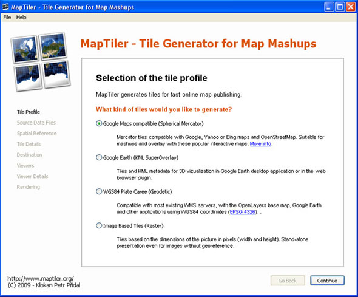
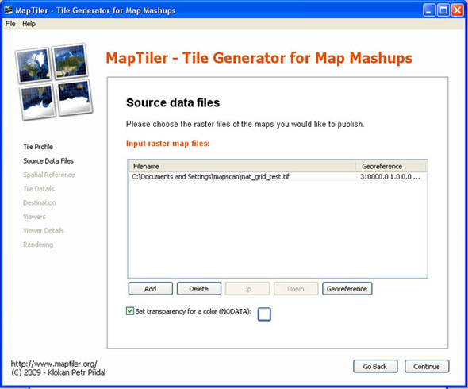
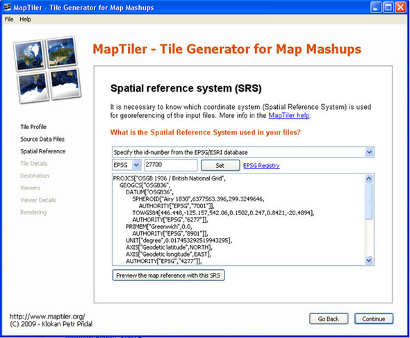
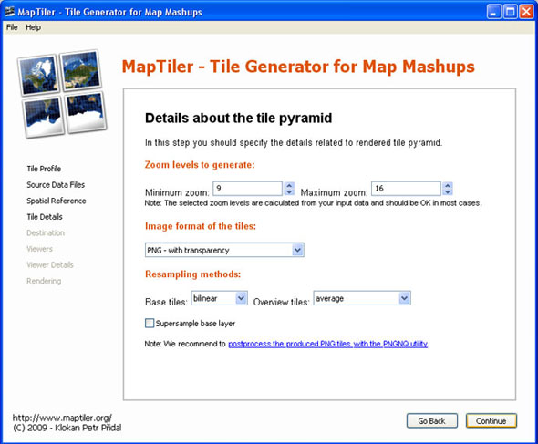
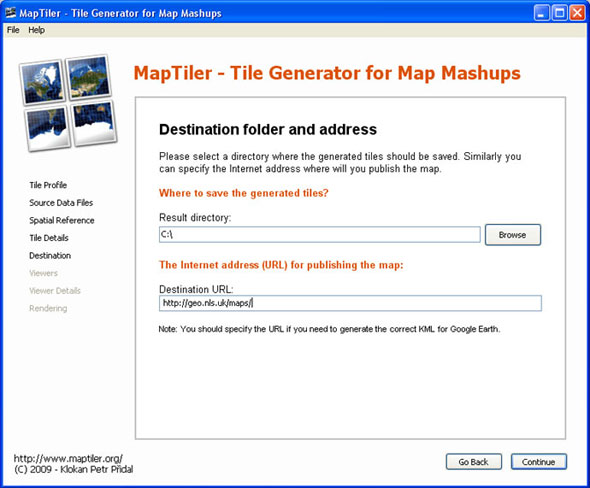
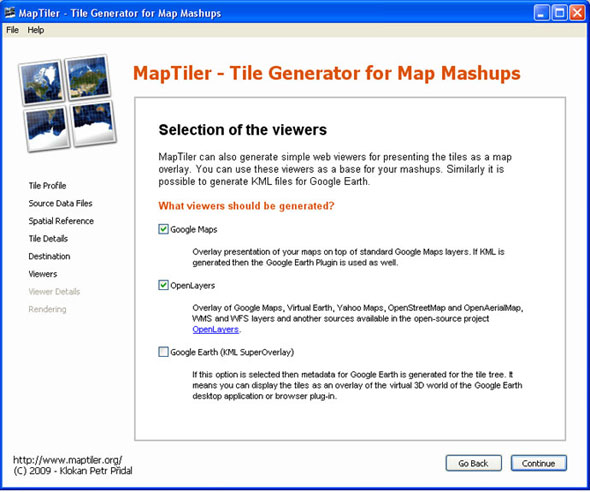
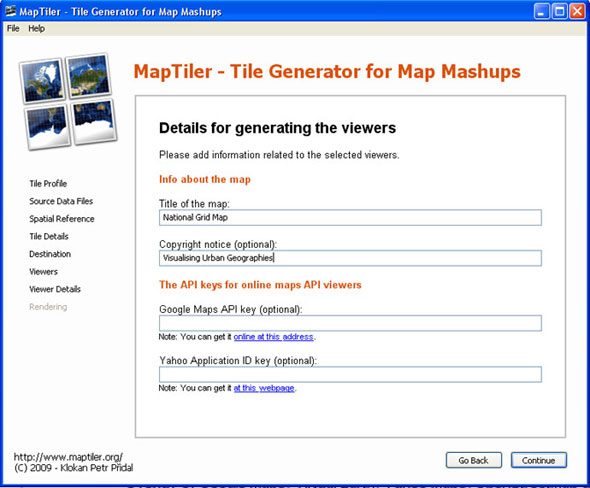

:Author: OSGeo-Live
:Author: Petr Pridal
:Author: Christopher Fleet
:Version: osgeo-live4.5
:License: Creative Commons Attribution-ShareAlike 3.0 Unported  (CC BY-SA 3.0)

.. image:: ../../images/project_logos/logo-maptiler.png
  :scale: 100 %
  :alt: project logo
  :align: right

Начало работы с MapTiler
~~~~~~~~~~~~~~~~~~~~~~~~~~~~~~~~~~~~~~~~~~~~~~~~~~~~~~~~~~~~~~~~~~~~~~~~~~~~~~~~

`MapTiler <http://www.maptiler.org/>`_ предоставляет простой способ создания
тайлов на базе геопривязанных растровых изображений. Созданные тайлы в
дальнейшем могут быть использованы в различных Web-приложениях. Структура
хранения тайлов соответствует спецификации `Tile Map Service (TMS)
<http://wiki.osgeo.org/wiki/Tile_Map_Service_Specification>`_, разработанной
`Open Source Geospatial Foundation (OSGeo's) <http://www.osgeo.org/>`_.

* **Входные данные**: Любой геопривязанный растр, например, TIFF или JPEG.
* **Выходные данные**: Набор директорий, содержащих тайлы, которые в дальнейшем могут быть скопированы на Web-сервер для использования в различных приложения. Примером может служить формирование отдельного слоя в клиентском приложении, `пример <http://examples.maptiler.org/>`_.
* **Сильные стороны**: MapTiler — это открытое программное обеспечение, простота работы с которым обеспечивается наличием специального Мастера, позволяющего с использованием графического интерфейса задавать необходимые настройки.

Поскольку `Google Maps <http://maps.google.com/>`_ , 
`Microsoft Bing <http://maps.bing.com>`_,  `Yahoo Maps <http://maps.yahoo.com/>`_
и другие публичные картографические Web-сервисы, включая `OpenStreetMap <http://www.openstreetmap.org/>`_, 
используют одну и ту же проекцию Меркатора (но разные способы адресации), то тайлы,
применяемые в них, взаимозаменяемы. На странице
`Tiles à la Google Maps <http://www.maptiler.org/google-maps-coordinates-tile-bounds-projection/>`_
наглядно представлено сравнение различных способов адресации одних и тех
же тайлов. MapTiler также поддерживает возможность создания тайлов
в проекции Меркатора. Это позволяет легко использовать тайлы, подготовленные
с его помощью, в различных Wеб-приложениях, объединяющих данные из
нескольких источников в один интегрированный инструмент ("мэшап").

Запуск MapTiler
--------------------------------------------------------------------------------

1. `Загрузите MapTiler <http://help.maptiler.org/betatest/>`_ на свой компьютер
или запустите его непосредственно с LiveDVD.

2. Выберите профиль тайлов **Tile Profile**. Отметьте *Google Maps Compatible
(Spherical Mercator)* для стандартной публикации в Web. Отметьте *Google Earth
(KML SuperOverlay)*, если вы хотите создать KML-файл для использования в
Google Earth. Нажмите *Continue*.

3. Выберите источник данных **Source Data Files** и откройте растр, который вы хотите
разбить на тайлы. Здесь же можно задать цвет участков NODATA, который будет отображаться
прозрачным в выходных тайлах. Нажмите *Continue*.

4. Задайте систему координат **Spatial Reference System / Coordinate System**
входного изображения. Выберите пункт **Specify the id-number from the EPSG/ESRI database**,
укажите необходимый идентификатор и нажмите **Set**. В случае необходимости
(например, если ваш растр в системе координат Великобритании), то описание
проекции должно включать параметр `EPSG:27700 with TOWGS84 <http://help.maptiler.org/coordinates/europe/uk>`_.
Нажмите *Continue*.

5. Укажите настройки масштабных уровней **Tile Pyramid**. Настроек по умолчанию зачастую
бывает достаточно. Нажмите *Continue*.

6. В разделе **Destination folder and Addresses /
URLs** выберите выходную директорию и опционально
URL для публикации. Нажмите *Continue*.

7. Задайте те Web-клиенты, приложения с использованием которых будут созданы для
наглядного просмотра сгенерированных тайлов **Viewers that should be generated**.
По умолчанию будут сгенерированы файлы *googlemaps.html* и *openlayers.html*.
Для создания "KML SuperOverlay" для Google Earth отметьте соответствующий пункт.
Нажмите *Continue*.

8. Определите настройки для указанных в предыдущем пункте Web-клиентов
**Details for generating the Viewers**, такие, как заголовок страницы,
отметка о копирайте и API-ключи. Если данная информация не известна на
текущем этапе, она может быть добавлена позже вручную путём редактирования
файлов *googlemaps.html / openlayers.html*. Нажмите *Continue*.

9. Нажмите **Render** для запуска процесса создания
тайлов. По окончании данного процесса MapTiler предоставит ссылку на
получившийся набор тайлов. Откройте *googlemaps.html* или *openlayers.html*
в Web-браузере для просмотра результата на фоне различных базовых слоёв, предоставляемых
публичными картографическими Web-сервисами. Для публикации полученных данных
в Сеть просто скопируйте каталог с тайлами и все подкаталоги на Web-сервер
и при необходимости отредактируйте файлы googlemaps.html или openlayers.html.
