:Author: Richard R. Schneider Dept. Biological Sciences University of Alberta Edmonton, Alberta, Canada 
:Author: Paul Meems, TopX Geo-ICT The Netherlands (RST conversion)
:Product: MapWindow GIS 4.8.6
:Version: osgeo-live5.5draft
:License: Creative Commons Attribution-ShareAlike 3.0 Unported  (CC BY-SA 3.0)
:PDF: http://www.mapwindow.org/apps/wiki/lib/exe/fetch.php?media=quick_guide_to_mapwindows_4.8.6.pdf
:Editor: http://rst.ninjs.org/
:Copyright: 2011 Richard R. Schneider

.. image:: ../../images/project_logos/logo-MapWindow.png
  :alt: MapWindow GIS
  :align: right
  :width: 220
  :height: 38
  :target: http://www.mapwindow.org
  
===============
1. Введение
===============
Это краткое руководство представляет собой введение в использование ГИС MapWindow v4.8.6 и содержит инструкции о том, как выполнить набор базовых ГИС-задач. Цель этого документа заключается в предоставлении простого пошагового руководства для пользователей, которые заинтересованы, главным образом, в отображении данных ГИС, проведении простых запросов и экспорта высококачественных карт для использования в публикациях и презентациях. Следует отметить, что не вся функциональность MapWindow отражена в данном руководстве. В-частности, руководство распространяется только на основную программу, а не на модули (за исключением редактора шейп-файлов).

Настольное программное обеспечение MapWindow свободно доступно для скачивания, как единый готовый к установке исполняемый файл с веб-сайта MapWindow: www.mapwindow.org. MapWindow и является **native Windows** приложением, которое требует установки Microsoft. NET Framework. Приложение запускается на XP, Vista и Windows 7 и прекрасно работает на 64-разрядных машинах. Программа довольно удобна в использовании и порог вхождения новых пользователей невысок. За исключением нескольких вещей, программа требует пользовательского опыта, который соответствует опыту работы в ArcMap или немного превышает его.

Настольное программное обеспечение MapWindow, которое описано в данном руководстве, является лишь одной частью большого проекта с открытым исходным кодом. Основная программа также доступна в виде ActiveX-компонента, позволяющего программистам разрабатывать собственные ГИС-приложения. Продвинутые пользователи также могут менять и расширять настольное приложение с учетом индивидуальных потребностей. Более подробную информацию о проекте MapWindow и его различных аспектах можно получить на веб-сайте MapWindow.

MapWindow находится в постоянном развитии, поэтому его поведение может отличаться от описанного в данном руководстве, в случае использования более новой версии программы. Веб-руководство для пользователей находится в стадии разработки на веб-сайте MapWindow, и вы можете заглянуть в него если столкнетесь с проблемами или захотите получить информацию о функциях, которые здесь не рассматриваются.

===================
2. Начало работы

--------------
2.1 Проекты
--------------
Файл проекта содержит информацию о различных слоях, надписях, цветах и стилях, определённых для вашей карты. При запуске MapWindow формируется новый проект. Вы можете также начать новый проект в любое время, нажав на кнопку **New** на панели инструментов. Любые изменения, которые вы вносите в проект, не сохраняются, пока вы не нажмете кнопку **Save** на панели инструментов или не ответите утвердительно на запрос о сохранении при выходе из программы. При нажатии на кнопку **Open** на панели инструментов или выборе подменю **Recent Projects** из меню **File** главного меню, откроется доступ к предыдущим проектам. Вы также можете дважды щёлкнуть на имени файла проекта в проводнике Windows, в результате проект откроется в новом экземпляре MapWindow. Файлы проекта имеют расширение .mwprj.

Кроме сохранения слоёв и связанных с ними символикой, файлы проекта хранят дополнительные настройки, такие, как единицы измерения карты, проекции и т.п. Доступ к ним можно получить, выбрав из меню **File** подменю **Settings**. Пользователям обычно не нужно вносить изменения в эти настройки, поэтому они не будут обсуждаться здесь.

--------------
2.2 Модули
--------------
Инсталлятор устанавливает ряд основных модулей (в т.ч. **Shapefile Editor**), которые обеспечивают дополнительную функциональность к базовой программе. Дополнительные модули доступны на веб-сайте MapWindow. Чтобы установить новый модуль необходимо скачать zip файл и распаковать его в папку модулей расширения MapWindow, как правило в C:\\Program Files\\MapWindow\\Plugins. Иногда модуль является одним .dll, но модуль может быть и папкой, содержащей несколько файлов. В этом случае вся папка перемещается в \\MapWindow\\Plugins. 

Прежде чем вы сможете использовать любой из модулей, они должны быть активированы в MapWindow. Для этого выберите меню **Plug-ins** из главного меню и выберите модули, которые хотите активировать. Они будут оставаться активированным, даже в новых проектах, пока вы не деактивируете их. После того, как какой-либо модуль активирован, появятся новые кнопки на панели инструментов или пункты в меню.

----------------------
2.3 Добавление слоёв
----------------------
Карты, создаваемые в ГИС, обычно состоят из нескольких "слоёв" геоданных. Слои могут быть добавлены как путём перетаскивания файлов из проводника Windows в окно карты, так и нажатием кнопки **Add** на панели инструментов. Каждый добавляемый слой появляется в окне легенды (используйте **View -> Panels -> Show Legend**, если окно скрыто). Двойной клик на слое в легенде или нажатие кнопки **Properties** на панели инструментов открывает диалог **Layer properties**, который имеет несколько вкладок для внесения изменений в свойства слоёв. Например, чтобы изменить имя, отображаемое в легенде, выберите вкладку **General** и измените текст в поле **Name**. Другие свойства будут рассмотрены в последующих разделах. Чтобы удалить слой из карты, нажмите кнопку **Remove** на панели инструментов. Кнопка **Clear** удаляет все слои карты.

Цветные значки, отображаемые в легенде, иллюстрируют тип данных в слоях (полигон, линия или точка), а также текущую символику. Порядок слоёв в легенде определяет порядок отображения на карте: слои, которые находятся выше в списке слоёв, перекрывают слои, которые расположены ниже. Если кажется, что слой отсутствует, возможно, он полностью перекрыт другими слоями. Чтобы изменить порядок слоёв, просто выделите его и перетащите в нужное место. Флажок (checkbox) рядом с каждой записью в легенде позволяет переключить отображение отдельных слоёв карты.

MapWindow может отображать различные виды геоданных, в том числе: векторные (полигоны, линии и точки), растровые (прямоугольные сетки данных) и изображения. Поддерживается множество различных форматов файлов, в том числе .shp, .asc, .aux, .bgd, .bil, .dem, dt1, .hdr, .img, .jpg, .sid, .std, .tif и другие. Шейп-файлы ESRI (.shp) представляют собой векторный формат, используемый MapWindow при создании новых векторных файлов. При создании растров используется форматы GeoTIFF и .bgd.

Чтобы добавить масштабную линейку, необходимо открыть меню **View** и выбрать **Show Floating Scale Bar**. 

-----------------
2.4 Проекции
-----------------
Проекция представляет собой математическое преобразование, которое используется для отображения трёхмерной поверхности Земли на двумерный экран компьютера. Имеются различные проекции, каждая имеет свои положительные и отрицательные моменты, соответствующие подходам к их использованию. Подробное обсуждение проекций выходит за рамки данного руководства, но несколько основных моментов должны быть охвачены. Основная проблема заключается в том, что различные слои в вашем проекте должны использовать одну проекцию для корректного послойного отображения. В MapWindow проекция слоя определяется в дополнительном файле с расширением *.prj. Это типовой формат для описания проекции, который также используется, например, в ArcMap. Проекцию слоя можно посмотреть во вкладе **General** диалога **Layer Properties**, который может быть вызван двойным щелчком в легенде по имени слоя или кнопкой **Properties** на панели инструментов.

Первая карта, добавляемая в проект, определяет проекцию для всего проекта. Каждый последующий слой должен иметь одинаковую проекцию, иначе MapWindow будет отображать диалоговое окно с предупреждением. При помощи этого диалога можно перепроецировать входящий слой или ничего не делать (в этом случае слои могут быть отображены неправильно). Отметим, что преобразование проекции слоя включает в себя больше, чем просто изменение содержания prj-файла, меняется также и геометрия. Поэтому, лучше всего осуществлять перепроецирование в новый файл, а не перезаписывать старый. Если у слоя отсутствует prj-файл, то необходимо определить проекцию самостоятельно. Это может быть сделано в MapWindow с помощью **Toolbox**, но описание этого процесса выходит за рамки данного руководства.

----------------------------
2.5 Базовые функции панели инструментов
----------------------------
Набор основных картографических функции может быть доступен через кнопки на панели инструментов. Их использование является интуитивно понятным, поэтому здесь приводится только краткое описание. Обратите внимание, что некоторые функции требуют, чтобы пользователь сначала выбрал целевой слой при помощи выделения в легенде. Вы можете перемещать панели инструментов (нажмите и перетащите до пунктирной линии) и включать/выключать подписи с помощью правой кнопки мыши (ПКМ).

================================================================================  =================================================================
================================================================================  =================================================================
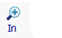
      Увеличить: либо щёлкните в нужную область, либо нарисуйте охватывающий прямоугольник. Увеличение и уменьшение также может быть сделано с помощью колеса прокрутки мыши.
.. image:: ../../images/screenshots/800x600/mapwindow-toolbar-zoomout.png         Уменьшить.
.. image:: ../../images/screenshots/800x600/mapwindow-toolbar-zoomfullextent.png  Масштабировать до охвата всех видимых слоёв.
.. image:: ../../images/screenshots/800x600/mapwindow-toolbar-zoomselected.png    Масштабировать для выбранных объектов целевого слоя.
.. image:: ../../images/screenshots/800x600/mapwindow-toolbar-zoomprevious.png    Перейти к списку предыдущих видов карты (охватов).
.. image:: ../../images/screenshots/800x600/mapwindow-toolbar-zoomnext.png        Перейти к списку последующих видов карты (охватов).
.. image:: ../../images/screenshots/800x600/mapwindow-toolbar-zoomlayer.png       Перейти к охвату целевого слоя.
.. image:: ../../images/screenshots/800x600/mapwindow-toolbar-pan.png             Щёлкните и перетащите карту.
.. image:: ../../images/screenshots/800x600/mapwindow-toolbar-select.png          Выбор объектов целевого слоя. Для выбора нескольких объектов удерживайте клавишу Ctrl или нарисуйте охватывающий прямоугольник. См. раздел 4.2 для получения дополнительной информации по выборкам.
.. image:: ../../images/screenshots/800x600/mapwindow-toolbar-measure.png         Открывает диалог для отображения информации о периметре и площади выбранных объектов из целевого слоя, или объектов, нарисованных при помощи мыши.
.. image:: ../../images/screenshots/800x600/mapwindow-toolbar-identify.png        Нажмите для просмотра атрибутов объектов целевого слоя.
================================================================================  =================================================================

==============================
3. Создание карт для экспорта
==============================
--------------------------------
3.1 Настройка отображения: векторные данные
--------------------------------
Когда вы впервые добавляете слой, все объекты получают одинаковый цвет заливки и контура. MapWindow имеет два способа для настройки символики (цветовая схема, обводка, стили и т.д.). Одним из них является диалог **Layer Properties**, который можно получить, дважды щёлкнув на слое в легенде.

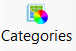

Другим способом является кнопка **Categories** панели инструментов. Оба способа работают одинаково. Ниже будет описана второй способ (кнопка **Categories**).

+++++++++++++++++++++++++
3.1.1 Уникальные значения
+++++++++++++++++++++++++

Если ваш слой состоит из объектов, которые представляют собой различные сущности, скажем стада оленей, то действуйте следующим образом. Нажмите кнопку **Categories** на панели инструментов, чтобы открыть диалог **Symbology**. При первом запуске диалог будет пуст, указывая, что символика не была определена. Далее нажмите кнопку **Generate Categories** (внизу слева), чтобы вызвать диалог **Category generation**. Следуйте инструкциям ниже, чтобы назначить цвета на основе атрибутов по вашему выбору.

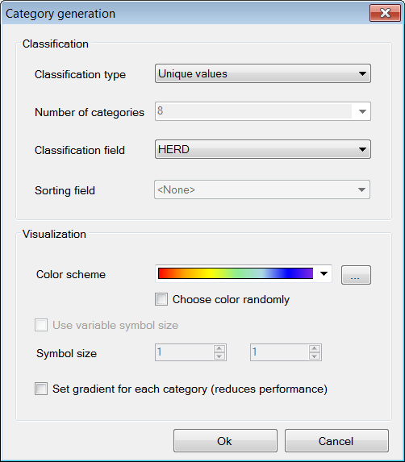

+ В поле **Classification type** выберите **Unique values**
+ В поле **Classification field** выберите атрибут, на основе которого вы хотите назначить различные цвета объектам.
+ **Color scheme** используется для выбора цветовой палитры для объектов. Нажмите на треугольник справа для выбора другой палитры. Кнопка настройки справа в конце может быть использована для редактирования палитры или определения новой.
+ Если в пункт **Choose color randomly** не выбрано **not** , цвета назначаются последовательно слева-направо по всей палитре.
+ Если пункт **Set gradient** выбран, то каждому полигону назначается градиент от тёмного к светлому (*each polygon*). Это эффект уместен, только если полигоны большие.
+ Другие свойства диалога не используются для задания уникальных значений.
+ Нажмите **Ok** для завершения

+++++++++++++++++++++++++
3.1.2 Непрерывные данные
+++++++++++++++++++++++++
Если ваш слой содержит непрерывные данные, скажем, высоту деревьев, то вы должны определить категории, в которую отнести геометрии. Начнём с открытия диалога **Category generation** и выбора области классификации и цветовой схемы, как описано в п.3.1.1. Установим количество категорий в поле **Number of categories**. Затем в списке **Classification type** выберем один из трёх методов для определения категорий: равные промежутки (**Equal intervals**), естественные отсчёты (**Natural breaks**) и квантили (**Quantiles**). Эти опции будут доступны только в том случае, если поле классификации содержит числовые данные (использование уникальных значений (**Unique values**) для текста). Нажмите кнопку **Ok**, чтобы завершить процесс.

Если вы хотите отобразить категории с помощью цветовой шкалы, скажем, от светло-красного для низких значений до тёмно-красного для высоких, то выберите плавную цветовую палитру из списка опций (см. пример ниже). Не отмечайте вариант **Set gradient**, потому что это относится к цветовым градиентам внутри (**within**) полигонов.

Если ваши слой геоданных состоит из линий или точек, то имеет смысл иллюстрировать использование градиентов через размер символов (например, увеличение толщины линии или размера точки), а не цветовой шкалы. Для этого отметьте **Use variable line width**, а затем определите минимальный и максимальный размер символов в полях ниже. Размер символа будет основываться на любом атрибуте, выбранном в **Classification field**.

+++++++++++++++++++++++++++++++++
3.1.3 Настройка отображения
+++++++++++++++++++++++++++++++++

  
После того, как цветовая схема была сформирована, присвоение категорий и цветов появятся в диалоге **Shapefile categories** и в легенде. Дальнейшее редактирование возможно из любого места. Для простого изменения самый быстрый и простой подход — это нажать на цвет, который вы хотите изменить в легенде. Но диалог, который открывается кнопкой **Categories** панели инструментов, имеет несколько вариантов, так что остановимся на нём.

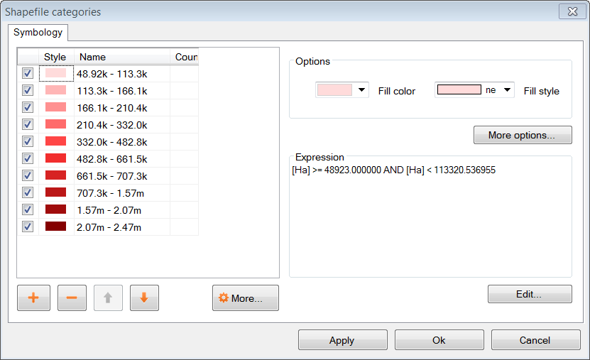

В диалоге **Shapefile categories**  выберите категорию, которую необходимо изменить, нажатием на её имя или на цвет. Затем: 

+ Измените отображение категории, ставя и снимая отметку слева от имени.
+ Измените имя категории, вводя новое значение в колонке **Name** (это изменит только запись в легенде, таблица атрибутов не будет изменена).
+ Измените порядок, в котором отображаются категории в легенде при помощи стрелок вверх и вниз в нижней части диалога.
+ Удалите категорию из списка при помощи кнопки со знаком минус.
+ Установите базовые настройки для цвета заливки и стиля заливки при помощи контролов в верхней правой части диалога.
+ Установите дополнительные настройки, нажав кнопку **More options** или двойным щелчком на категории:
    - Показать/скрыть заливку, обводку и узлы
    - Выберите цвет и прозрачность заливки, обводки или узлов
    - Определите тип заливки
    - Установите ширину и стиль обводки

Сделать верхний слой частично прозрачным — удобный способ отобразить геоданные в нижележащих слоях. 

Если вы работаете с непрерывными данными, то вам может понадобиться ввести опорные точки в категорию. Например, вам нужно отметить все геометрии, которые имеют нулевые значения и уникальные цвета, но отображают большинство данных при помощи плавного градиента. Ни одна из схем классификации в диалоге **Category generation** не сделает это автоматически. Однако, вы можете определить опорные точки для каждой категории вручную при помощи окна **Expression** этого диалога. Окно **Expression** отображает текущие опорные точки в виде выражения для выборки. Изменение опорных точек представляет собой просто ввод новых значений в выражение. По завершению ввода нажмите кнопку **Apply**. Вы должны контролировать самостоятельно, чтобы значения не попадали в промежутки между категориями. 

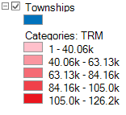
  
Стоит отметить, что некоторые вещи могут привести к неожиданным результатам: при создании категорий оригинальная символика остается по умолчанию в фоне. Для примера, в легенде, показанной справа, градиент красного цвета назначен категории, но оригинальный цвет по умолчанию (синий) все еще там. Обычно это не проблема, потому что все формы отображаются с помощью схемы категорий. Но если вы вручную определили опорные точки и оставляете зазоры между категориями, то геоданные, не попадающие в категорию, будут отображаться цветом по умолчанию. Следует помнить, что по умолчанию символика используется в качестве шаблона для создания категорий. Если вы не хотите, чтобы у вас  присутствовала обводка, то перед созданием категории её следует отключить. Точно так же, если вы хотите, что бы в категориях присутствовала заливка, для начала убедитесь, что она видна по умолчанию. 

---------------------------------
3.2 Настройка отображения: растровые данные
---------------------------------
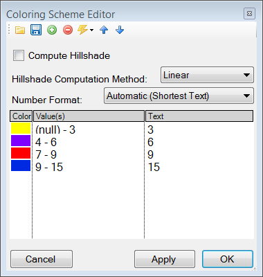

Растровые слои используют иной диалог настройки символики, вызываемый **Legend
 Editor**, который остался от предыдущих версий MapWindow. Для того чтобы открыть диалог **Legend Editor** дважды щёлкните на слое в легенде. Прокрутите до раздела символики диалога и в колонке **Coloring Scheme** нажмите **Edit** для настройки **Coloring Scheme Editor**. 

Кнопки в верхней части диалога имеют схожую функциональность с кнопками в нижней части диалога **Symbology**, описанного в разделе 3.1. Кнопка **Generate categories** открывает мастер (**Wizard**) и принимает форму с желтой молнией. Он имеет схожий набор настроек и работает схожим образом. Настройка **Continuous Ramp** позволяет предварительно выбрать цветовую схему. 

Для смены цвета категории нажмите на неё в **Coloring Scheme Editor**. Не существует настройки для определения обводки ячеек растров. Текст, отображаемый в легенде, может быть изменён при помощи колонки **Text**, а значения фона могут быть изменены вручную при помощи колонки **Value**. Отмывка рельефа не входит в рамки этого руководства. 

Прозрачность устанавливается в **Legend Editor**, в четырёх записях ниже **Coloring Scheme**. Если растр достаточно мелкомасштабный, то прозрачность может быть использована для эффективного объединения информации из растра с другими слоями. Для этого переместите растр в верхнюю часть легенды, назначьте градиент от черного до белого цвета и установите прозрачность до 50%. Независимо от слоя, под растром, он будет оттеняться растром. Например, векторные карты типов экосистем могут быть оттенены на основе высоты: более низкие высоты — более темным цветом, возвышенности — более светлым.

------------------
3.3 Добавление подписей
------------------
Надписи добавляются при помощи вкладки **Labels** диалога **Layer Properties**, который можно открыть двойным щелчком на слое в легенде. Когда вы впервые открываете этот диалог, окно предварительного просмотра надписи будет пустым. Щёлкните на кнопке **Setup** для продолжения (см. картинку на следующей странице). При нажатии на маленькую иконку справа от имени слоя в легенде откроется тот же диалог. Кнопка **Setup** активирует диалог **Label Style**, который открывается по умолчанию для вкладки **Expression**. Первым делом необходимо выбрать атрибут, который содержит значения подписей. Доступные атрибуты перечислены на окне **Fields**. Двойной щелчок на соответствующем атрибуте отображает его в окне **Expression**, показывая, что он выбран. Нажмите **Apply**, и во всплывающем окне будет запрошено, каким именно образом вы хотите нанести надписи. 

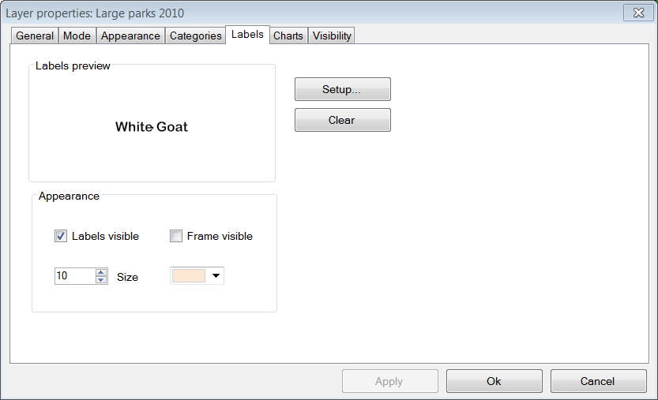

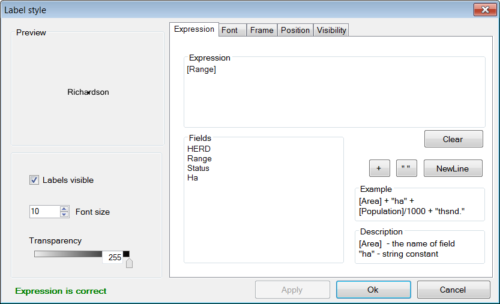

Далее откройте вкладу **Font** и выберите шрифт. Заметьте, что шрифт по умолчанию может быть не установлен, поэтому вы можете ничего не увидеть, до того момента, пока вы не выберите шрифт. Нажмите **Apply**, и надписи появятся на вашей карте. Диалог **Label style** имеет множество настроек для управления надписями, но все они необязательные. Нажмите **Ok** для завершения. 

После того, как надписи сформированы, вы можете изменить текст и стиль отдельных надписей при помощи кнопки  **Categories** панели инструментов. Теперь станет доступна новая вкладка **Labels** (т.е. как только надписи были настроены). Вначале она будет пустой, указывая, что нет категорий, использующих стиль, который вы определили в **Setup**. Для определения уникальных стилей для отдельных категорий вам необходимо сформировать категории надписей аналогично формированию символики (разд. 3.1). Затем надо использовать остальные настройки в диалоге, аналогично диалогу **Shapefile categories** (см. 3.1.3), для изменения внешнего вида отдельных надписей. 

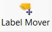
  
Местоположение надписей может быть определено кнопкой **Label Mover** на панели инструментов. 

---------------------------------
3.4 Сохранение настроек отображения в файл
---------------------------------

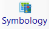

Все настройки символики для слоя могут быть сохранены для новых проектов. Это может быть сделано при помощи диалога **Symbology manager**, который открывается при помощи кнопки **Symbology** на панели инструментов. При первом открытии отображается окно предварительного просмотра с настройками символики, которые вы только что назначили. Нажмите кнопку **Add Current** для сохранения текущей символики. Программа запросит имя для сохранения. Файл сохраняется в ту же папку, что и слой, и получает расширение *.mwsymb*. Если вы внесёте дополнительные изменения в символику слоя, вы можете сохранить новую версию под новым именем. В диалоге также имеются возможности удаления файлов со старой символикой или их переименования. Возможность перетаскивания ("drag-and-drop") файлов символики пока не реализована в MapWindow 4.8.6, но такая возможность планируется в новых версиях. 

Для применения сохранённой символики в новом проекте для начала добавьте слой на карту, а затем откройте диалог **Symbology manager**. Ранее сохранённые файлы символики будут перечислены в окне **Available options**. Выберите один и щёлкните **Apply options**. Необходимо заметить, что когда вы открываете файл символики, содержащий подписи, подписи могут быть невидимы до того момента, пока вы не нажмёте кнопку **Relabel shapefile**, в меню **Layer**. 

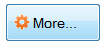

Вы можете сохранить умолчальную символику в файл (.mwleg) и затем применять её к другим слоям, которые имеют схожую структуру атрибутов (т.е., удачно запускаются из пространственной модели). Это можно сделать при помощи **Save Categories** и настройки **Load Categories**, которую можно найти под кнопкой **More** внизу диалога, которая открывается при помощи кнопки **Categories** панели инструментов. 

--------------------
3.5 Экспорт карты
--------------------
++++++++++++++++++++++++++++
3.5.1 Экспорт с низким разрешением
++++++++++++++++++++++++++++
MapWindow предоставляет два способа для экспорта карт низкого разрешения. Первый, используя буфер обмена Windows: откройте меню **View** и выберите **Copy**. Вы можете скопировать карту, легенду, масштабную линейку и стрелку "С-Ю". Во втором случае, те же самые компоненты карты экспортируются в файл. Откройте меню **File** и выберите **Export**. Доступен широкий выбор различных форматов. Для большинства карт наиболее подходит формат PNG. При однородных цветах, обычно присутствующих на карте, формат PNG обеспечивает высокий уровень компрессии с минимальным количеством искажений изображения (т.н. "сжатие без потерь"). Для определения формата для экспорта просто добавьте необходимое расширение к вашему имени файла (например, Map1.png). 

Экспорт с использованием сжатия без потерь является эквивалентом скриншота. Необходимо заметить, что пользование функции **Preview Map** не играет при этом никакой роли. Если имеется много белых полей в главном окне, то экспортированная карта будет иметь много белых полей. Если вы свернули MapWindow (вместо того, чтобы развернуть на полный экран), результат экспорта будет маленьким (обычно 1:1 того, что вы видите на экране). Разрешение карты будет эквивалентно разрешению экрана. Это случай, когда экспортированная карта подходит для PowerPoint, но не подходит для печати. Даже если карта хорошо выглядит в Microsoft Word, качество на бумаге может быть низким. 

++++++++++++++++++++++++++++++++++++++++++
3.5.2 Подготовка качественной карты к публикации
++++++++++++++++++++++++++++++++++++++++++
После формирования карты необходимо ещё несколько шагов для подготовки её к публикации. Например, вы готовите научно-исследовательскую работу или брошюру, и вы хотите добавить карту, которая впишется в одну из колонок текста 7 см в шириной. Карта должна иметь разрешение 300 точек на дюйм (качество печати) и помещаться в отведенные 7см с минимальным белыми полями. Карта также должна включать соответствующую легенду и, возможно, масштабную линейку и стрелку "С-Ю". Диалог **Print Layout**, доступ к которому можно получить через меню **File**, предназначен для облегчения этого процесса, но он скорее подходит для печати, чем для публикации (например, макет не может быть сохранен в виде файла изображения). Кроме того, выходное разрешение не может быть указано (только высокое и низкое), в легенду не могут быть внесены изменения и есть ограниченные возможности для определения рамки. В таком случае наиболее подходящим для подготовке к публикации карты является (в настоящее время) работа в графическом редакторе, таком, как Photoshop или GIMP.

Первым шагом в подготовке вашей карты к экспорту является определение её охвата. Это может быть сделано при помощи отдельного шейп-файла с прямоугольной геометрией, которая задаёт охват вашей карты (см. п. 4.3). Этот слой должен быть включён в проект, но он не должен быть виден. В качестве альтернативы вы можете использовать один из существующих слоёв проекта, но следует помнить, что выходная карта будет сильно обрезана (т.е. без полей). При определении охвата необходимо "поиграть" с настройками, если вы создаёте несколько карт с одинаковым охватом, хотя поля могут быть добавлены в Photoshop, если следующие карты имеют такой же охват.

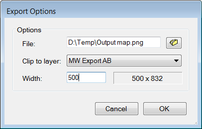

Далее, откройте **Export** в меню **File** и выберите пункт **Georeferenced Map** из списка опций.
Введите имя экспортируемой карты в поле **File**. Не забудьте включить расширение необходимого типа файла (т.е. .png). В поле **Clip to layer** выберите слой в качестве охвата. Если вы не определили охват, выберите слой с наибольшим охватом. В поле **Width** укажите общую ширину карты в пикселах. Значение, которое вы ввели здесь, будет зависеть от назначенного разрешения и выбранной ширины. В дополнение к файлу экспортируемой карты, будет создан файл привязки с расширением .wld.

Экспорт легенды, масштабной линейки и стрелки "С-Ю" выполняется аналогично описанному в предыдущем разделе (3.5.1). К сожалению, в текущей версии MapWindow не существует способа генерации версий этих элементов с высоким разрешением. Обычно экспорт легенды ограниченно применим, потому, что нет никакого способа, чтобы настроить ее (за исключением изменения названия слоев). Поэтому, можно формировать легенду в Photoshop с использованием шаблонов с высоким разрешением, которые сделаны для этих целей. Создание легенды — это просто добавление шаблона в базовую карту с размещением в нужном мест и изменением цвета и текста. Это занимает всего пару минут и даёт гораздо лучший результат, чем работа с легендой в низком разрешении, экспортируемой из MapWindow.

===================
4. Дополнительно
===================
Предупреждение: многие из диалогов и процессов, рассматриваемых в этом разделе, могут привести к изменениям в геоданных. MapWindow отображает несколько предупреждений, чтобы уведомить вас, что такие изменения произойдут, и что функциональность для отмены операций пока не работает.
Учитывая отсутствие хорошей защиты, вы должны действовать осторожно. Например, с помощью Windows Explorer вы можете задать свойство "только для чтения" для важных слоёв карты, либо выбрать для работы копии вместо оригиналов. 

------------------------
4.1 Таблица атрибутов
------------------------

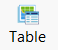

Векторные данные соединяются с таблицей атрибутов, которая содержит информацию о каждом объекте. Например, если объект описывает лес, то таблица атрибутов может включать информацию о типе растительности, возрасте, высоте и т.п. Когда вы используете инструмент идентификации **Identify**  из панели инструментов, вы просматриваете информацию из таблицы атрибутов. Для просмотра всей таблицы атрибутов нажмите кнопку **Table** из панели инструментов, которая откроет **Attribute Table Editor**. Этот диалог позволит вам просматривать данные, а также предоставит доступ к базовой функциональности базы данных. В таблице ниже приведены наиболее полезные функции. 

===================================================================================  ===
**Function**                                                                         **Method**
===================================================================================  ===
Изменить одну запись                                                                 Набирайте поверх созданных данных в ячейке, и она будет изменена
Скопировать и вставить отдельные записи (возможность копировать колонки отсутствует) Щёлкните правой клавишей мыши на ячейке и выберите **Copy** или **Paste**
Добавить новую колонку                                                               **Edit -> Add field**
Удалить колонку                                                                      **Edit -> Remove field**
Переименовать колонку                                                                **Edit -> Rename field**
Отсортировать колонку по возрастанию или убыванию                                    Щёлкните ПКМ на заголовке колонки и выберите **Sort Asc** или **Sort Desc**
Суммарная статистика по колонке                                                      Щёлкните ПКМ на заголовке колонки и выберите **Statistics**
Назначить значения колонке на базе математического выражения                         Щёлкните ПКМ на заголовке колонки и выберите **Calculate values**
Задать атрибуты для постоянного значения (для выбранных объектов)                  Щёлкните ПКМ на заголовке колонки и выберите **Assign values**
Сформировать уникальный идентификатор для каждого объекта                           **Tools -> Generate MWShapeID Field**
===================================================================================  ===

Если в таблицу были внесены изменения, то будет выведено предупреждение при закрытии редактора таблиц. 
**Yes** — записать изменения и **No** — отменить изменения. 

Функция, которая отсутствует в текущей версии MapWindow — это возможность ссылаться на внешние источники данных в таблице атрибутов (как Joins - Relates в ArcMap). Тем не менее, если вам нужно категорировать объекты на базе внешних источников данных, вам нужно физически вести необходимые атрибуты в ваш шейп-файл. Это может быть сделано в Microsoft Access или иной программе для работы с БД. Вы также можете воспользоваться Excel, но если у вас устаревшая версия, то будет необходимо добавить модуль Excel для работы с файлами .dbf (.dbf — формат файлов, который MapWindow и ArcMap используют в таблице атрибутов). Исходные коды для этого модуля располагается по адресу:
http://es.sourceforge.jp/projects/sfnet_exceltodbf/ Объединение может быть сделано с использованием опции **Import External Data** модуля **Swift-D** MapWindow (он довольно медленный). Редактор атрибутов имеет инструмент под названием **Generate MWShape ID field**, который помогает поддерживать правильный порядок в таблице при объединении с внешними данными. 

----------------
4.2 Выборки
----------------
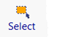

Векторные объекты могут быть выбраны четырьмя способами: 

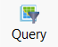

(1) кнопка **Select** панели инструментов, 
(2) кнопка **Query** панели инструментов, 
(3) таблица атрибутов и 
(4) модуль пространственных запросов.
Цвет, используемый для подсветки выделенных фигур, можно изменить во вкладке **Appearance** диалога **Layer Properties**. Для снятия выделения нажмите **Clear selection** в меню **View**. Выделенные объекты могут быть экспортированы в другой шейп-файл при помощи меню **selection** редактора таблицы атрибутов. Выборки полезны для отображения результатов выбора и для ограничения сферы работы многих инструментов геообработки. 

+++++++++++++++++++++++++++++++++
4.2.1 Кнопка выбора
+++++++++++++++++++++++++++++++++
Кнопка **Select** используется для ручного выделения объектов. Целевой слой должен быть выделен в легенде. Нажмите на объект для его выбора. Для добавления дополнительных объектов удерживайте нажатой клавишу Ctrl при выборе. Если клавиша Ctrl не зажата при выборе, то предыдущее выделение будет сниматься. Для выбора нескольких объектов нажмите и нарисуйте охватывающий прямоугольник необходимого размера. 

+++++++++++++++++++++++++++++++
4.2.2 Кнопка формирования запроса
+++++++++++++++++++++++++++++++
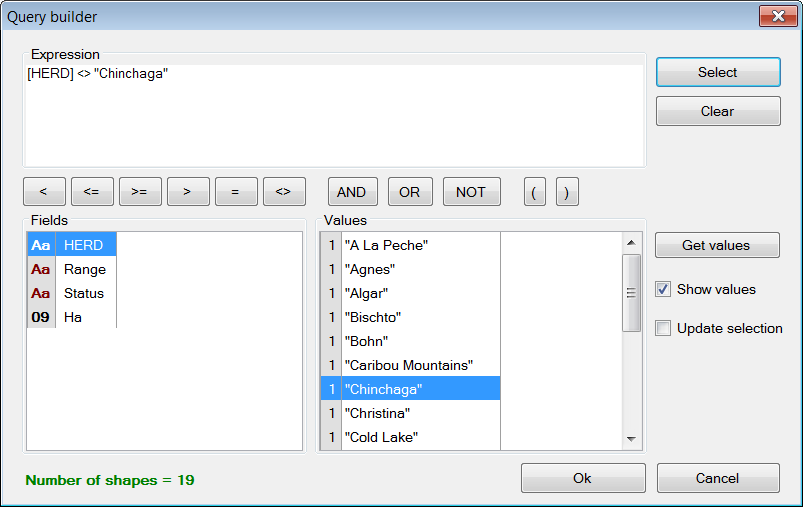

Кнопка **Query** открывает диалог **Query builder**. Этот диалог используется для выбора объектов на основе атрибутов, определённых в строке поиска. Доступные атрибуты перечислены в окне **Fields**. Дважды щёлкните на необходимом атрибуте, и он появится в окне **Expression**. Затем выберите логический символ и значение, которое необходимо найти. Когда ввод выражения завершится, щёлкните **select**. Можно добавить объекты в существующее выделение, исключить их из выделения или начать новое выделение. В диалоге будет выведено количество выбранных объектов. 

В примере, приведённом на предыдущей странице, в выражении был определён поиск всех стад, которые не имеют в названия "Chinchaga". В общей сложности 19 объектов соответствуют этому описанию и были отобраны.

++++++++++++++++++++++++++
4.2.3 Таблица атрибутов
++++++++++++++++++++++++++

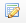

Таблица атрибутов может быть использована для вида и выборок. Для отображения только выбранных объектов щёлкните по кнопке **Show only selected shapes** на панели инструментов в верхней части редактора таблицы. Повторное нажатие этой кнопки покажет все записи. Для выбора записи нажмите на серый треугольник в левой части таблицы. Запись будет подсвечена. Используя стандартный для Windows щелчок с зажатой клавишей Shift, можно выбрать несколько записей подряд. Аналогичный результат можно получить при перемещении указателя мыши с зажатой левой клавишей. Используйте щелчок с зажатой клавишей Ctrl для выбора множества записей. Нажатие кнопки **Apply** не требуется для выборки. 

Несколько важных функций выбора могут быть обнаружены в меню **selection**, включая: обратить выборку, снять выборку, выбрать всё. Это меню может быть найдено и  настройках экспорта выбранных объектов. "Экспорт" означает создать новый шейп-файл, идентичный текущему слою, но содержащему только выбранные записи. Это удобный путь для создания производных карт. 

Если слой содержит большое количество объектов, может быть непросто увидеть выбранные из них. Вы можете приблизиться к выбранному объекту при помощи меню **View**, используя кнопку **selected** на панели инструментов в главном окне программы. 

++++++++++++++++++++++++++++++++
4.2.4 Модуль пространственного поиска
++++++++++++++++++++++++++++++++

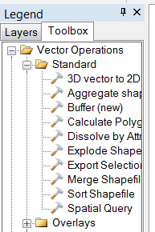

  :alt: инструменты геообработки
  :align: right
  :width: 193 
  :height: 290
  
Диалог **Spatial Query** является частью набора инструментов ГИС **Toolbox**, которые размещены под легендой. Частью **Spatial Query** являются: 
**Legend -> Toolbox -> Vector Operations -> Standard**. 

Пространственный запрос — это выбор объектов из одного слоя на основе пространственных взаимосвязей с объектами из другого слоя. Например, запрос может выбрать объекты из слоя A, тогда и только тогда, когда они пересекаются с объектами из слоя B. Могут быть определены несколько типов взаимосвязей, включая: пересечение, содержание, касание, перекрытие и др. Имеется возможность ограничить запрос выбранными объектами слоя B. 

------------------------------------
4.3 Создание и редактирование шейп-файлов
------------------------------------
Шейп-файлы добавляются и изменяются при помощи модуля под названием **Shapefile Editor**. Не забудьте активировать модуль в меню **Plug-ins**. При этом будет открыта новая панель инструментов, которая используется для запуска различных функций. Все кнопки панели инструментов ссылаются на панель редактирования шейп-файлов. Следует заметить, что это большая панель и её отображение может привести к скрытию части других панелей. Для предотвращения этого вы можете потянуть панель вдоль строки с точками и переместить её ниже на одну строку или в любое другое место. 

Предупреждение: панель редактора шейп-файлов работает с выделенным в легенде слоем. Если вы измените выбор слоя в момент редактирования, не последует никакого предупреждения, что редактируемый слой изменён. Кроме того, хотя на панели инструментов шейп-файла имеется кнопка **Undo**, её код еще не реализован в версии 4.8.6. Как было сказано, имеется опция установки свойства слоя в так называемый **Editing mode** во вкладке **Mode** диалога **Layer Properties**. Это даёт вам возможность отменить все изменения по завершению сессии редактирования. 

+++++++++++++++++++++++++++++++
4.3.1 Создание нового шейп-файла
+++++++++++++++++++++++++++++++
Шейп-файлы создаются с использованием кнопки **New** панели инструментов. Нажатие **New** открывает диалог, в котором указывается имя и путь к новому файлу. Вы также выбираете тип геометрии: точка, линия, полигон. Прежде чем создать новый шейп-файл, вам необходимо загрузить слой в ваш проект для установки проекции в качестве системы координат добавляемых объектов. Расширенные техники работы с геопривязкой выходят за рамки этого руководства. 

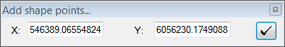

Когда создается шейп-файл, он пустой. Чтобы добавить объекты, используйте кнопку **Add** панели инструментов. Имеется две опции для ввода вершин. Наиболее простая — это использовать мышь, каждый раз при нажатии ЛКМ будет добавляться новая вершина. Когда все вершины введены, нажатие ПКМ завершает фигуру. Альтернативным способом является задание вершин вводом координат X и Y. Для этих целей служит специальный диалог, открываемый при щелчке на кнопке **Add**. После ввода значений X и Y, щёлкните на отметке слева для ввода вершины. Повторите шаги для следующей вершины, пока не завершите. Правый клик завершает объект и осуществляет выход. Следует заметить, что поля ввода X и Y заполняются текущим местоположением указателя мыши, поэтому не двигайте мышь при вводе значений, иначе значения изменятся. 

Для ввода типовой фигуры (например, треугольник, круг и т.п.) используйте кнопку **Insert** панели инструментов. Для начала, выберите тип фигуры, щёлкнув переключатель **Add this**. Затем, заполните необходимые данные (например, высоту и ширину прямоугольника). Затем перейдите к карте и щелкните в место расположения центроида нового объекта. Повторные щелчки приведут к созданию нескольких объектов. Когда все объекты будут введены, нажмите **Done** в диалоге для выхода. 

+++++++++++++++++++++++++++++++++
4.3.2 Изменение существующего шейп-файла
+++++++++++++++++++++++++++++++++
Панель инструментов шейп-файла имеет три кнопки для изменения объектов: **Move vertex**, **Add vertex** и **Remove vertex**. Вершины не должны быть видимыми для использования этих инструментов. При подведении курсора мыши к существующей вершине она будет показана, позволяя её перемещать ("щёлкни-и-тащи") или удалить её ("щёлкни") при помощи соответствующих инструментов. Если добавляются вершины, новая вершина появится под указателем мыши (щёлкните, чтобы добавить). Если вершина сразу не появилась, подождите несколько секунд. Для работы инструментов нет необходимости выбирать объекты. До тех пор, пока не появится возможность отмены (**Undo**), рекомендуется работать с копиями существующих карт при изменении вершин, не с оригиналами. т.к. изменения вносятся сразу же. 

Для удаления геометрии из слоя их необходимо выделить. При щелчке на кнопке **Remove** происходит их удаление. Будет выведено предупреждение для подтверждения действия. 

Щёлкните по кнопке **Merge** для объединения отдельных объектов. Будет выведено предупреждение для подтверждения действия. Объединяемые объекты должны принадлежать одному слою.  

------------------
4.4 Геопроцессинг
------------------
В MapWindow включен набор инструментов для общих задач геообработки. Основной набор инструментов может быть найден в ГИС **Toolbox**, которая представляет собой вкладку под легендой. Несколько дополнительных инструментов представляют собой отдельные модули. Описание операций геопроцессинга выходит за рамки данного руководства, но можно перечислить некоторые из основных операций, чтобы дать представление о возможностях MapWindow: 

+ Построение буферов 
+ Векторное наложение, включая пересечение и объединение
+ Различные операции отсечения, включая отсечение по шейп-файлу или полигональной маске
+ Объединение на основе атрибутов
+ Расчёт площади полигонов
+ Различные функции перепроецирования
+ Несколько растровых операций, включая обрезку полигоном, объединение растров и переклассификацию.
