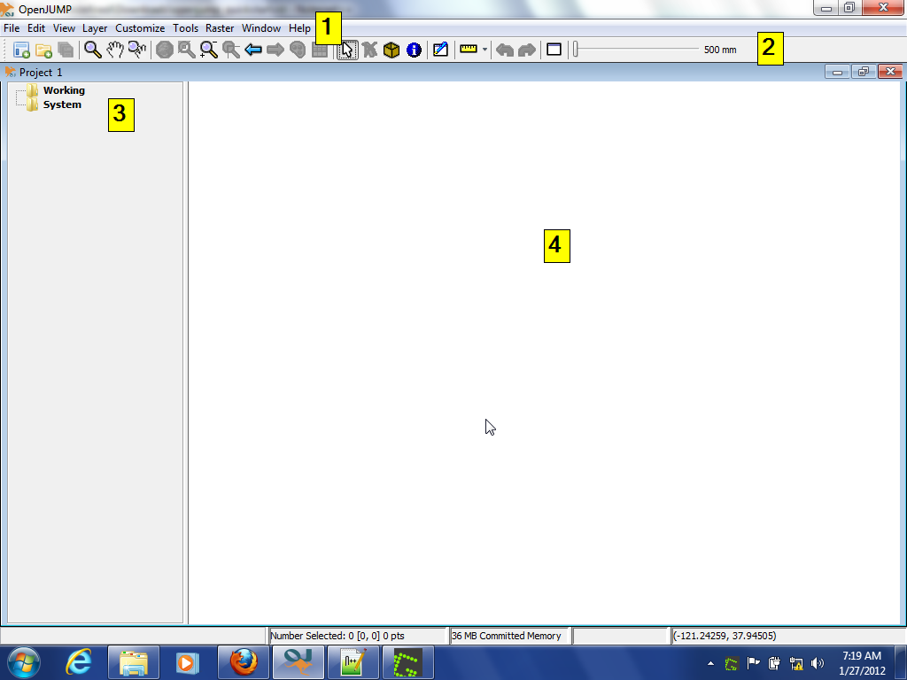
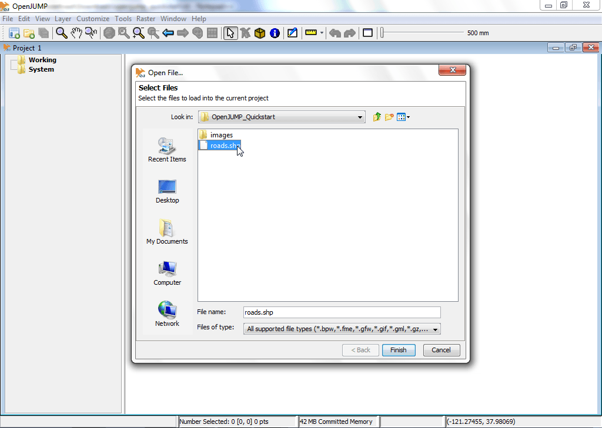
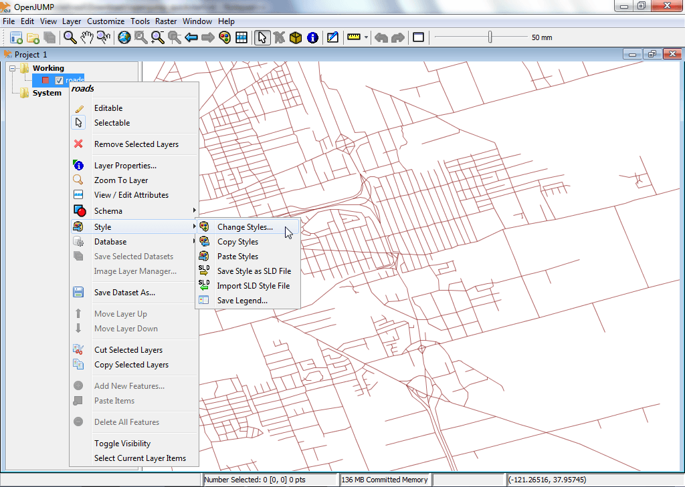
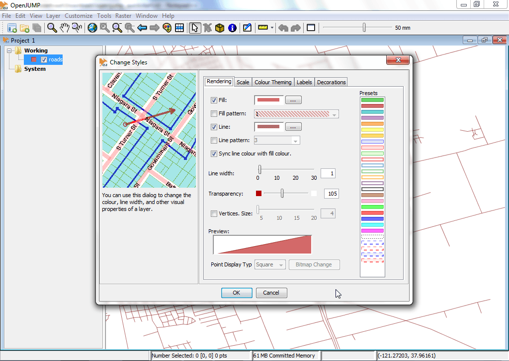
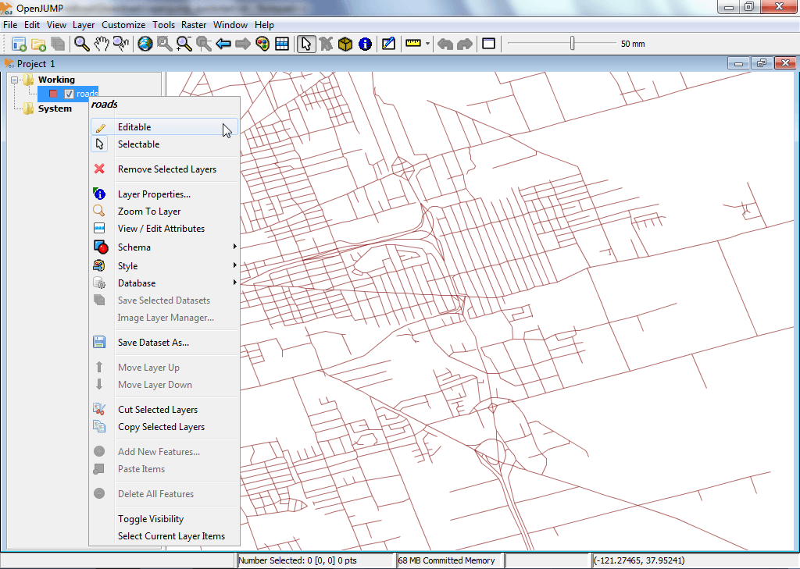
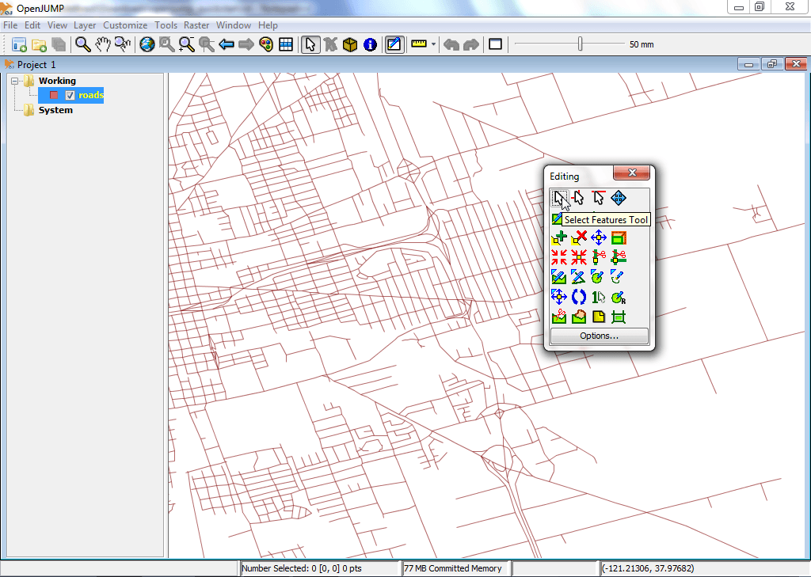
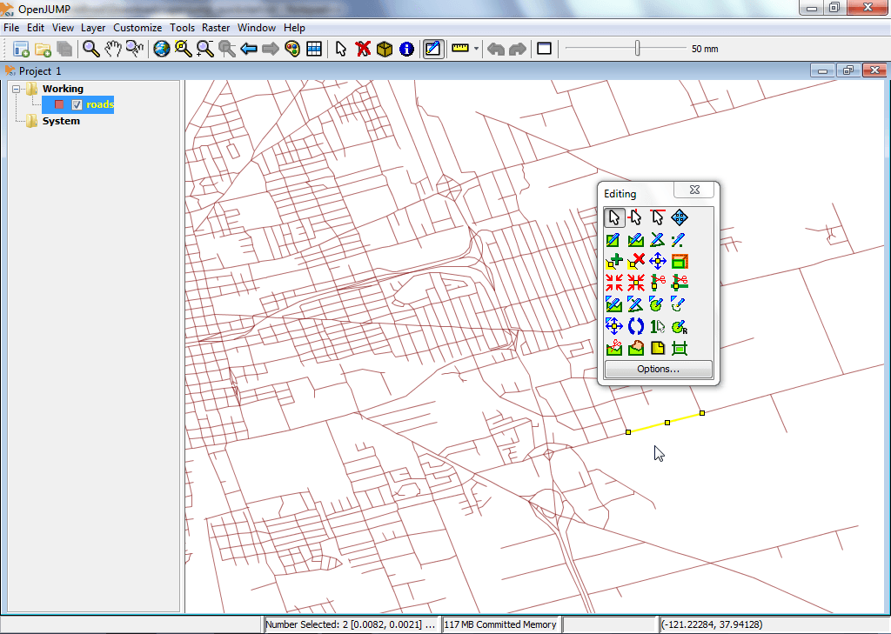
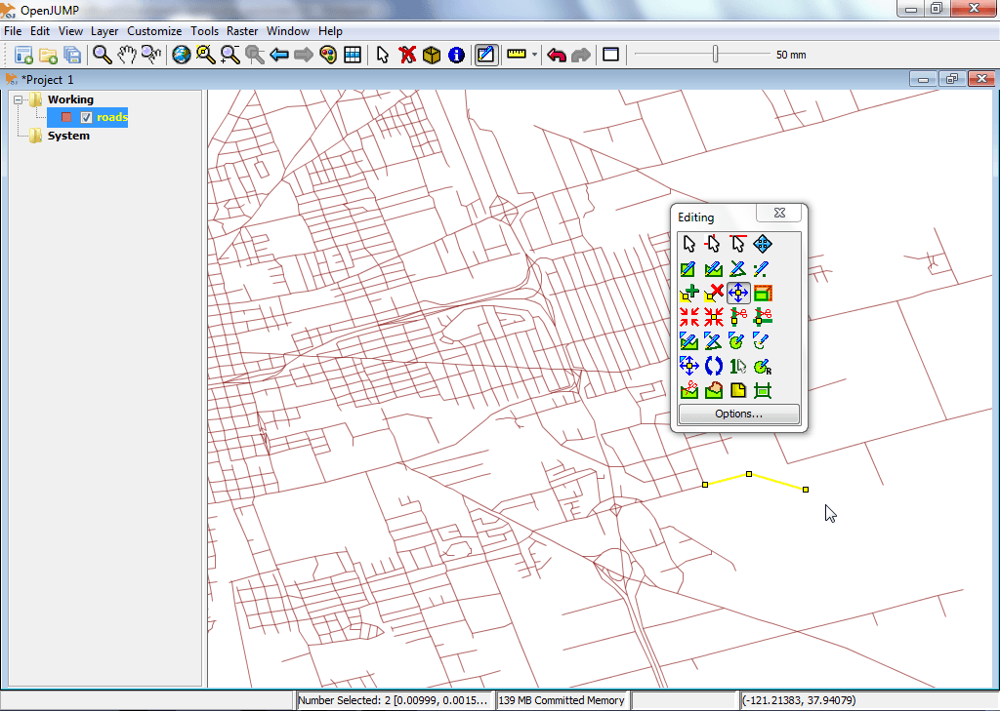

:Author: OSGeo-Live
:Author: Landon Blake
:Author: Stefan Steiniger
:Version: osgeo-live6.0
:License: Creative Commons Attribution-ShareAlike 3.0 Unported  (CC BY-SA 3.0)
:Thanks: OpenJUMP Community

********************************************************************************
Начало работы c OpenJUMP
********************************************************************************

OpenJUMP — это ГИС, позволяющая просматривать и редактировать пространственные векторные данные.
В OpenJUMP имеется также возможность просмотра растровых данных.

Данное "введение" описывает, как:

  * Открыть шейп-файлы в OpenJUMP;
  * Пприменить оформление к слою, созданному из шейп-файла, для удобного просмотра;
  * редактировать геометрию слоя.

Запуск OpenJUMP
================================================================================

В OSGeo-Live: щёлкните по ссылке OpenJUMP из меню или запустите /usr/bin/openjump.

Общая информация: для Windows перейдите в папку *bin* директории *OpenJUMP* и дважды кликните на 
openjump.exe или openjump.bat. Для Linux запустите файл oj_linux.sh. Для MacOSX кликните по значку OpenJUMP.

(Помните: для работы OpenJUMP необходим Java runtime environment. Вы можете загрузить Java runtime environment на ваш компьютер отсюда: http://java.com/en/download/index.jsp)

Базовый обзор интерфейса
================================================================================

Интрфейс OpenJUMP, как и в многих других ГИС, состоит из четырёх основных компонентов.
(i) Первый — панель меню, содержащая большую часть функционала. 
(ii) Второй компонент — основная панель инструментов, находящаяся под панелью меню. Кнопки дают доступ к самым важным функциям отображения и навигации. 
(iii) Третий — дерево слоев, находящееся слева, которое показывает список слоев активного проекта.
(iv) Четвертый — вид карты, графически отображающий пространственные данные каждого из слоёв. В самом низу находится панель, на которой отображаются координаты текущего положения указателя мыши, отчёты обработки данных и использование памяти. 

Окно проекта содержит список слоёв и Вид карты. Каждая сессия OpenJUMP может содержать множество проектов. 
Здесь будет рассмотрена работа с одним окном.

Открытие шейп-файла
================================================================================

Этот раздел кратко описывает, как открыть ESRI Shapefile.

Выберите меню [File] на панели меню, затем выберите опцию  
 [Open File...]. Появится диалоговое окно, с помощью которого вы сможете открыть файлы, содержащие пространственые данные. 
В данном примере вы подгрузите ESRI Shapefile. Найдите файл с расширением .shp, выберите его и кликните по кнопке  
 [Finish] в диалоговом окне. Через некоторое время вы сможете увидеть данные в Виде слоёв. 
Вы также увидите новый слой, созданный из ваших данных, в списке слоёв. Имя слоя будет соответствовать имени шейп-файла.

Другой, более быстрый способ — перетащить нужный шейп-файл прямо в Вид карты.

Оформление слоя
================================================================================

Этот раздел описывает, как изменить оформление слоя. 

Правой клавишей мыши кликните по имени слоя в Списке слоёв. В появившемся меню [Style] выберите стиль, а затем нажмите [Change Styles]. Окно "Смена оформления" состоит из пяти вкладок, позволяющих изменять отображение слоя в Виде слоёв:
цвета, заливки, стили линий, их толщину, прозрачность, подписи, а также указывать минимальний и  максимальный
масштабы, на которых слой отображается.

* Пользователи MacOS X  должны нажать кнопку :guilabel:`Apple`, чтобы попасть в это меню. 

   

Редактирование геометрии слоя
================================================================================

Правой клавишей мыши кликните по имени слоя в списке слоёв. 
В меню "Редактирование" поставьте флажок возле пункта меню "Editable". 
Справа над Видом слоёв появится плавающая панель с набором кнопок, позволяющих редактировать геометрию объектов.

   

Давайте попробуем быстро отредактировать объект, выбрав его, а затем перестив одну из точек этого объекта.
Чтобы сделать это, кликните по кнопке в виде указателя мыши на панели редактирования. 
Используйте её, чтобы выбирать объект в один клик в Виде слоёв.
После этого объект будет выделен жёлтым цветом с небольшими желтыми квадратами возле каждой точки (вершины) геометрии объекта.

Далее кликните по кнопке в виде прицела с желтым квадратом посередине :guilabel:`Move Vertex Tool`.
(Проведите мышкой над кнопками, чтобы увидеть всплывающую подсказку).
Указатель мыши сменится на небольшой прицел, когда вы будете проводить им над Видом слоя.

.. image:: ../../images/screenshots/1024x768/openjump_ss_08.png
   :scale: 55 

Используя этот инструмент, попробуйте переместить вершину выбранной геометрии, кликая на ней и перетягивая её с зажатой левой клавишей мыши.

   
Другие источники для обучения OpenJUMP
================================================================================

Это только первый шаг на пути использования OpenJUMP. Существует ещё много материалов для изучения.

Вы можете загрузить учебные материалы OpenJUMP тут:
http://sourceforge.net/projects/jump-pilot/files/Documentation/

Вы можете почитать OpenJUMP-вики тут:
http://sourceforge.net/apps/mediawiki/jump-pilot/index.php?title=Main_Page

Вы сможете получить быструю помощь через список рассылки пользователей OpenJUMP:
http://groups.google.com/group/openjump-users

