:Author: OSGeo-Live
:Author: Tom Kralidis, Angelos Tzotsos
:Version: osgeo-live6.0
:License: Creative Commons

********************************************************************************
pycsw: начало работы
********************************************************************************

**pycsw** является реализацией сервера OGC CSW на языке `Python`_.

pycsw реализует положения параграфа 10 (HTTP protocol binding (Catalogue
Services for the Web, CSW)) спецификации`OpenGIS Catalogue Service Implementation
Specification`_, версия 2.0.2. Процесс разработки начался в 2010 г. (официальный
анонс сделан в `2011`_ г.).

pycsw позволяет публиковать и просматривать пространственные метаданные.
Существующие репозитории метаданных должны могут быть сделаны доступными
через OGC:CSW 2.0.2.

pycsw имеет `открытый код`_, распространяется под лицензией MIT и работает на
всех основных платформах (Windows, Linux, Mac OS X).

pycsw входит в состав OSGeo-Live. Этот документ показывает, как:

* выполнить установку pycsw;
* проверить работоспособность pycsw при помощи проверочного приложения;
* редактировать документ Capabilities и отображать эту информацию в браузере;
* создавать описание метаданных в формате ISO 19139 (при помощи INSPIRE Metadata Editor или GIMED);
* загружать созданный файлы метаданных в базу данных pycsw;
* установить модуль CSWClient для QGIS;
* выполнять поиск данных в каталоге pycsw из QGIS.

Установка
=========

Системные требования
--------------------

Для работы **pycsw** необходимо наличие следующих библиотек:

- `lxml`_ (версия >= 2.2.3) для работы с XML
- `SQLAlchemy`_ (версия >= 0.0.5) для взаимодействия с базами данных
- `Shapely`_ (версия >= 1.2.8) для поддержки пространственных запросов
- `pyproj`_ (версия >= 1.8.9) для преобразования координат

Установка из исходных кодов
---------------------------

`Загрузите`_ последнюю версию pycsw или получите код из svn:

.. code-block:: bash

  $ svn co https://pycsw.svn.sourceforge.net/svnroot/pycsw pycsw

Убедитесь, что для каталога установки разрешен CGI. Например, при использовании
Apache, если вы установили pycsw в ``/srv/www/htdocs/pycsw`` (и ваш URL
будет иметь вид ``http://host/pycsw/csw.py``), добавьте следующие строки
в ``httpd.conf``:

.. code-block:: none

  <Location /pycsw/>
   Options FollowSymLinks +ExecCGI
   Allow from all
   AddHandler cgi-script .py
  </Location>

Установка в Ubuntu/Xubuntu/Kubuntu
----------------------------------

Для установки **pycsw** в Ubuntu и производных можно использовать установочный
скрипт OSGeo-Live из ``pycsw/etc/dist``:

.. code-block:: bash

  $ cd pycsw/etc/dist
  $ sudo ./install_pycsw.sh

Этот скрипт выполнит установку всех необходимых зависимостей (Apache, lxml,
sqlalchemy, shapely, pyproj) и затем установит pycsw в ``/var/www``.

Установка в openSUSE
--------------------

Установить OBS-пакет в openSUSE 12.1 можно, выполнив следующие команду от
имени ``root``:

.. code-block:: bash

  $ zypper -ar http://download.opensuse.org/repositories/Application:/Geo/openSUSE_12.1/ GEO
  $ zypper -ar http://download.opensuse.org/repositories/devel:/languages:/python/openSUSE_12.1/ python
  $ zypper refresh
  $ zypper install pycsw

Для предыдущих версий замените ``12.1`` на ``11.4``. Для будущих версий
openSUSE используйте ``Factory``. Также поддерживается и rolling-ветка
``Tumbleweed``. pycsw включен в официальный репозиторий Application::Geo
OpenSUSE Build Service.

Проверочное приложение
======================

Запустить проверочное приложение pycsw можно при помощи ярлыка pycsw в группе
Web Services или открыв Firefox и указав адрес ``http://localhost/pycsw/tester/index.html``:

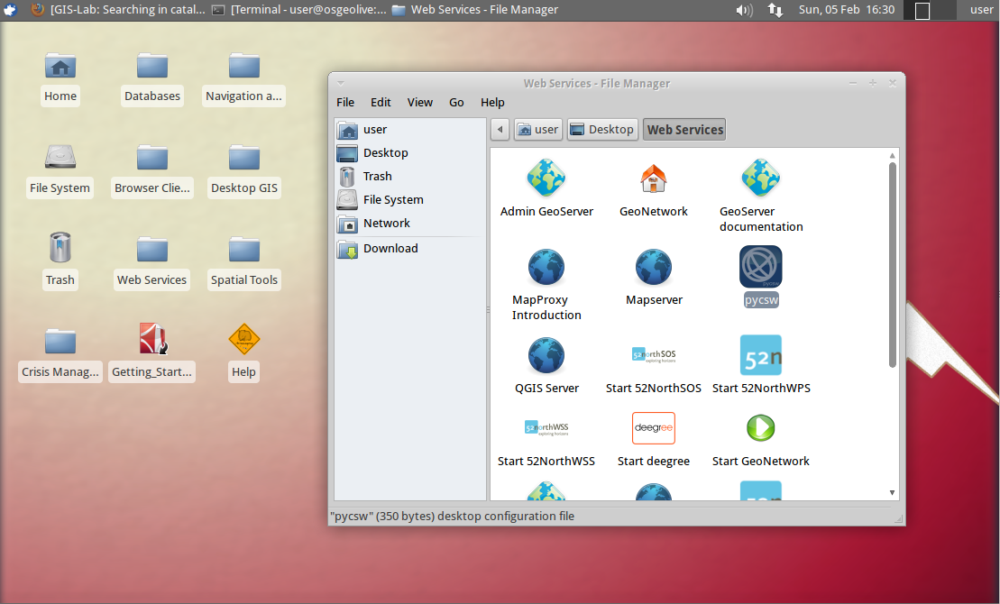

В левом выпадающем списке пользователь может выбирать предустановленные
POST-запросы в формате XML, которые затем будут отправлены pycsw:

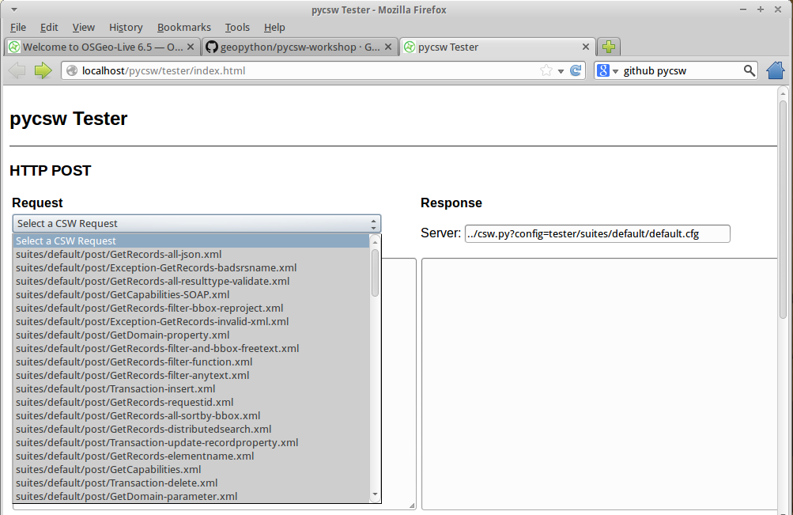

Например, если выбрать "apiso/DescribeRecord" и нажать кнопку "Send", в
правой панели отобразится описание записи в ISO Application Profile:

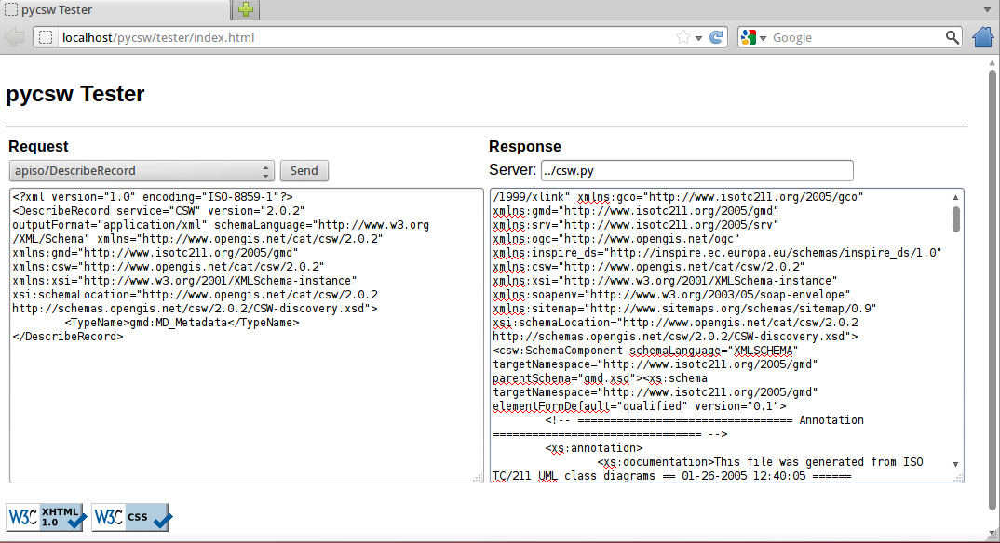

Если выбрать "GetCapabilities-SOAP" и нажать кнопку "Send", на сервер будет
отправлен SOAP-запрос на получение его возможностей:

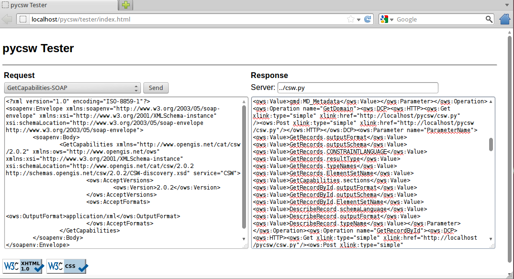

Кроме того, пользователь может выполнять поиск данных с фильтрацией по охвату,
выбрав "GetRecords-filter-bbox" и отредактировав координаты в XML-представлении
запроса:

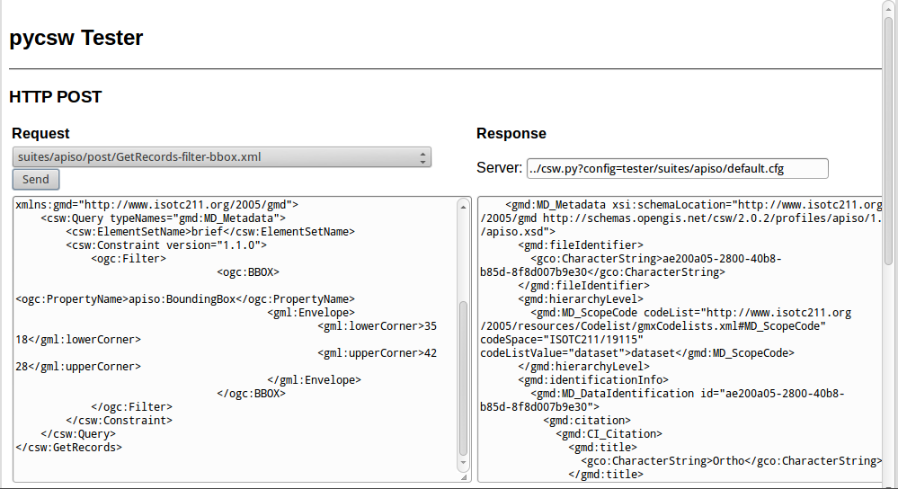

Пользователь может пройтись по всем доступным запросам и выполнять различные
операции из этого приложения. Более надежный и удобный способ выполнения
запросов описан ниже.

Документа Capabilities и настрока
=================================

Описание capabilities можно просмотреть по адресу ``http://localhost/pycsw/csw.py?service=CSW&version=2.0.2&request=GetCapabilities``.

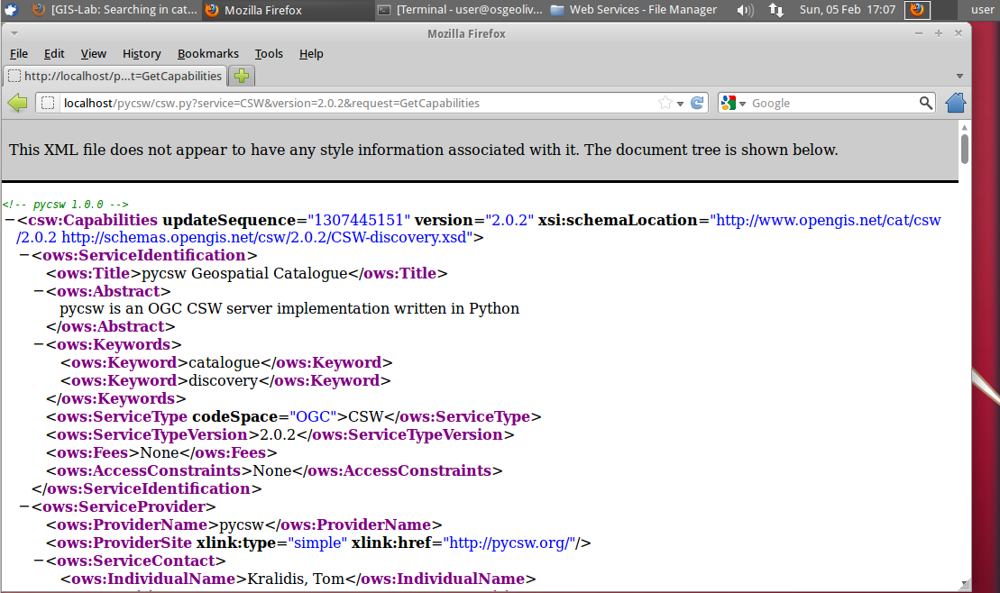

Чтобы отредактировать метаданные сервиса, входящие в состав документа capabilities,
необходимо изменить файл ``/var/www/pycsw/default.cfg``, а именно раздел
``[metadata:main]``. Если необходимо включить поддержку INSPIRE Discovery Service,
заполните метаданые в разделе ``[metadata:inspire]`` и установите значение
свойства ``enabled`` в ``true``.

За подробным описаним настроек обратитесь к `документации`_ на сайте pycsw.

Создание метаданных
===================

При помощи European Open Source Metadata Editor (EUOSME)
--------------------------------------------------------

Описание метаданных пространственного набора данных или пространственного
веб-сервиса можно создать при помощи открытой реализации редактора INSPIRE,
European Open Source Metadata Editor (EUOSME). Это приложение можно найти
по адресу ``http://inspire-geoportal.ec.europa.eu/editor/``. Также доступен
исходный код ``https://joinup.ec.europa.eu/svn/euosme/trunk``

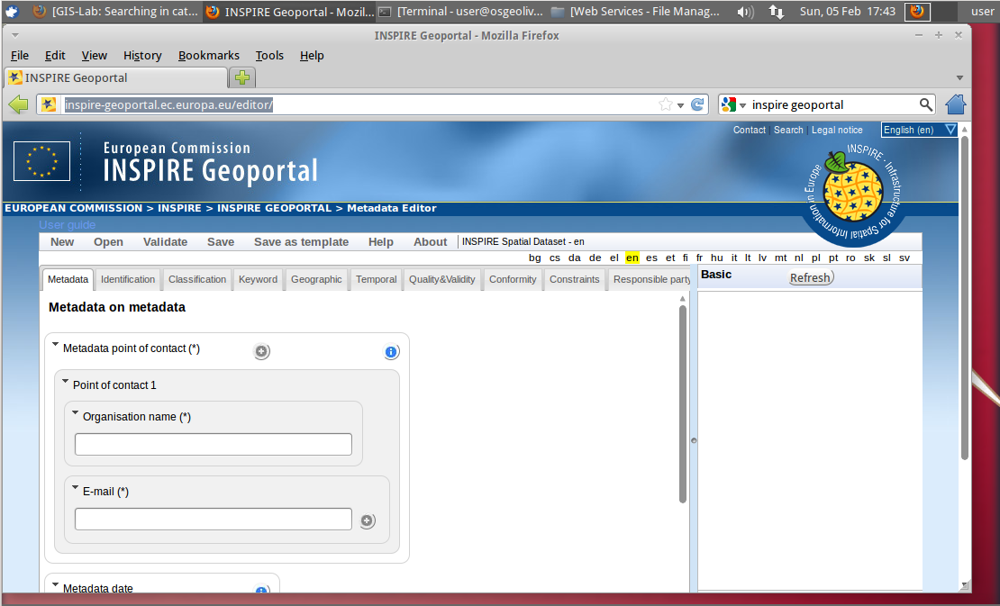

Пользователь заполняет необходимые поля метаданных, переключаясь между
вкладками приложения, и внося информацию о владельце данных, ключевых словах,
размещении, географическом охвате (задавая координаты ограничивающего
прямоугольника или название страны) и т.д.

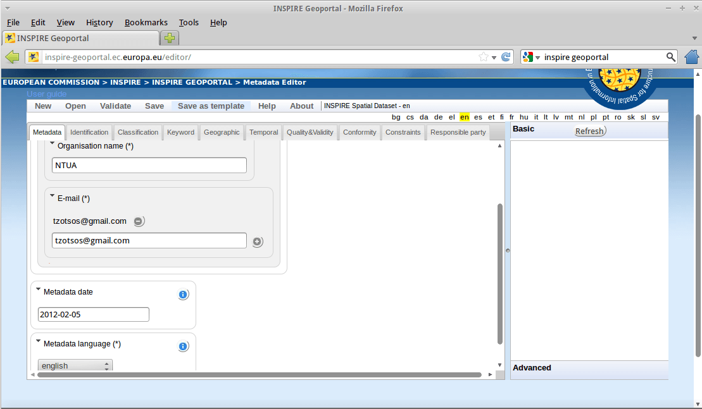

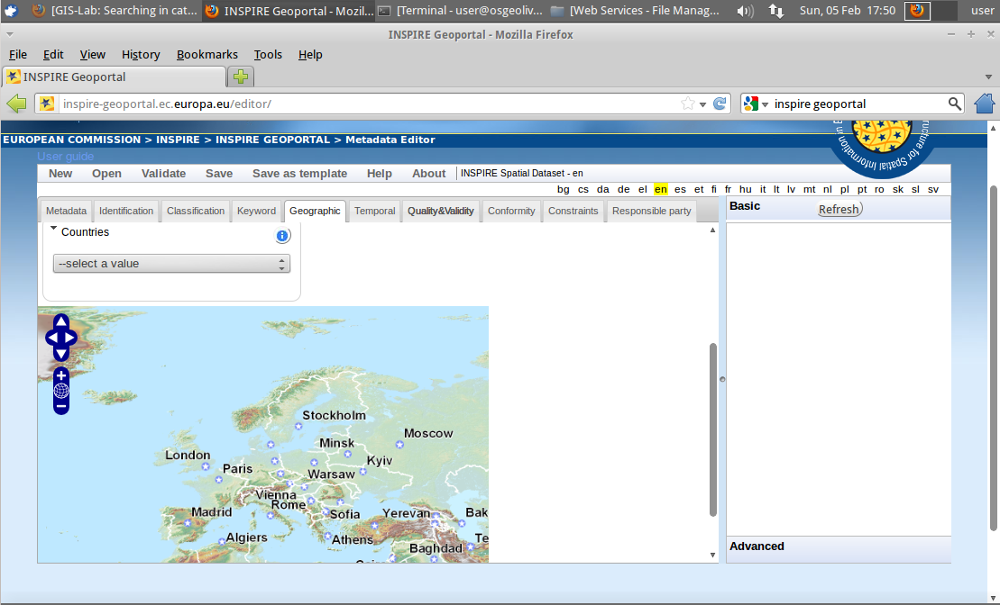

После добавления всей необходимой информации необходимо нажать кнопку валидации
вверху страницы, чтобы проверить целостность и соответствие директивам INSPIRE.

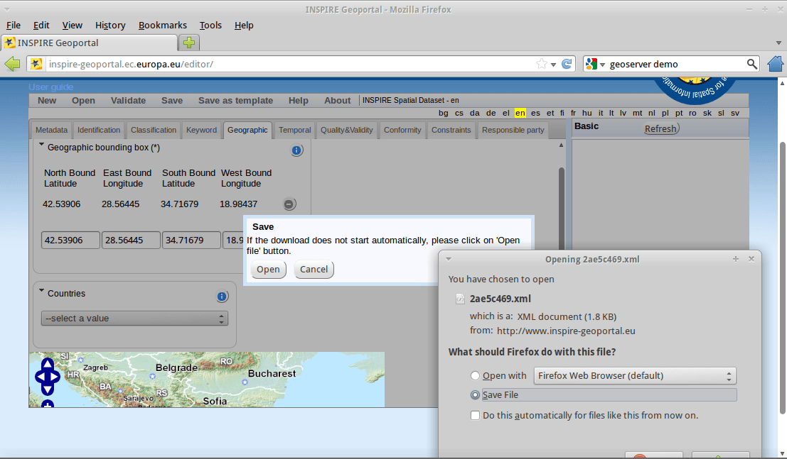

После успешной валидации файл можно сохранить на диск и просмотреть, используя
текстовый редактор либо браузер.

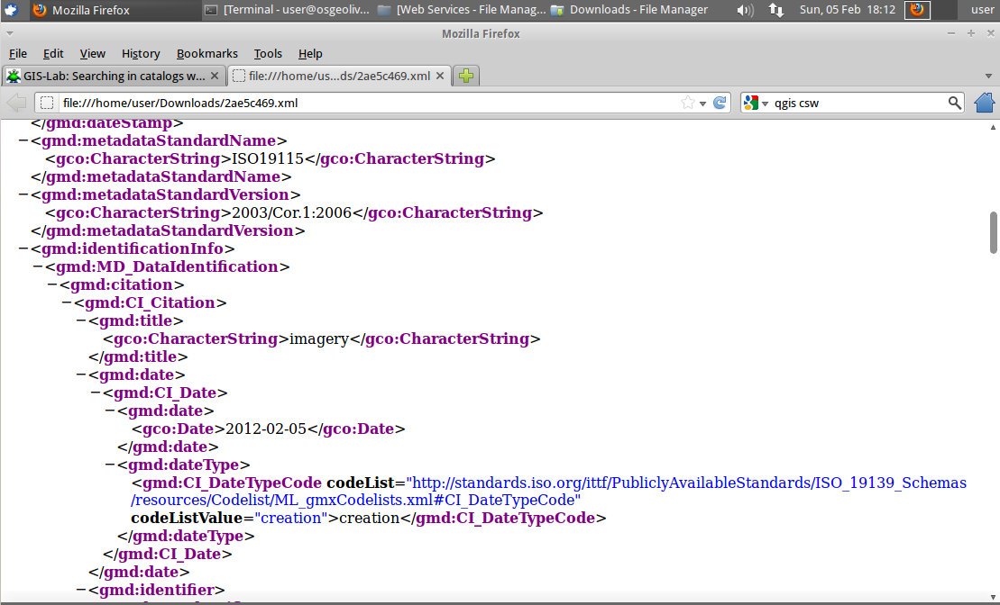

При помощи GIMED
----------------

`GIMED`_ — свободное приложение для создания и редактирования метаданных
в формате XML, совместимом с директивами INSPIRE. Для установки приложения
введите следующие команды в окне терминала:

.. code-block:: bash

  $ wget http://downloads.sourceforge.net/project/gimed/GIMED_v1.3.0.tar.gz
  $ tar zxvf GIMED_v1.3.0.tar.gz
  $ mono ./GIMED_v1.3.0/bin/GIMED.exe

Пользователь может вводить или редактировать метаданные как и при использовании
EUOSME, но без необходимости в подключении к Интернет.

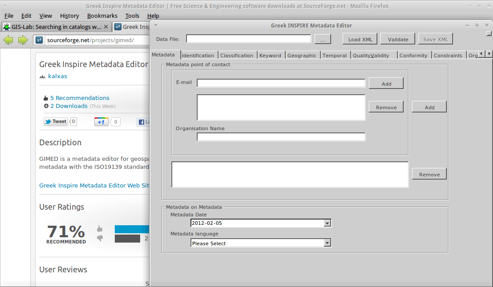

Загрузка метаданных
===================

Настройка репозитория метаданных
--------------------------------

pycsw поддерживает следующие базы данных:

- SQLite3
- PostgreSQL
- MySQL

В OSGeo-Live использован простой вариант с SQLite. Базу данных можно найти
в ``/var/www/pycsw/data/cite``

В случае новой базы данных, процесс установки будет выглядеть так:

.. code-block:: bash

  $ cd /path/to/pycsw
  $ export PYTHONPATH=`pwd`
  $ python ./sbin/setup_db.py sqlite:////path/to/records.db

Импорт метаданных
-----------------

.. code-block:: bash

  $ cd /path/to/pycsw
  $ export PYTHONPATH=`pwd`
  $ python ./sbin/load_records.py /path/to/records sqlite:////path/to/records.db

Эта последовательность команд импортирует все записи ``*.xml`` из ``/path/to/records``
в ``records.db`` и настроит репозиторий на отображение информации в соответствии
с таблицей 53 OGC:CSW.

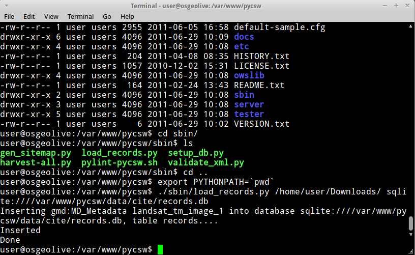

Установка CSW Client для QGIS
=============================

Механизм HTTP запросов/ответов не достаточно удобен для конечных пользователей.
Поэтому существует несколько различных клиентов CSW в форме веб-приложений
как `INSPIRE Geoportal <http://inspire-geoportal.ec.europa.eu/discovery/discovery/>`_
или :doc:`GeoNetwork <../overview/geonetwork_overview>`. В этом документе
мы будем использовать модуль `OGC Catalogue Service Client <https://sourceforge.net/apps/trac/qgiscommunitypl/wiki/qgcsw>`_
для :doc:`QGIS <../overview/qgis_overview>`.

Для установки модуля выполните:

.. code-block:: bash

  $ cd ~
  $ cd .qgis/python/plugins
  $ svn co https://qgiscommunitypl.svn.sourceforge.net/svnroot/qgiscommunitypl/python/plugins/qgcsw/trunk qgcsw

Поиск данных
============

Модуль CSW для QGIS
-------------------

Запустите QGIS из группы Desktop GIS и найдите пункт "Manage Plugins"

Активируйте модуль CSW

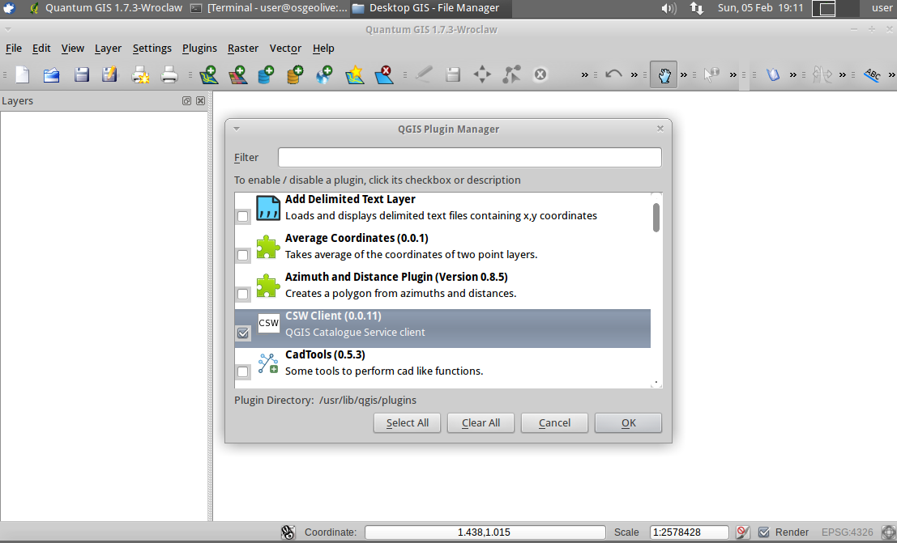

Затем при помощи кнопки CSW на панели инструментов запустите CSW Client

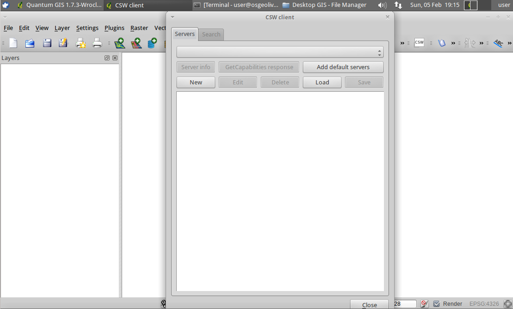

Добавьте сервер pycsw, нажав на кнопку "New" и введя адрес ``http://localhost/pycsw/csw.py``

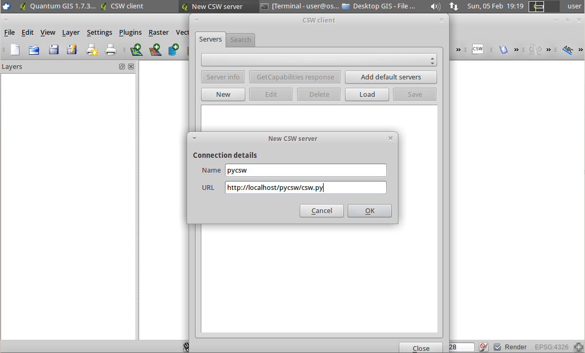

Также можно добавить несколько предустановленных серверов, нажав кнопку
"Add default servers" и получить описание возможностей сервера при помощи
кнопки "Server info"

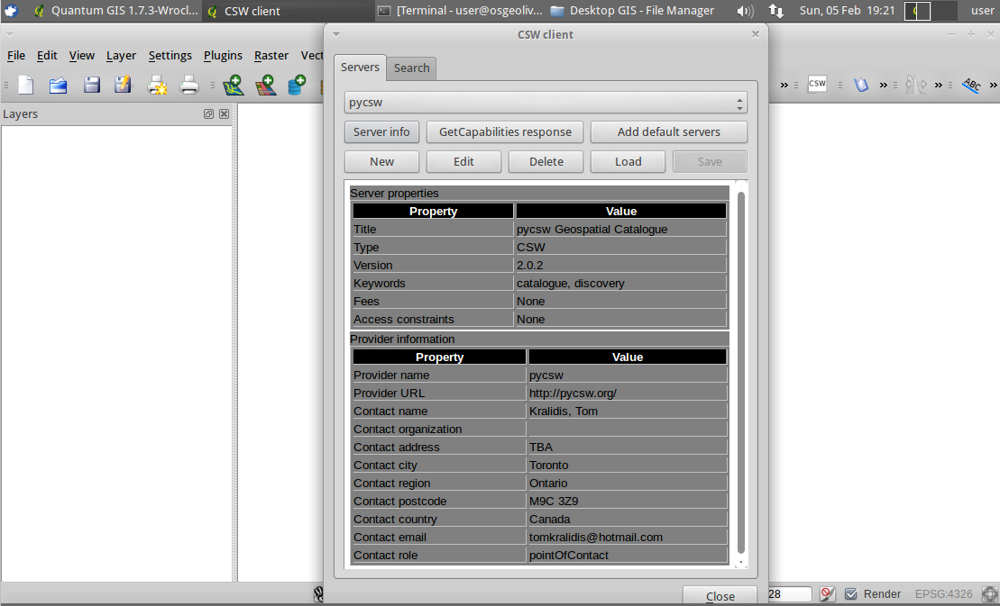

Выполнять поиск данных в каталоге можно как по описанию, так и по охвату

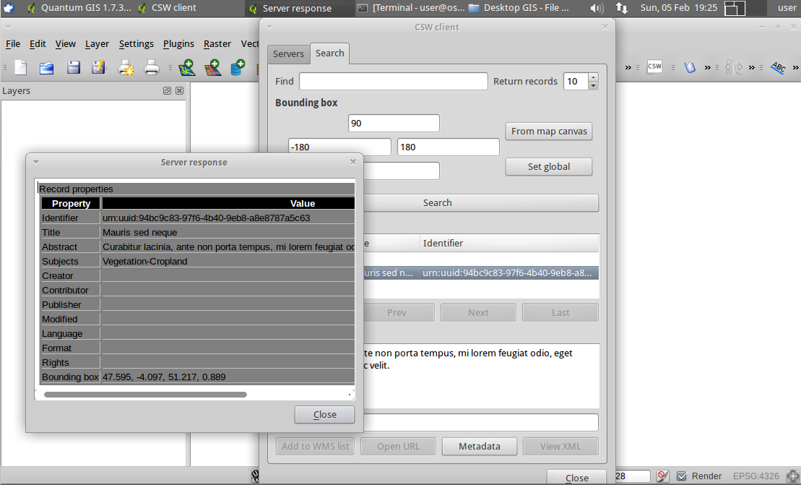

Проверочное приложение
----------------------

Поиск данных также можно выполнять из проверочного приложения, задав
соответствущий запрос, например, поиск по фразе "imagery" приведет к отображению
всех данных, созданных ранее в EUOSME

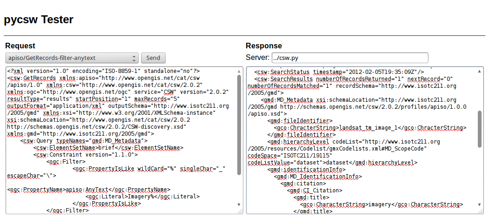

Более подробное описание pycsw можно получить в `документации`_, размещенной
на официальном сайте.

.. _`Python`: http://www.python.org/
.. _`OpenGIS Catalogue Service Implementation Specification`: http://www.opengeospatial.org/standards/cat
.. _`2011`: http://www.kralidis.ca/blog/2011/02/04/help-wanted-baking-a-csw-server-in-python/
.. _`открытый код`: http://www.opensource.org/
.. _`документации`: http://pycsw.org/docs/documentation.html
.. _`lxml`: http://lxml.de/
.. _`SQLAlchemy`: http://www.sqlalchemy.org/
.. _`Shapely`: http://trac.gispython.org/lab/wiki/Shapely
.. _`pyproj`: http://code.google.com/p/pyproj/
.. _`Загрузите`: http://pycsw.org/download.html
.. _`GIMED`: http://sourceforge.net/projects/gimed/
