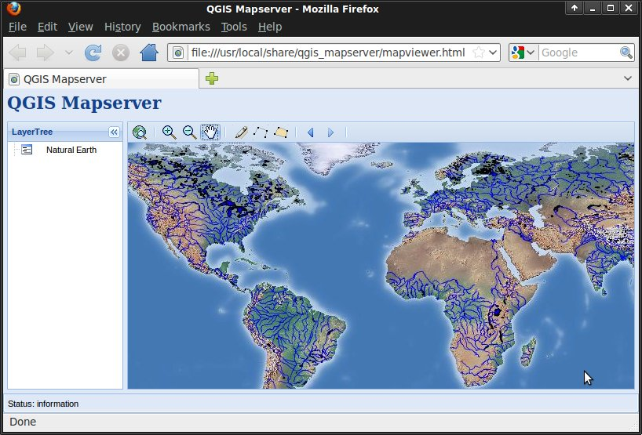

:Author: OSGeo-Live
:Author: Pirmin Kalberer
:Version: osgeo-live4.5
:License: Creative Commons Attribution-ShareAlike 3.0 Unported  (CC BY-SA 3.0)

.. image:: ../../images/project_logos/logo-qgis_mapserver.png
  :scale: 100 %
  :alt: логотип проекта
  :align: right

********************************************************************************
Начало работы с QGIS Server
********************************************************************************

QGIS Server реализует WMS-сервис на базе библиотек настольного приложения Quantum GIS (QGIS).

Этот документ описывает, как:

  * обновить существующий проект QGIS и визуализировать его с помощью QGIS Server;
  * создать новый проект QGIS и открыть WMS непосредственно в браузере.

Документация:
  * http://www.qgis.org/wiki/QGIS_Server_Tutorial

Инструкция по установке QGIS Server на Debian/Ubuntu:

  * :command:`apt-get install qgis-mapserver libapache2-mod-fcgid`
  * -> http://localhost/cgi-bin/qgis_mapserv.fcgi

QGIS веб-клиент:
  * https://github.com/qgis/qgis-web-client

Запуск просмотрщика GeoExt
================================================================================

OSGeo-Live содержит пример просмотрщика карт на базе JavaScript-библиотеки GeoExt, использующего QGIS Server для визуализации карты.

* Нажмите :menuselection:`Geospatial --> Web Services --> QGIS Server`

Вы должны увидеть окно браузера с веб-просмотрщиком карт, отображающим карту мира.
   

Теперь мы изменим стиль отображения карты, используя QGIS.

Редактирование проекта QGIS
================================================================================

#. Нажмите :menuselection:`Geospatial --> Desktop GIS --> Quantum GIS`

#. Выберите в меню :menuselection:`File --> Open Project...`

#. Укажите файл :file:`QGIS-NaturalEarth-Example.qgs` и нажмите :guilabel:`Open`

   * Вы должны увидеть ту же карту мира, отрисованную QGIS
     Теперь мы изменим стиль отображения рек и посмотрим на результат в веб-просмотрщике карт.

#. Дважды щёлкните на :file:`10m_rivers_lake_centerlines` в списке слоёв

#. Измените цвет в *Outline Options* на другой оттенок голубого

#. Нажмите :guilabel:`OK`

   * Реки должны отобразиться другим цветом

#. Сохраните проект, нажав :menuselection:`File --> Save Project`

#. Откройте веб-браузер заново

#. Увеличьте масштаб

   * Вы должны увидеть, что реки отображаются тем же новым цветом.

Создание нового проекта QGIS
================================================================================

#. Снова откройте QGIS

#. Выберите :menuselection:`File --> New Project`

#. Нажмите :menuselection:`Layer --> Add Vector Layer...`

#. Перейдите к набору данных :file:`/home/user/data/natural_earth/10m_admin_0_countries.shp`

#. Нажмите :guilabel:`Open`

   * Вы должны увидеть границы стран мира.

#. Сохраните проект, нажав :menuselection:`File --> Save Project`

#. Укажите :file:`/home/user/world.qgs` и нажмите :guilabel:`Save`

#. Откройте `WMS URL <http://localhost/cgi-bin/qgis_mapserv?map=/home/user/world.qgs&SERVICE=WMS&VERSION=1.3.0&REQUEST=GetMap&BBOX=-91.901820,-180.000000,83.633800,180.000000&CRS=EPSG:4326&WIDTH=722&HEIGHT=352&LAYERS=10m_admin_0_countries&STYLES=default&FORMAT=image/png&DPI=96&TRANSPARENT=true>`_.

   * Вы должны увидеть страны мира, отрисованные на этот раз с помощью QGIS Server.

Что дальше?
================================================================================

Хорошей отправной точкой для более подробного изучения QGIS Server является `вики-страница QGIS Server <http://hub.qgis.org/wiki/quantum-gis/QGIS_Server_Tutorial>`_.
