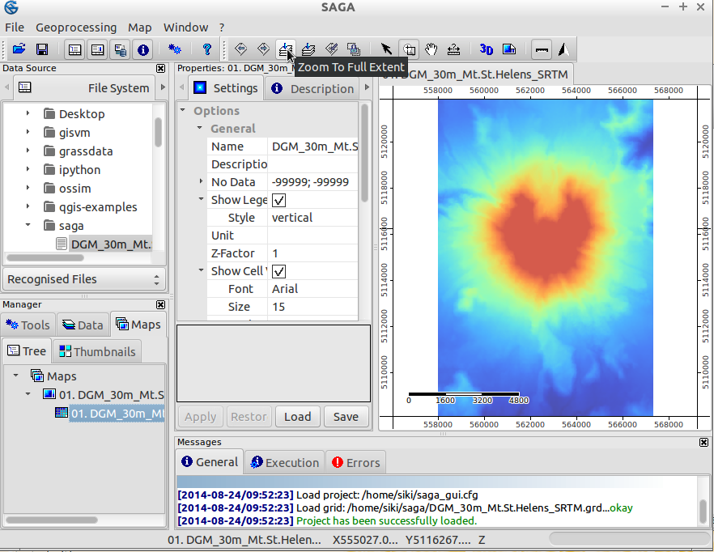
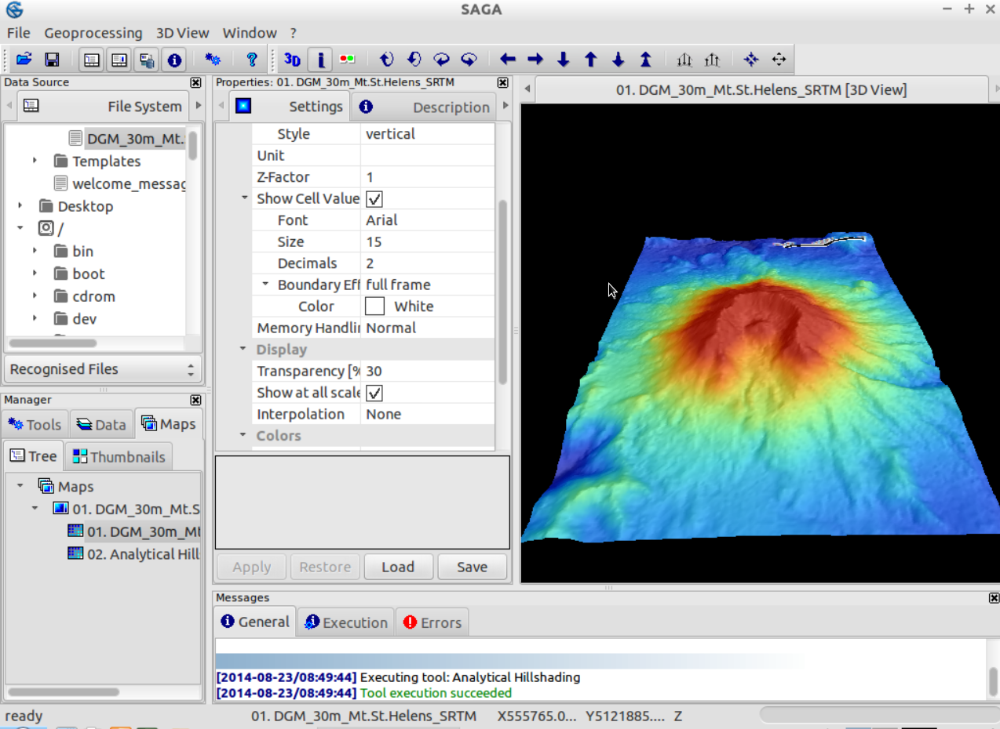
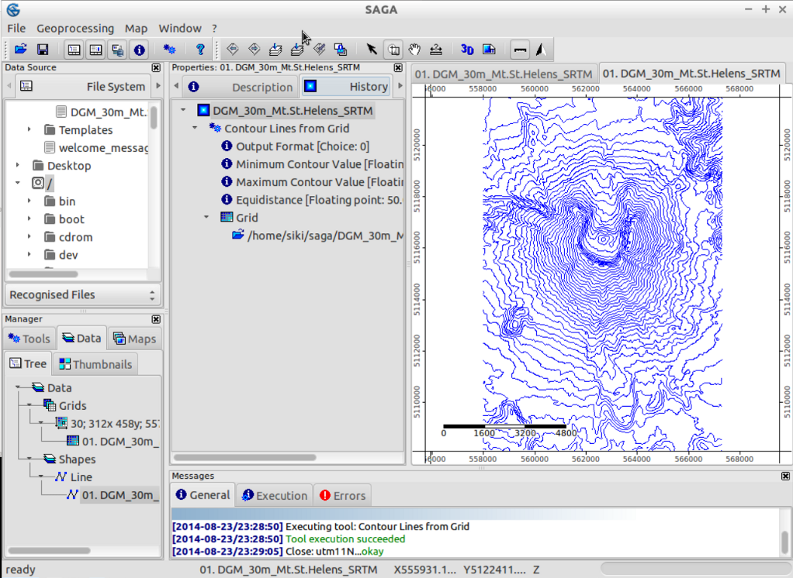

:Author: Johan Van de Wauw
:Version: osgeo-live4.0
:License: Creative Commons Attribution-ShareAlike 3.0 Unported  (CC BY-SA 3.0)

.. image:: ../../images/project_logos/logo-saga.png
  :scale: 100 %
  :alt: логотип проекта
  :align: right
  :target: http://www.saga-gis.org

********************************************************************************
Начало работы в ГИС SAGA
********************************************************************************

Запуск
================================================================================

Для запуска ГИС SAGA с Live DVD кликните ярлык SAGA на рабочем столе.

Открыв SAGA первый раз, вы увидите 3 главных элемента интерфейса: Рабочую область, Свойства объекта и Окно сообщений. Информация в Свойствах объекта будет изменяться в соответствии с вашим выбором в Рабочей области.

  .. image:: ../../images/screenshots/1024x768/saga_guioverview.png
     :scale: 80

Добавление данных
================================================================================

Откройте SAGA GUI и загрузите растр `/home/user/saga/DGM_30m_Mt.St.Helens_SRTM.grd` через меню **File|Grid|Load Grid**. На 
вкладке General Окна сообщений вы получите сообщение об успешном или 
неуспешном выполнении этой задачи. Вы должны увидеть что-то вроде `Load Grid: DGM_30m_Mt.St.Helens_SRTM.grd...okay`. 
После загрузки набора данных он появится на вкладке *Data* Рабочей области. 
Данные будут находиться в списке Grids в соответствии с системой координат файла. 

В данном случае информация о системе координат выглядит как **30;312x 458y; 557970x 5108130y**. 
Первое число это — размер ячейки (30 метров), следующие два показывают количество ячеек в направлениях
*x* и *y* соответственно, а два последних - начало координат растра, которое в SAGA 
обычно находится  в нижнем левом  углу. Эта и другая полезная информация 
о наборе данных будет показана, если вы выберете вкладку *Description* окна Свойств объекта. После 
открытия вкладки вы увидите не только более подробную информацию о системе координат растра, 
но и тип его данных (здесь FLOAT), диапазон значений, некоторые статистические показатели 
и размер занимаемого дискового пространства.

Визуализация данных
================================================================================

Для отображения данных в виде карты просто дважди кликните на соответствующем 
наборе данных вкладки Data Рабочей области. Появится окно новой карты с добавленным
в него набором данных. Рамка отображает реальные координаты *x* и *y* на земной поверхности
в единицах измерения проекции данных. Двигая указатель мыши по карте, вы можете видеть,
как изменяются значения x-, y- и z-координат, отображающиеся на нижней панели SAGA. 
Значения z-координаты отвечают отметкам абсолютной высоты набора данных (имейте в виду, 
что отображающиеся значения всегда соответствуют тому набору данных, который выбран на 
вкладке Data или Maps).

Теперь воспользуйтесь инструментами навигации для увеличения и передвижения карты. 
Инструмент *Zoom* выбран по умолчанию. Левый клик мыши по карте увеличивает масштаб отображения, 
а правый — уменьшает. Протягивание по диагонали карты курсора с удерживанием в нажатом состоянии
левой кнопки мыши позволяет увеличить масштаб отображения определённого фрагмента. Если вы 
продолжите увеличивать масштаб отображения, то сможете увидеть отдельные ячейки растра. Для 
передвижения изображения воспользуйтесь инструментом *Pan*, нажав и протягивая указатель мыши
вместе с изображением. Обратите внимание и на другие кнопки панели инструментов: они позволяют
вам изменить масштаб отображения, например, до полного охвата — *Full Extent*.

.. tip:: SAGA увеличивает масштаб отображения очень быстро, поэтому если вы растерялись, просматривая свои данные, просто кликните на панели инструментов кнопку *Zoom to Full Extent*.

Создание растра светотеневой отмывки рельефа
~~~~~~~~~~~~~~~~~~~~~~~~~~~~~~~~~~~~~~~~~~~~~~~~~~~~~~~~~~~~~~~~~~~~~~~~~~~~~~~~

Улучшим визуализацию данных, рассчитав карту теневой отмывки рельефа. Перейдите на
вкладку *Modules* Рабочей области и кликните на символе плюса слева от 
библиотеки **Terrain Analysis - Lightning, Visibility**: появится 
список входящих в нее модулей. Теперь выберите модуль *Analytical Hillshading* и перейдите на
вкладку *Settings* окна Свойств объекта. В ней отображаются параметры модуля (обратите также внимание на вкладку *Description*, которая содержит подробную информацию о модуле и его параметрах). Кликните в правой колонке параметра *Grid system* (там где отображается [not set]) и выберите систему координат набора данных **Mt. St. Helens**. Далее кликните в правой колонке параметра *Elevation* и выберите ваш набор данных. В правой колонке опции *Shading Method* выберите *Standard*. Теперь нажмите кнопку *Apply*, а затем — *Execute*. В результате будут рассчитаны значения теневой отмывки.

Проверьте вкладку Рабочей области *Data* — вы увидите только что созданный набор данных. Дважды кликните по набору данных *Analytical Hillshading* и выберите *New* в диалоговом окне. Набор данных отобразится в окне новой карты. После изучения набора данных закройте окно карты, выбрав *Close* из меню *Window*.

Теперь снова дважды кликните по набору данных с теневой отмывкой, но в открывшемся диалоговом окне выберите карту, уже содержащую высотные данные (Add layer to selected map). В результате растр теневой отмывки рельефа наложится на слой абсолютных высот.

Перейдите на вкладку *Maps* Рабочей области. Вы увидите содержимое вашей карты и наборы данных, из которых она состоит, в порядке их отрисовки — снизу вверх. Кликните правой кнопкой мыши по набору данных *Analytical Hillshading* и выберите *Move To Bottom* из появившегося контекстного меню. Это изменит порядок отрисовки, переместив слой аналитической отмывки под слой абсолютных высот (который теперь снова станет видимым в окне карты). Выберите набор данных абсолютных высот (кликом левой кнопки мыши) и обратите внимание на вкладку *Settings* окна Свойств объекта. Перейдите к секции параметров Display и кликните в правой колонке опции *Transparency*. Введите значение **30** и нажмите кнопку *Apply*. Теперь вы можете увидеть значения абсолютной высоты, оттененные с помощью аналитической отмывки.

Попробуйте другие настройки *Transparency* или же *Shading Methods* в модуле Analytical Hillshading (в случае, если вы не измените параметры результирующего набора данных, изменения будут записаны в уже созданный растр, т.е. вы сразу же увидите результат на карте).

.. image:: ../../images/screenshots/1024x768/saga_withhillshade.png
    :scale: 80

3D-визуализация
~~~~~~~~~~~~~~~~~~~~~~~~~~~~~~~~~~~~~~~~~~~~~~~~~~~~~~~~~~~~~~~~~~~~~~~~~~~~~~~~
Возможно, далее вы захотите визуализировать ваши данные в 3D. Проверьте, чтобы было выбрано окно соответствующей карты и нажмите на панели инструментов кнопку *Show 3D-View*. В появившемся диалоговом окне выберите систему координат, которая соответствует набору данных абсолютных высот и установите *Mt. St. Helens* в качестве параметра Elevation. После нажатия кнопки *Okay* появится 3D-вид вашей карты. Удерживайте нажатой левую кнопку мыши и двигайте указатель для вращения и наклона поверхности. Используйте правую кнопку мыши для увеличения/уменьшения масштаба отображения и движения поверхности. Обратите внимание на панель инструментов 3D-вида: кнопки повторяют функции мыши и дают дополнительные возможности. Для закрытия 3D-вида выберите *Close* в меню Window.

Построение изолиний
================================================================================
В качестве краткого знакомства с возможностями SAGA по работе с векторными данными построим 
горизонтали на основе цифровой модели рельефа. Это можно сделать с помощью 
**Shapes - Grid | Contour Lines From Grid**, если вы откроете вкладку модулей в рабочей области, 
или же с помощью меню **Modules|Shapes|Grid|Vectorization**. Установите систему координат вашего растра и собственно растр 
(это должна быт абсолютная высота). Дальнейшие установки можно оставить без изменений, однако лучше изменить высоту сечения рельефа на 50м вместо стандартных 10м. 
Несколько секунд спустя создастся слой изолиний, который можно увидеть, перейдя на вкладку данных Рабочей области. Откройте его в новой карте. Все горизонтали имеют один и тот же цвет, что не очень удобно. Если вы выберете свой набор данных (вкладка данных рабочей области) и посмотрите на вкладку *Settings* окна свойств объекта, то увидите раздел *Display: color classification*. Здесь можно изменить способ классификации "Unique symbol" на градуированный цвет. После этого необходимо указать высоту в качестве атрибута на основе которого будут изменяться цветовые значения. Нажмите применить, чтобы увидеть цветные горизонтали.

Проверка истории
~~~~~~~~~~~~~~~~~~~~~~~~~~~~~~~~~~~~~~~~~~~~~~~~~~~~~~~~~~~~~~~~~~~~~~~~~~~~~~~~
Выбрав набор данных (например, изолинии) на вкладке Рабочей области, можно перейти на вкладку *history* окна Свойств объекта, чтобы увидеть какие модули и с какими настройками были использованы для создания этого набора данных. Эта информация также записывается во время сохранения файлов (в файлах с расширениями .hshp и .hgrd).

Сохранение данных
================================================================================
Для того, чтобы сохранить результаты работы, перейдите на вкладку данных Рабочей области и кликните правой кнопкой мыши по файлу, который вы собираетесь сохранить. SAGA сохранит растровые файлы в собственном формате (\*.sgrd) а векторные — в общепринятом ESRI shapefile (\*.shp). Выбрав **File|Project|Save Project**, можно сохранить проект — это опция позволит сохранить все карты и настройки визуализации данных, а также предложит сохранить непосредственно все файлы данных.

Импорт/Экспорт данных
================================================================================
Для импорта и экспорта данных существуют различные модули. Наиболее полезный из них — *Import/Export GDAL/OGR*, который расположен в меню **modules|file|GDAL/OGR**. С использованием этого модуля можно импортировать большое число растровых форматов, в т.ч. GeoTIFF. Этот же модуль может быть использован и для экспорта данных в различные растровые форматы.

.. tip:: формат растровых данных SAGA ГИС поддерживается GDAL, начиная с версии 1.7.0. Благодаря этому растровые файлы, сохраненные в SAGA, могут быть открыты и другими программами, использующими GDAL. Однако, для этого нужно открывать файл с расширением '\*.sdat' а не '\*.sgrd'.

В этом примере мы используем данные цифровой модели рельефа SRTM для территории неподалёку от г. Барселоны.

Файл данных, который мы хотим использовать (`SRTM_u03_n041e002.tif`), находится 
в директории `/home/user/data/raster`. Его можно импортировать с помощью модуля *Import/Export GDAL/OGR*, расположенного в меню **modules|file|GDAL/OGR**. 

После импорта набора данных и открытия его в новом окне, вы, вероятно, будете разочарованы: он же весь серый! Проверим, что тому причиной: некоторые пиксели возле побережья имеют очень маленькие значения (-32768) (проверить значения пикселей можно с помощью Z: чисел на панели статуса, которые изменяются во время перемещения курсора мыши по карте).

На самом деле эти пиксели не имеют значений, поэтому нам следует откорректировать параметры отсутствующих данных: в окне свойств объекта (после выбора набора данных в окне рабочей области), установите максимальное значения отсутствующих данных равным "-32768" и нажмите кнопку *Apply*. 
После этого мы можем установить цветовую шкалу в соответствии с диапазоном значений данных. Проще всего это сделать правым кликом мыши по растру в рабочей области, выбрав из контекстного меню "Classification|Set Range to minimum maximum".

Теперь вы готовы к тому чтобы повторить вышеописанные шаги по созданию карты теневой отмывки рельефа или же исследовать другие модули SAGA!

Дополнительная информация
================================================================================
Дополнительную документацию можно найти на веб-сайте SAGA:
 * http://www.saga-gis.org
особенно в архиве документации:
 * http://www.saga-gis.org/en/about/references.html 
 * http://sourceforge.net/projects/saga-gis/files/SAGA%20-%20Documentation/ 
