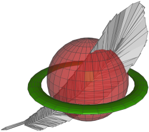

:Author: OSGeo-Live
:Author: Micha Silver
:Version: osgeo-live5.5
:License: Creative Commons Attribution-ShareAlike 3.0 Unported  (CC BY-SA 3.0)

********************************************************************************
SpatiaLite: быстрый старт
********************************************************************************

SpatiaLite — это система управления базами данных (СУБД) SQLite с дополнительными
пространственными функциями.

В этом документе показано, как открыть базу данных с использованием командной
строки и графического интерфейса.

Запуск SpatiaLite
================================================================================

* Откройте командную строку и введите следующую команду, чтобы открыть демонстрационную базу данных::

   spatialite /home/user/data/spatialite/trento.sqlite

* Полезные команды консольного интерфейса::

   .help
   .tables
   .quit

* Несколько простых пространственных запросов::

   SELECT lc.NOME, lc.NOME_PROV, lc.COM, mh.Perimeter
        FROM LocalCouncils AS lc, MunicipalHalls AS mh
        WHERE CONTAINS(lc.Geometry,mh.Geometry) AND lc.NOME LIKE 'VILLA%'
        ORDER BY lc.NOME;
   .headers ON
   SELECT COMUNE, LOCALITA, Area(Geometry)/1000000 AS "Area Sq.km."
        FROM PopulatedPlaces ORDER BY "Area Sq.km." DESC LIMIT 10 ;
   SELECT lc.NOME AS "Provence Name", X(mh.Geometry) AS X_COORD, Y(mh.Geometry) AS Y_COORD
        FROM LocalCouncils AS lc, MunicipalHalls AS mh
        WHERE mh.COMU=lc.COM ORDER BY "Provence Name" LIMIT 10;

Создание новой базы данных в **spatialite-gui**
================================================================================

* Из папки Databases на рабочем столе запустите **spatialite_gui**
* Выберите :menuselection:`File --> Creating a new SQLite DB`
* Нажмите Browse и перейдите в каталог /home/user/data/spatialite/. Введите имя файла, например "Test.sqlite" и нажмите Save.

Открытие существующей базы данных в **spatialite-gui**
================================================================================

* Нажмите кнопку "Disconnecting current SQLite DB"
* Теперь нажмите кнопку "Connect existing SQLite DB"
* Перейдите в каталог /home/user/data/spatialite и выберите файл trento.sqlite
* Вызовите контекстное меню таблицы MunicipalHallsView и выберите "Show Columns"
* Вызовите контекстное меню таблицы PopulatedPlaces и выберите "Edit table rows"
* В верхнем окне SQL введите::

   SELECT NOME, X(Geometry) AS Longitude, Y(Geometry) AS Latitude
        FROM "MunicipalHallsView"
        WHERE NOME_PROV LIKE "BRESCIA";

  и нажмите кнопку "Execute SQL" справа.

Запуск **spatialite-gis**
================================================================================

* Из папки Desktop GIS на рабочем столе запустите **spatialite-gis**
* Нажмите кнопку "Connecting existing SQLite DB" и подключитесь к базе
  /home/user/data/spatialite/trento.sqlite

Вы должны увидеть карту итальянской провинции Тренто.

   - Вызовите контекстное меню слоя Highways и выберите :menuselection:`Hide`
   - Вызовите контекстное меню слоя LocalCouncilsTrento и выберите
     :menuselection:`Layer Configuration->Classify`, затем укажите "Shape Area"
     в качестве признака классификации. Задайте 4 класса, при помощи кнопок
     Min и Max задайте цвета. Сохраните изменения.
   - Измените цвет границы, вызвав контекстное меню слоя LocalCouncils и выбрав
     :menuselection:`Layer configuration->Graphics`. Укажите другой цвет для
     Border Graphics.
   - Немного увеличьте карту. Вызовите контектсное меню слоя PopulatedPlaces
     и выберите :menuselection:`Indentify on`. Затем щёлкните на одном из
     объектов слоя PopulatedPlaces, чтобы увидеть его атрибуты.

Ещё можно попробовать
================================================================================

Вот несколько вещей, которые также можно попробовать

* Изучение геометрической составляющей объектов в spatialite-gui
* Открытие и редактирование слоёв SpatiaLite в QGIS

Дополнительная информация
================================================================================

Чтобы узнать больше о SpatiaLite, начните со `страницы проекта SpatiaLite`_.

.. _`страницы проекта SpatiaLite`: https://www.gaia-gis.it/fossil/libspatialite/index

а также обязательно ознакомьтесь с `поваренной книгой SpatiaLite`_

.. _`поваренной книгой SpatiaLite`: http://www.gaia-gis.it/gaia-sins/spatialite-cookbook/index.html
