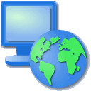
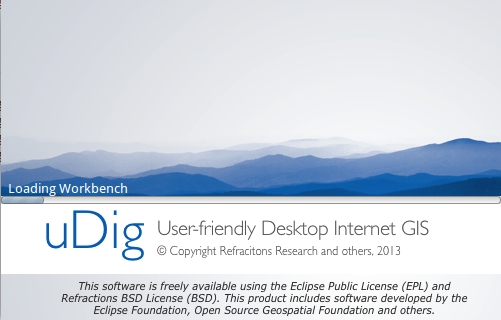

.. Writing Tip:
  Writing tips describe what content should be in the following section.

.. Writing Tip:
  This Quick Start should describe how to run a simple example, which
    covers one of the application's primary functions.
  The Quick Start should be able to be executed in around 5 minutes.
  The Quick Start may optionally include a few more sections
    which describes how to run extra functions.
  This document should describe every detailed step to get the application
    to work, including every screen shot involved in the sequence.
  Finish off with "Things to Try" and "What Next?" sections.
  Assume the user has very little domain expertise, so spell everything out.
  If using example data, please use the general layers from NaturalEarth
   and Open Street Map. These layers are loaded into:
   Open Street Map:
     /home/user/data/osm/
   Vector Data: Available as .shp files
     /home/user/data/natural_earth/
       cultural/10m-populated-places-simple
       cultural/10m-admin-0-countries
       cultural/10m-populated-places-simple
       cultural/10m-urban-area
       physical/10m-land
       physical/10m-ocean
       physical/10m-lakes
       physical/10m-rivers-lake-centerlines
   Raster Raster basemap Cross Blended Hypso with Shaded Relief and Water
     1:50 million (40mb). Available as .tif
     /home/user/data/natural_earth/HYP_50M_SR_W/

.. Writing Tip:
  Metadata about this document

:Author: OSGeo-Live
:Author: Jody Garnett
:Author: Frank Gasdorf
:Version: osgeo-live5.0draft
:License: Creative Commons Attribution-ShareAlike 3.0 Unported  (CC BY-SA 3.0)
:Thanks: udig-devel list

********************************************************************************
Начало работы с uDig
********************************************************************************

.. Writing Tip:
  First sentence defines what the application does.
  You may also need to include a sentence of two describing the domain.
  Eg: For a Business Intelligence application, you should describe what
  Business Intelligence is.

uDig представляет собой программу для просмотра и редактирования пространственных данных.

.. Writing Tip:
  Describe what will be covered in this Quick Start.

В данном "введении" рассказывается о:

  * загрузке слоёв из шейп-файлов и :doc:`Web Map Service (WMS) <../standards/wms_overview>`;
  * использовании стандартных картографических инструментов;
  * изменении стиля отображения карты.

.. contents:: Содержание
  
Запуск uDig
================================================================================

.. Writing Tip:
  Describe steps to start the application
  This should include a graphic of the pull-down list, with a red circle
  around the application menu option.
  #. A hash numbers instructions. There should be only one instruction per
     hash.

.. TBD: Add menu graphic to this uDig Quickstart

#. Выберите |osgeolive-appmenupath-udig| из меню.
#. Приложению нужно несколько секунд для старта.

.. Writing Tip:
  For images, use a scale of 50% from a 1024x768 display (preferred) or
  70% from a 800x600 display.
  Images should be stored here:
    https://svn.osgeo.org/osgeo/livedvd/gisvm/trunk/doc/images/screenshots/1024x768/

Если у вас возникли трудности с запуском uDig, пожалуйста, просмотрите страницу "Запуск uDig".

Начальный вид
================================================================================

#. После первого запуска uDig откроется окно "Начальный вид" и займёт весь экран. Здесь размещены ссылки на руководства, документацию и веб-сайт проекта.

#. Нажмите на стрелку с надписью "Рабочий набор" в верхнем правом углу для показа состава рабочих наборов uDig.
  
  .. image:: ../../images/screenshots/800x600/udig_welcome.png
   :scale: 70 %
   
Вы можете вернуться к "Начальному виду" в любой момент, выбрав :menuselection:`Help --> Welcome` из меню.

Рабочий набор
================================================================================

Окно Рабочего набора предоставляет множество инструментов редактирования (каждый показан на карте) и поддерживает Виды (предоставляет информацию о текущей карте). 

  .. image:: ../../images/screenshots/800x600/udig_workbench.png
   :scale: 70 %

Ниже представлена типичная сессия в uDig:

	#. вид слоев (1),
	#. вид проектов (2), 
	#. вид каталога (3) и 
	#. редактор карт (4). 

Эти виды будут описаны далее по ходу демонстрации их использования.

Файлы
================================================================================

Для начала мы загрузим некоторые данные примеров.

#. Выберите :menuselection:`Layer --> Add` из меню для открытия Мастера **Add Data**.

#. Выберите **Files** из списка источников данных.

#. Нажмите :guilabel:`Next`, чтобы открыть диалог выбора файлов.

#. OSGeo-Live содержит данные примеров в:
   
   * :file:`~/data` (ссылка :file:`/usr/local/share/data`)

#. Выберите следующий файл из папки :file:`natural_earth`:
   
   * :file:`10m_admin_0_countries.shp`
   
#. Нажмите :guilabel:`Open`
   
   * Откроется новый редактор карт на основе содержимого шейп-файлов. Имя и проекция карты будут взяты из шейп-файла.
   
   * Вы можете заметить, что вид **Catalog view** обновился и в нём появилась запись для шейп-файла :file:`10m_admin_0_countries.shp`. Этот вид предназначен для отображения ресурсов, используемых uDig.
   
   * Вид **Layers** отображает отдельный слой карты. Этот вид используется для изменения порядка и отображения информации на карте.
   
   * Вид **Projects** при обновлении показывает, что карта хранится в `projects > 10m admin 0 countries`.
     Вы можете иметь множество одновременно открытых проектов, каждый проект может иметь несколько карт.

#. Откройте папку :file:`~/data/natural_earth/HYP_50M_SR_W` на рабочем столе.

#. Перетащите :file:`HYP_50M_SR_W.tif` в окно редактора карт, при этом появится новый слой в карте.

#. Вы можете видеть порядок слоев, в котором они отрисовываются в окне карты. Сейчас слой `HYP_50M_SR_W` рисуется поверх слоя `10m admin 0 countries`.

#. Выберите слой `HYP_50M_SR_W` в окне каталога и перетащите его вниз списка.
  
  .. image:: ../../images/screenshots/800x600/udig_QuickstartCountriesMap.jpg
   :scale: 70 %

.. Writing Tip:
  Notes are used to provide descriptions and background information without
  getting in the way of instructions. Notes will likely be rendered in
  the margin in some printed formats.

.. note::
  Одним из самых распространенных вопросов, задаваемых при анализе возможности использования uDig в организации является: сколько памяти использует приложение? В отличие от большинства ГИС-приложений uDig можете занимать фиксированный объемом памяти. Шейп-файлы не загружаются в память, у нас есть политика хранения данных на диске и их отображения по мере необходимости.

.. Writing Tip:
  Tips are used to provide extra useful information, and will 
  likely be rendered in the margin in some printed formats.

.. tip:: Вы можете перетащить ("drag-and-drop") шейп-файлы прямо в окно приложения uDig!

Карта
================================================================================

Вы можете управлять, каким именно образом редактор карт отображает контент, используя навигационные инструменты на панели инструментов в верхней части экрана.

#. |ZOOM|Инструмент масштабирования доступен по умолчанию.
   
   .. |ZOOM| image:: ../../images/screenshots/800x600/udig_zoom_mode.gif
   
   * Используйте инструмент масштабирования, рисуя прямоугольник на экране вокруг области карты, которую необходимо приблизить/отдалить.
   * Для уменьшения рисуйте прямоугольник правой клавишей мыши. Текущий экстент будет локализован внутри нарисованного прямоугольника.

#. |PAN| Инструмент перемещения служит для сдвига карты без изменения масштаба.
  
   .. |PAN| image:: ../../images/screenshots/800x600/udig_pan_mode.gif

#. Имеется несколько навигационных кнопок, которые могут быть использованы в любой момент:
 
   * Инструмент |SHOWALL| "Показать всё" может быть использован для возврата к полному охвату в любой момент времени.
   
     .. |SHOWALL| image:: ../../images/screenshots/800x600/udig_zoom_extent_co.gif

   * Инструменты |ZOOM_IN| "Приблизить" и |ZOOM_OUT| "Отдалить" могут быть использованы для изменения масштаба.

     .. |ZOOM_IN| image:: ../../images/screenshots/800x600/udig_zoom_in_co.gif
     .. |ZOOM_OUT| image:: ../../images/screenshots/800x600/udig_zoom_out_co.gif

   * Вы можете использовать инструменты навигации "Назад" |BNAV| и "Вперёд" |FNAV| в меню для перемещения между предыдущими местоположениями.

     .. |BNAV| image:: ../../images/screenshots/800x600/udig_backward_nav.gif
     .. |FNAV| image:: ../../images/screenshots/800x600/udig_forward_nav.gif

.. tip:: Большинство инструментов позволяют перемещать содержимое окна карты, зажимая центральную клавишу мыши и изменять масштаб колесом прокрутки.

WMS
================================================================================

Одной из причин использовать приложения типа uDig — это доступ ко всем замечательным ресурсам пространственных данных в сети Интернет. Данная глава посвящена использованию WMS.

.. note:: Если у вас нет доступа в Интернет, запустите |osgeolive-appmenupath-geoserver| для создания локального WMS. Скрипт откроет страницу с данными "Service Capabilities" и двумя ссылками для WMS, которые вы можете перетащить в вашу пустую карту.

.. tip:: Также, вы можете подключится к WMS используя мастер **Add Data** (:menuselection:`Layer --> Add...`).

#. Выберите :menuselection:`File --> New --> New Map` в меню.

#. Переключите на вид **Web**, кликните на вкладке после вида **Catalog** для отображения вида *Web*.

	.. image:: ../../images/screenshots/800x600/udig_WebViewClick.png
		:scale: 50 %

#. Кликните на ссылке WMS\:`dm solutions`_ link

	.. _dm solutions: http://www2.dmsolutions.ca/cgi-bin/mswms_gmap?Service=WMS&VERSION=1.1.0&REQUEST=GetCapabilities

#. На странице выбора ресурсов выберите следующие слои:

   * Высоты/батиметрия
   * Парки
   * Населённые пункты
   
	.. image:: ../../images/screenshots/800x600/udig_AddWMSLayers.png
		:scale: 70 %

#. Нажмите :guilabel:`Finish` для добавления слоев на карту.
   
	.. image:: ../../images/screenshots/800x600/udig_WMSMap.png
		:scale: 70 %

#. Используйте |ZOOM| инструмент масштабирования для приближения к одному из парков.

#. Переключитесь на |INFO| инструмент информации и кликните на парке для изучения информации о нём.

.. |INFO| image:: ../../images/screenshots/800x600/udig_info_mode.gif

.. tip:: Вы можете переключаться между инструментами масштабирования и информации, нажимая клавиши `Z` и `I` на клавиатуре.

Стили
================================================================================

#. Выберите `project > 10m admin 0 countries`. Вы можете открыть эту карту двойным щелчком или щелчком ПКМ и выбором пункта "Открыть карту".

#. Выберите слой countries в виде "Слои".

#. Откройте **Style Editor** щелчком ПКМ на слое `10m admin 0 countries` и выберите :guilabel:`Change Style`.

#. Мы собираемся изменить настройки отображения для слоя *countries*
   
   * линии: нажмите :guilabel:`Border`, нажмите кнопку Цвет и измените цвет на чёрный;
   
   * заливка: на вкладке :guilabel:`Fill` снимите выбор :guilabel:`enable/disable fill` чтобы отключить заливку;
   
   * подписи: на вкладке :guilabel:`Labels` поставьте выбор :guilabel:`enable/disable labeling`, и отметьте **NAME** из списка атрибутов.

   .. image:: ../../images/screenshots/800x600/udig_StyleEditor.png
      :scale: 70 %

#. Нажмите :guilabel:`Apply`, чтобы увидеть как это выглядит на нашей карте. Вид **Layer** будет также обновлён, чтобы соответствовать текущему стилю.

#. Если вам понравился результат, вы можете нажать :guilabel:`Close`, чтобы закрыть диалог.

.. note:: Некоторые файлы содержат настройки стиля. Настройки стиля могут быть в файлах с расширением :file:`*.sld`. Название файла стиля должно совпадать с файлом данных. Если такой файл :doc:`Styled Layer Description (SLD) <../standards/sld_overview>` создан, то стиль будет применен автоматически. 

Иногда тяжело определить, что творится со стилем, имеющем множество деталей. Для того, чтобы сфокусироваться на задаче, с которой вы хотите работать, вы можете выбрать :menuselection:`Map --> Mylar` из меню. При помощи вида *Layer* выберите различные слои, чтобы увидеть эффект. Вы можете отключить эффект в любой момент при помощи меню :menuselection:`Map --> Mylar`.
  
	.. image:: ../../images/screenshots/800x600/udig_MapMylar.jpg
		:scale: 70 %

.. Writing tip
  The final heading should provide pointers to further tutorials,
  documentation or further things to try.
  Present a list of ideas for people to try out. Start off very specific
  with something most people can do based on the materials as presented.
  Continue on with a challenge that involves a small bit of research (it
  is recommended that research be limited to something that can be
  found in documentation packaged on OSGeo-Live, as users might not be
  connected to the Internet.

Что еще
================================================================================

Вот некоторые дополнительные действия, которые стоит попробовать:

#. Попробуйте отобразить вашу собственную карту или попробуйте добавить слой из :doc:`Web Feature Service (WFS) <../standards/wfs_overview>`.
#. Попробуйте настроить стили слоя WFS.

Что дальше?
================================================================================

.. Writing tip
  Provide links to further tutorials and other documentation.

Это только первый шаг к использованию uDig. Есть множество хороших материалов для изучения в документах типа **walkthrough**:

* Пошаговое руководство 1

  Попробуйте воспользоваться :doc:`PostGIS <../overview/postgis_overview>` для получения данных от WFS и изучить использование **Themes** при помощи мощной технологии `Color Brewer`.

  :file:`/usr/local/share/udig/udig-docs/uDigWalkthrough 1.pdf`

* Пошаговое руководство 2

  Изучите, как создавать шейп-файлы и использовать инструменты редактирования для управления пространственными данными. Руководство охватывает установку :doc:`GeoServer <../overview/geoserver_overview>` и редактирование WFS.

  Всё это доступно по ссылке http://udig.refractions.net/

