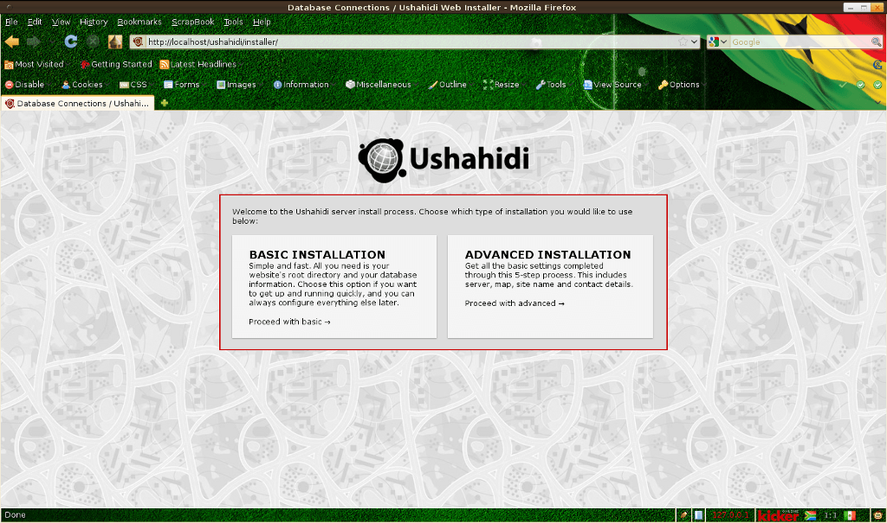
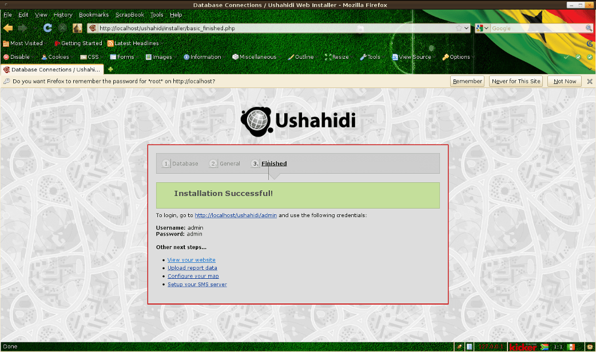
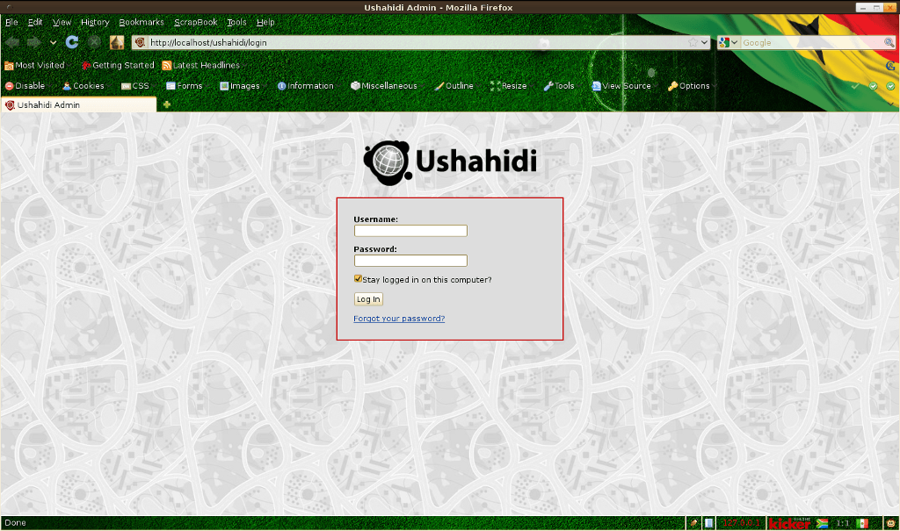

:Author: Henry Addo
:Version: osgeo-live4.0
:License: Creative Commons Attribution-ShareAlike 3.0 Unported  (CC BY-SA 3.0)

.. image:: ../../images/project_logos/logo-ushahidi.png
  :scale: 100 %
  :alt: Логотип проекта
  :align: right 

Начало работы с Ushahidi
================================================================================

В данном руководстве приведена информация о том как:

* установить и запустить Ushahidi 

Установка и запуск Ushahidi
--------------------------------------------------------------------------------

1. Запустите Ushahidi с помощью ярлыка, расположенного на рабочем столе,
   или через меню. После чего в Веб-браузере откроется страница установки.
   Сайт Ushahidi довольно прост в настройке:

.. image:: ../../images/screenshots/1024x768/ushahidi-drc-screenshot.png
  :scale: 50 %
  :alt: ushahidi desktop icons
  :align: center 

2. Выберите **"Basic Installation"**, **"Let's get started"**, после чего
   необходимо указать нужные настройки. Имя базы данных - **"ushahidi"**,
   имя пользователя базы данных - **"user"**, пароль тоже **"user"**,
   хост базы данных - **"localhost"**. Затем нажмите **"Continue"**.
   На странице *General* укажите имя сайта (заголовок), например
   **OSGeo demo** и если хотите - слоган в качестве подзаголовка. Указанный
   вами адрес электронной почты будет использоваться для получения
   автоматических оповещений при добавлении данных в базу.
   Сейчас задайте просто что-то вроде **"ushahidi@localhost.localdomain"**
   или **"ushahidi@example.org"** и нажмите **"Continue"**.

   **Примечание:** Если Ushahidi выдаёт сообщение **"Oops! We couldn't make a 
   connection to the database server with the credentials given. Please make 
   sure they are correct."**, это означает, что у установочного скрипта не
   достаточно прав для создания базы данных. В этом случае её нужно создать
   вручную. Выполните следующую команду (от имени суперпользователя):

   **"mysql -uroot -p"**

   Появится предложение ввести пароль суперпользователя MySQL-сервера.
   Введите пароль или нажмите Enter, если пароль для суперпользователя
   отсутствует. Затем введите следующую команду, которая создаст новую базу
   данных **"ushahidi"**:

   **"CREATE DATABASE ushahidi;"**
   
   Затем создайте пользователя **"user"** с паролем **"user"** и назначьте
   ему необходимые права:
   
   **"GRANT ALL PRIVILEGES ON ushahidi.* TO 'user'@'localhost' IDENTIFIED BY 'user';"**
   
   Теперь можно вернуться в Веб-установщик и продолжить установку.

3. После того как всё выполнится, появится сообщение о том, что установка
   успешно завершена и появится ссылка 'View your website', по которой следует
   перейти.

 
4. Для внесения изменения в части `администрирования <http://localhost/ushahidi/admin>`_
   войдите в систему, используя имя пользователя **"admin"** и пароль **"admin"**. 
   Например на странице настроек вы можете выбрать **"Settings"**
   (справа сверху), перейти во вкладку **"Map"** и изменить провайдер 
   **"Map provider"** на OpenStreetMaps (для OSM не требуется API-ключ).

Файл README с описанием процесса установки доступен локально по адресу
`/var/www/ushahidi/readme.html <../../ushahidi/readme.html>`_.
