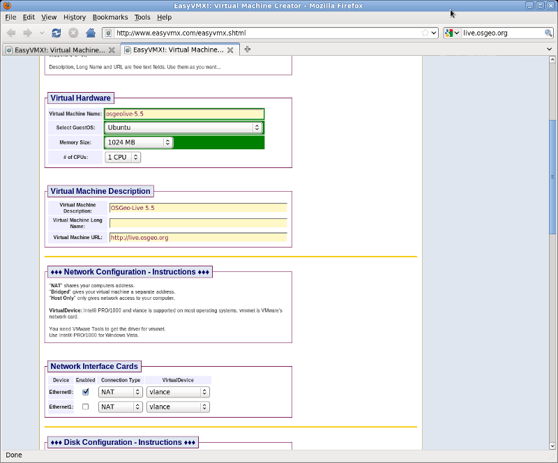
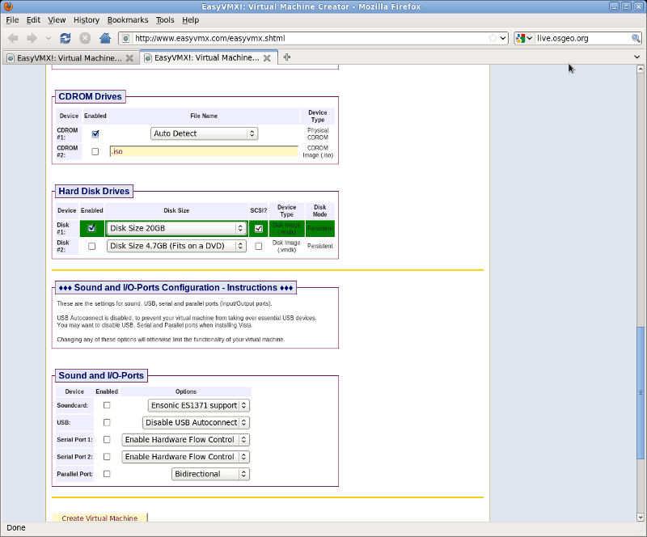
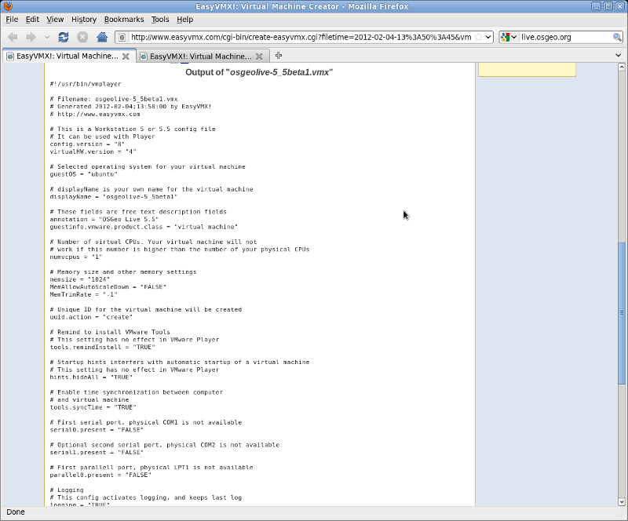
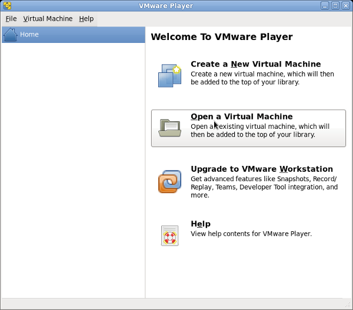
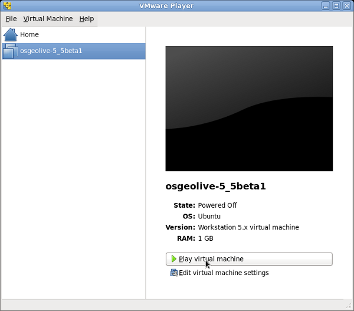
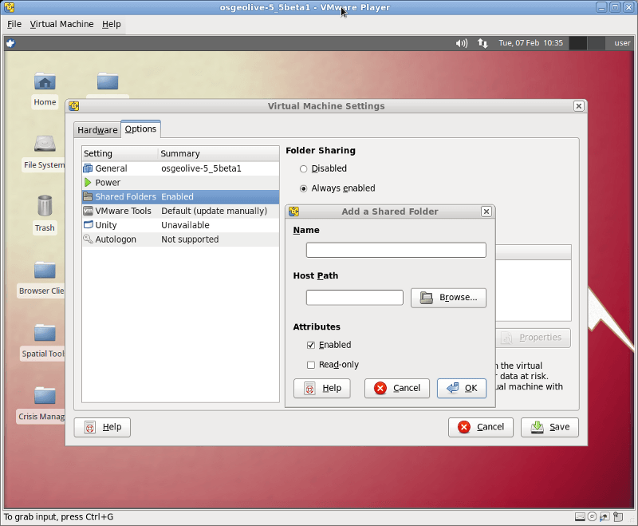

:Автор: OSGeo-Live
:Автор: Micha Silver
:Версия: osgeo-live5.5
:Линцензия: Creative Commons Attribution-ShareAlike 3.0 Unported  (CC BY-SA 3.0)

********************************************************************************
Начало работы с OSGeo-Live в VMWare Player
********************************************************************************
OSGeo-Live может быть установлен и запущен в качестве гостевой виртуальной машины. Основной операционной системой может выступать как Windows, так и Linux. В ней может быть установлено определённое ПО (например, VMWare Player), позволяющее запускать виртуальные машины. Следуйте данной инструкции для настройки OSGeo-Live как виртуальной машины. 

================================================================================
Зачем это нужно?
================================================================================
Запуск OSGeo-Live в виртуальной машине предпочтительней, чем использование LiveDVD. Она позволяет пользователю сохранить свою работу, обновить существующую систему и добавлять дополнительное ПО. Кроме того, виртуальная машина быстрее работает, чем LiveDVD. Виртуальная машина OSGeo создает полную работоспособную среду. В отличие от LiveDVD, файлы и данные будут сохранены, а конфигурация не нарушится. Эта платформа расширяет применение OSGeo-Live в качестве презентации и учёбы, а также позволяет использовать её для работы. 

================================================================================
Требования
================================================================================

Аппаратные средства
----------------
В вашем компьютере должно быть установлено не менее 2 Гб ОЗУ. 1 Гб вы выделите для виртуальной машины, а оставшийся 1 Гб будет использоваться хост-системой. Чем больше будет установлено оперативной памяти, тем лучше. Поэтому, в зависимости от производительности ПК, вы можете скорректировать выделенный объём памяти для виртуальной машины. 
Что касается дискового пространства, то вам необходимо 25 Гб свободного места. Чем больший виртуальный диск вы создадите , тем больше места будет у вас для работы. 
Процессор компьютера должен поддерживать виртуальные машины (большинство современных ПК имеют процессоры с технологией "Virtualization Technology").      

Программное обесечение
----------------
Загрузите образ OSGeo-Live для виртуальной машины. Вам понадобится архиватор *7-zip* для распаковки файлов. Также понадобится VMWare Player для запуска виртуальной машины. Обратите внимание, что VMWare Player, хоть и беспланый, не является программным обеспечением с открытым исходным кодом. Вы должны зарегистрироваться на сайте VMWare и согласиться с условиями использования ПО.:

`Образ виртуальной машины OSGeo <http://download.osgeo.org/livedvd/release/5.5/osgeo-live-vm-5.5.7z>`_

`Архиватор 7 zip <http://www.7-zip.org/download.html>`_

`Регистрация для загрузки VMWare Player: <https://www.vmware.com/tryvmware/?p=player&lp=1>`_

Для распаковки osgeo-live-vm используйте команду 

::

        7z e osgeo-live-vm-5.5.7z

или графическую оболочку для 7-zip. Установите VMWare Player.

================================================================================
Настройки виртуальной машины
================================================================================
Для того, чтобы запустить образ виртуальной машины OSGeo, сперва для неё нужно создать файл конфигурации **vmx**. Для быстрой настройки перейдите на: 

`EasyVMX web site: <http://www.easyvmx.com/easyvmx.shtml>`_

Нажмите кнопку easyvmx и введите в форму следующие параметры конфигурации:
        - Virtual Machine Name: osgeolive-6.0 (указать такой же, как и файл vmdk)
        - Select GuestOS: Ubuntu
        - Memory Size: 1024 MB (минимум)
        - Virtual Machine Description: OSGeo-Live 6.0
        - Network Interface Card: оставьте по умолчанию
        - Hardisk Drives: Disk#1 Disk Size 20 Гб (рекомендуется) и отметить SCSI
        - Sound and IO: снять все

Нажмите кнопку "Create Experimental Virtual Machine". После этого будет создан отформатированный **vmx**, содержащий указанную выше конфигурацию. Поместите данный файл в папку с образом OSGeo. Скопируйте строку, как показано на рисунке ``#!/usr/bin/vmplayer`` в ``# END OF EasyVMX! CONFIG`` и вставьте в новый файл osgeolive-6.0.vmx. 

Основное имя файла (без расширения vmx) должно соответствовать имени vmdk-файла OSGeo. Кроме того, проверьте данную строку в vmx-файле ``scsi0:0.fileName =``. Убедитесь, что она также **полностью совпадает с загруженным файлом vmdk**.
Сохраните новый файл vmx в той же папке, где находится загруженный образ виртуальной машины OSGeo.

Теперь запустите VMWare Player и нажмите кнопку **Открыть виртуальную машину**. Укажите папку, в которой вы сохранили загруженный файл vmdk и вновь созданный vmx. Новая виртуальная машина должна будет отобразиться в списке окна проигрывателя. Нажмите кнопку **Запустить виртуальную машину**. Начнётся загрузка OSGeo.

================================================================================
После того, как запустили виртуальную машину
================================================================================
Для начала установите инструменты VMWare-tools. После того, как они будут установлены, вы сможете поменять разрешение дисплея и создать **сетевые папки** между хост-системой и виртуальной машиной OSGeo-Live. Запустите данную команду в терминале для установки VMWare tools:
 
::

        sudo apt-get install open-vm-dkms open-vm-toolbox

В окне виртуальной машины выберите пункт меню :menuselection:`Виртуальная машина --> Настройки виртуальной машины`, перейдите на вкладку "Параметры" и выберите "Настройки общих папок". Нажмите кнопку "+" для добавления папки из хост-системы, чтобы она была доступна в виртуальной машине OSGeo-Live. например, вы хотите открыть общий доступ к каталогу `C:\\Users\\your_name\\Downloads`. Нажмите кнопку "Обзор", чтобы найти данную папку, задайте ей имя, например, "Downloads", и нажмите "Сохранить".

Теперь выполните следующую команду в терминале системы в виртуальной машине для монтирования общей папки:
::

        sudo mkdir /mnt/Downloads
        sudo mount -t vmhgfs .host:/Downloads /mnt/Downloads

Вот и всё!
