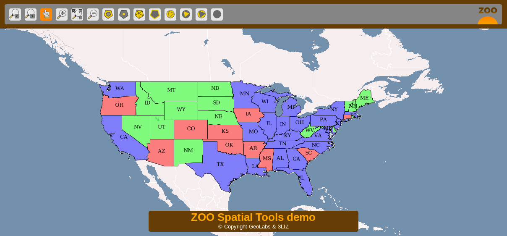
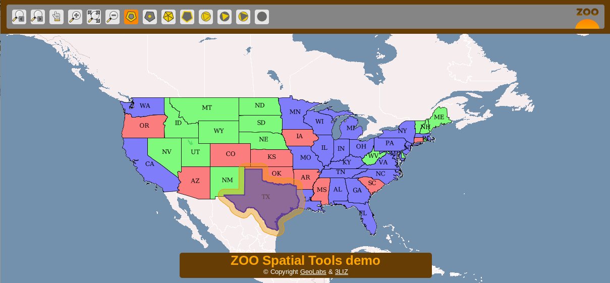
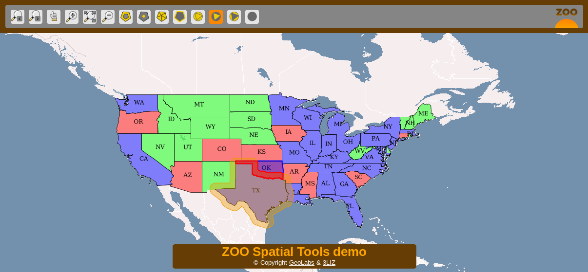

:Author: Gérald Fenoy
:Version: osgeo-live4.0
:License: Creative Commons Attribution-ShareAlike 3.0 Unported  (CC BY-SA 3.0)

********************************************************************************
Начало работы с ZOO Project
********************************************************************************

Запуск
================================================================================

* Для запуска демонстрации ZOO Project с OSGeo-Live DVD нажмите последовательно на |osgeolive-appmenupath-geoserver|, затем на ссылку "ZOO Project" на рабочем столе или найдите ссылку в меню.

* Веб-браузер Firefox откроет демо ZOO Project Spatial Tools.

  
* Щёлкните на экран для выбора для выбора пространственного объекта из :doc:`GeoServer <../overview/geoserver_overview>` WFS. Объект будет показан в синем цвете. Когда запускается простой инструмент геообработки, например, буферизация, создание центроидов, выпуклая оболочка или граница, результат будет показан жёлтым цветом.

* Теперь выберите другой объект недалеко от первого и щёлкните по кнопке обработки нескольких геометрий: "объединить", "пересечь", "симметричное вычитание" или "вычитание", чтобы получить результат на карте в красном цвете.

* Вы можете формировать собственные запросы к ядру ZOO при помощи следующей страницы:
		http://localhost/zoo-demo/test_services.html

* Вам необходимо запросить "capabilities" у сервера ZOO WPS следующим запросом:
		http://localhost/zoo/?Request=GetCapabilities&Service=WPS
	
* Вопросы можно задавать в списке рассылке ZOO:
	zoo-discuss@gisws.media.osaka-cu.ac.jp
