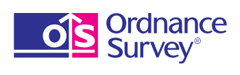
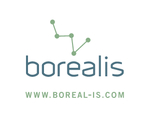
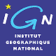
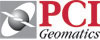
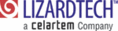
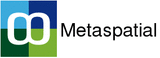

The OSGeo Foundation
================================================================================

`Open Source Geospatial Foundation (OSGeo) <http://osgeo.org>`_ — некоммерческая 
организация, миссией которой является поддержка и содействие
совместной разработки открытых геопространственных технологий и данных.
Фонд предоставляет финансовую, организационную и правовую поддержку для
более широких открытых источников геопространственной сообщества. Он выступает 
в качестве независимого юридического лица, которому члены сообщества могут 
передавать код, финансирование и другие ресурсы, и быть уверенными в том, 
что их вклад будет поддерживаться на благо общества. OSGeo также занимается 
пропагандой ГИС с открытым исходным кодоми и деятельностью по их защите, обеспечивает 
общую "площадку" и коллективную инфраструктуру для улучшения межпроектного сотрудничества.

Все проекты OSGeo свободно доступны и могут быть использованы под 
`сертифицированной OSI свободной лицензией <http://www.opensource.org/licenses/>`_.

Live DVD и образ виртуальной машины были созданы совместными усилиями
членов сообщества OSGeo, чтобы продемонстрировать используемые ими свободные
геопространственные приложения с открытым исходным кодов. Мы включили целый 
ряд пакетов, не входящих в проекты OSGeo, относящихся к ГИС или нет, в надежде, 
что они окажутся полезными для вас. Фонд OSGeo не даёт рекомендации или гарантии
насчёт программного обеспечения, проектов или компаний в содержимом диска.
 
`Данное программного обеспечение распространяется в надежде, что оно будет 
полезно, но БЕЗ КАКИХ-ЛИБО ГАРАНТИЙ; даже без подразумеваемых гарантий 
КОММЕРЧЕСКОЙ ЦЕННОСТИ или ПРИГОДНОСТИ ДЛЯ КОНКРЕТНОЙ ЦЕЛИ.`    

Поддержка OSGeo 
--------------------------------------------------------------------------------

Спонсоры OSGeo 
--------------------------------------------------------------------------------

.. image:: ../images/logos/geocat_logo.png
  :alt: GeoCat
  :align: left
  :target: http://geocat.net/

.. image:: ../images/logos/astun.gif
  :alt: Astun Technology
  :align: center
  :target: http://www.isharemaps.com

.. image:: ../images/logos/camptocamp_logo.png
  :scale: 80 %
  :alt: Camptocamp
  :align: right
  :target: http://camptocamp.com

.. image:: ../images/logos/1spatial_sml.jpg
  :alt: 1Spatial
  :align: center
  :target: http://www.1spatial.com

.. image:: ../images/logos/first-base-solutions_logo.png
  :alt: First Base Solutions
  :align: right
  :target: http://www.firstbasesolutions.com

Подробности
--------------------------------------------------------------------------------

По вопросам спонсирования OSGeo или обсуждения возможностей
спонсорства в дальнейшем, пожалуйста, обращайтесь по контактам:        

.. include :: ../osgeo_contact.rst

