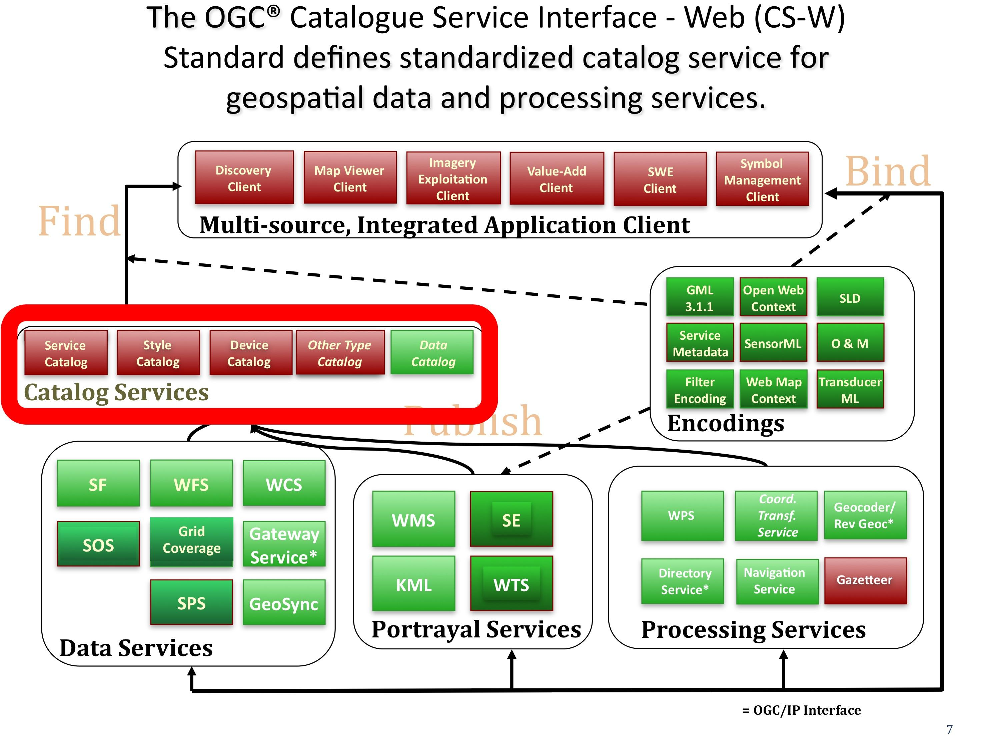

.. Writing Tip:
  Writing tips describe what content should be in the following section.

.. Writing Tip:
  Metadata about this document

:Author: OGC
:License: Creative Commons

.. Writing Tip: 
  Project logos are stored here:
    https://svn.osgeo.org/osgeo/livedvd/gisvm/trunk/doc/images/project_logos/
  and accessed here:
    ../../images/project_logos/<filename>
  A symbolic link to the images directory is created during the build process.

.. image:: ../../images/project_logos/logo-OGC-left.png
  :scale: 100 %
  :alt: OGC logo
  :align: right

.. image:: ../../images/project_logos/logo-OGC-right.png
  :scale: 100 %
  :alt: OGC logo
  :align: right

.. Writing Tip: Name of application

Catalogue Service (CS-W)
================================================================================

.. Writing Tip:
  1 paragraph or 2 defining what the standard is.

Стандарт OGC "Catalogue Service for the Web" (CS-W) определяет схему проектирования
для публикации и поиска коллекций описательной информации (метаданных), касающихся
пространственных данных, сервисов и информационно связанных с ними объектов. 
Поставщики ресурсов (например, контента) используют каталоги для регистрации метаданных, 
которые соответствуют выбору поставщика информационной модели; подобные модели включают
в себя описания пространственных ссылок и тематической информации. Это повышает эффективность
поиска геопространственных данных и сервисов клиентскими приложеними.

Есть несколько профилей текущей модели OGC CS-W. Они включают:

* ISO 19115/19139 — профиль метаданных (http://www.iso.org/iso/catalogue_detail.htm?csnumber=32557). Этот документ определяет профиль приложения для ISO-метаданных с поддержкой XML-кодирования по стандарту ISO 19139 (http://www.iso.org/iso/catalogue_detail.htm?csnumber=32557) и HTTP-протоколу. Это профиль широко применяется в Европе, например, в инфраструктуре пространственных данных для Северной Рейн-Вестфалии (федеральная земля в Германии).
* CSW-ebRIM  — сервис регистрации (http://portal.opengeospatial.org/files/?artifact_id=31137). Этот профиль применяется для CSW-интерфейсов в информационной модели реестра OASIS ebXML (ebRIM 3.0) так, чтобы обеспечить базовый и гибкий сервис веб-реестра, который позволяет пользователям — реальным людям или программным агентам — найти к ним доступ, сделать использование ресурсов на базе открытых и распределённых систем; он также обеспечивает средства для получения и хранения многих видов описаний ресурсов, а также управления ими. Механизм расширений позволяет содержимому реестра быть адаптированным к более специализированных областям применения.
* CSW 39,50: протокол привязки Z39.50 использует сообщения на основе клиент-сервер архитектуры, реализованной с использованием 
ANSI/NISO Z39.50 Application Service Definition и Protocol Specification3. Этот протокол направляет каждую из общих операций модели соответствующему сервису, указанному в стандарте ANSI / NISO / ISO http://lcweb.loc.gov/z3950/agency/document.html .

Большая часть текущей работы по данному стандарту связана с реструктуризацией стандарта
каталога так, чтобы он был правильно разработанным, легко реализуемым в сочетании с хорошо
определённым механизмом для выражения различных расширений (ранее известным как "профили
приложений").

См. также
--------------------------------------------------------------------------------

.. Writing Tip:
  Describe Similar standard

* Cat: ebRIM App Profile: Earth Observation Products
* ISO 23950 (2003). "Information Retrieval (Z39.50): Application Service Definition and Protocol Specification"
