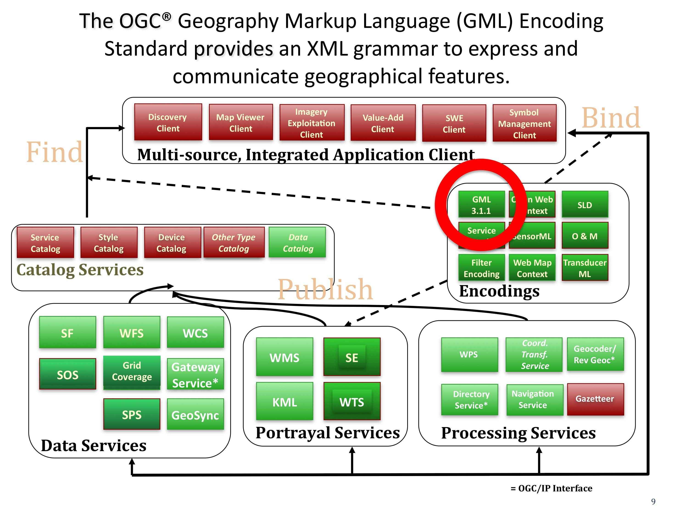

.. Writing Tip:
  Writing tips describe what content should be in the following section.

.. Writing Tip:
  Metadata about this document

:Author: OGC
:License: Creative Commons

.. Writing Tip: 
  Project logos are stored here:
    https://svn.osgeo.org/osgeo/livedvd/gisvm/trunk/doc/images/project_logos/
  and accessed here:
    ../../images/project_logos/<filename>
  A symbolic link to the images directory is created during the build process.

.. Writing Tip: Name of application

Geography Markup Language (GML)
================================================================================

.. Writing Tip:
  1 paragraph or 2 defining what the standard is.

GML (http://www.opengeospatial.org/standards/gml) - основанный на базе XML стандарт описания географических объектов. GML используется в качестве языка описания моделей в географических системах, а также удобен как обменный формат для передачи данных в Интернет. Отметим, что концепция объекта в GML очень общая и включает в себя не только обычные "вектора" или дискретные объекты, но также покрытия и некоторые элементы данных от разнородных датчиков. Возможность объединения всех форм географической информации в одном месте - ключевой фактор полезности GML.

GML содержит широкий спектр примитивов, которые используются для построения схем приложений или отдельных языков. Доступные примитивы: 

* Объект (Feature)
* Геометрия (Geometry)
* Система координат (Coordinate Reference System)
* Топология (Topology)
* Время (Time)
* Динамический объект (Dynamic feature)
* Покрытие (включая географические изображения) (Coverage)
* Единица измерения (Unit of measure)
* Направления (Directions)
* Наблюдения (Observations)
* Правила отрисовки карты (Map presentation styling rules)

Понимания концепций “Feature”, “Geometry” и “CRS” - необходимое условие использования и разработки любых форматов, основанных на базе GML.

Работа над GML началась в 1998 году, а в 2001 году это был первый утверждённый стандарт OGC. В 2007 году GML стал стандартом ИСО. Последняя версия совместного OGC-ISO стандарта GML - 3.2.16. Версии 3.2.2 и 4.0 в настоящее время находятся в разработке.

См. также
--------------------------------------------------------------------------------

.. Writing Tip:
  Describe Similar standard

* CityGML
* GeosciML
* GML in JPEG 2000
* :doc:`wfs_overview`
* :doc:`kml_overview`
* :doc:`sld_overview`
* :doc:`fe_overview`
