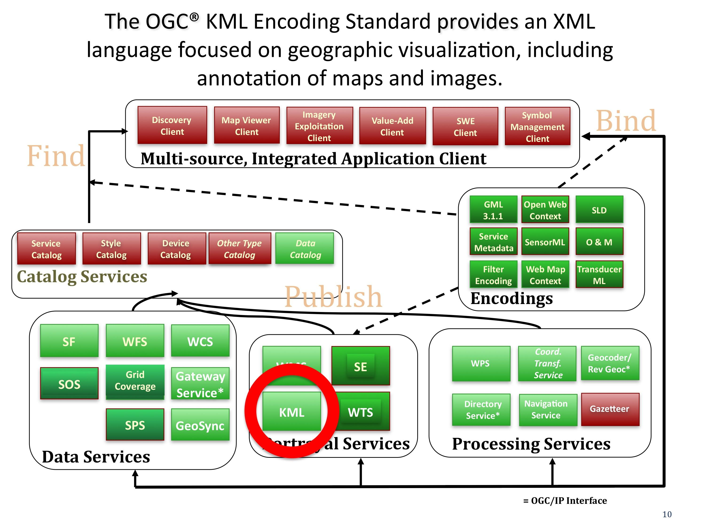

.. Writing Tip:
  Writing tips describe what content should be in the following section.

.. Writing Tip:
  Metadata about this document

:Author: OGC
:License: Creative Commons

.. Writing Tip: 
  Project logos are stored here:
    https://svn.osgeo.org/osgeo/livedvd/gisvm/trunk/doc/images/project_logos/
  and accessed here:
    ../../images/project_logos/<filename>
  A symbolic link to the images directory is created during the build process.

.. image:: ../../images/project_logos/logo-OGC-left.png
  :scale: 100 %
  :alt: Логотип OGC
  :align: right

.. image:: ../../images/project_logos/logo-OGC-right.png
  :scale: 100 %
  :alt: Логотип OGC
  :align: right

.. Writing Tip: Name of application

Стандарт кодирования KML (KML)
================================================================================

.. Writing Tip:
  1 paragraph or 2 defining what the standard is.

`Стандарт OGC KML <http://www.opengeospatial.org/standards/KML>`_ — язык на основе XML, предназначенный для визуализации географической информации, включая аннотации к картам и изображениям. Визуализация географической информации состоит не только в представлении данных на поверхности земного шара, но также в контроле пользовательской навигации.

В 2006 г. компания Google предложила KML (когда-то язык разметки "Keyhole") как стандарт на рассмотрение OGC. Это был первый уже существующий стандарт, предложенный для утверждения в OGC, и поэтому OGC изменила процесс принятия для внесения стандартов, которые были разработанны вне рамок консорциума и затем представлены на его рассмотрение. Преследовались 4 цели:

 * Будет один международный язык представления географических аннотаций и визуализации для существующих и будущих веб-карт (2d) и интерактивных глобусов (3d).
 * KML разработан в соответствии с лучшей международной практикой и стандартами, что позволяет создавать более понятные и удобные реализации интерактивных глобусов.
 * OGC и сообщество KML будут совместно работать, чтобы гарантировать, что сообщество KML правильно участвует в процессе и получает оперативную информацию о прогрессе и существующих проблемах.
 * Стандартизация OGC будет использоваться для обеспечения надлежащего управления жизненным циклом спецификации KML, включая такие вопросы, как обратная совместимость.

KML был утверждён в качестве стандарта OGC в 2008 году, так как консорциум считает, что данный шаг будет способствовать более широкому внедрению, повышению взаимодействия и совместного использования контента и контекста интерактивных глобусов.

KML является дополнением к большинству существующих спецификаций OGC, включая такие ключевые стандарты, как GML (Geography Markup Language), WFS (Web Feature Service) и WMS (Web Map Service). В настоящее время, KML (v2.1) использует некоторые элементы геометрии GML (версия 2.1.2). Эти элементы включают в себя точки, линии, замкнутые линии и полигоны.

См. также
--------------------------------------------------------------------------------

.. Writing Tip:
  Describe Similar standard

* :doc:`gml_overview`
* :doc:`wfs_overview`
