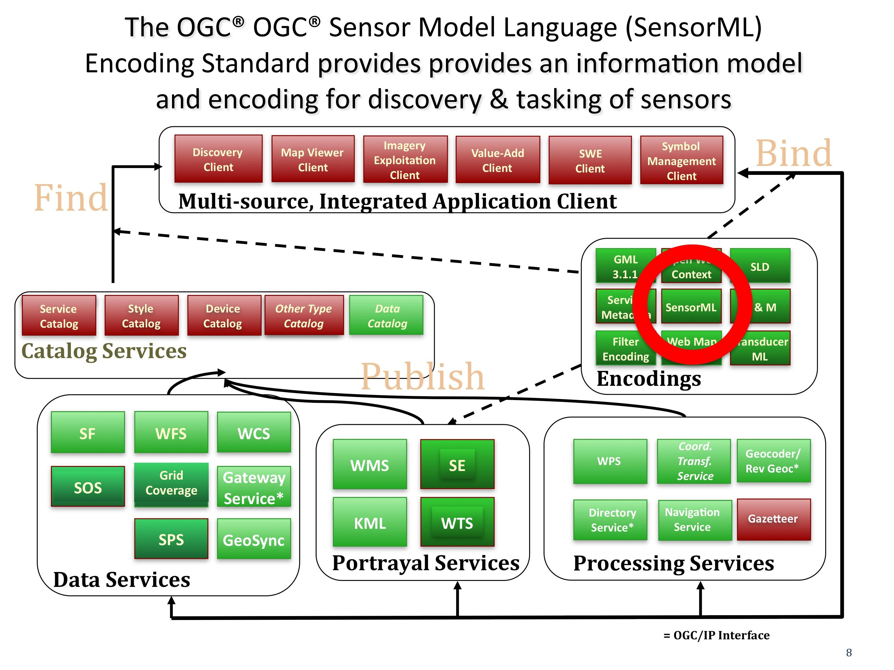

.. Writing Tip:
  Writing tips describe what content should be in the following section.

.. Writing Tip:
  Metadata about this document

:Author: OGC
:License: Creative Commons

.. Writing Tip: 
  Project logos are stored here:
    https://svn.osgeo.org/osgeo/livedvd/gisvm/trunk/doc/images/project_logos/
  and accessed here:
    ../../images/project_logos/<filename>
  A symbolic link to the images directory is created during the build process.

.. image:: ../../images/project_logos/logo-OGC-left.png
  :scale: 100 %
  :alt: Логотип OGC
  :align: right

.. image:: ../../images/project_logos/logo-OGC-right.png
  :scale: 100 %
  :alt: Логотип OGC
  :align: right

.. Writing Tip: Name of application

Sensor Model Language (SensorML)
================================================================================

.. Writing Tip:
  1 paragraph or 2 defining what the standard is.

OGC Sensor Model Language (SensorML) — это стандарт кодирования, который описывает информационную модель и кодировку XML, которые позволяют искать датчики, подключённые к сети Интернет, ставить задачи этим датчикам, а также использовать результаты наблюдений с датчиков. В рамках этого контекста SensorML позволяет разработчикам определять модель и схему XML для описания любого процесса, включая измерения системой датчиков и постобработку. (http://www.opengeospatial.org/standards/sensorml)

Рассмотрим более детально, что позволяет SensorML: 

* Предоставляет описание датчиков и систем датчиков.
* Предоставляет информацию о датчике или процессе в помощь к определению источников и результатов измерений.
* Поддержка обработки и анализа результатов наблюдений.
* Поддержка определения местоположения полученных значений с датчиков (измеренных данных).
* Обеспечить характеристики (например, точность, порог и др.).
* Обеспечить явное описание процесса, посредством которого наблюдений было получено (например, его линейность).
* Обеспечить цепочки исполняемых процессов для получения новых информационных продуктов по требованию (например, выводимых наблюдения).
* Накопление основных свойств и предположений относительно систем датчиков. 

Отдельная схема SensorML описывает конкретный датчик или массив датчиков и может размещаться в реестре. 

Имеется множество примеров реализаций SensorML, таких, как программа NASA MSFC SMART (http://smartdev.itsc.uah.edu/casestudy/documents/paper_nstc_2007_A1P1.pdf). В этом проекте группа учёных разработала веб-ориентированный инструмент обработки измерений датчиков для интеллектуального анализа данных со спутника зондирования атмосферы в ИК-диапазоне, с получением температуры и влажности и передачи их в региональную конфигурацию модели исследования погоды и прогноза по юго-востоку США.

Также по теме
--------------------------------------------------------------------------------

.. Writing Tip:
  Describe Similar standard

* :doc:`sos_overview`
* Сервис планирования съемки (Sensor Planning Service)
* Наблюдения и измерения (Observations and Measurements)
* Язык разметки преобразований (Transducer Markup Language)
