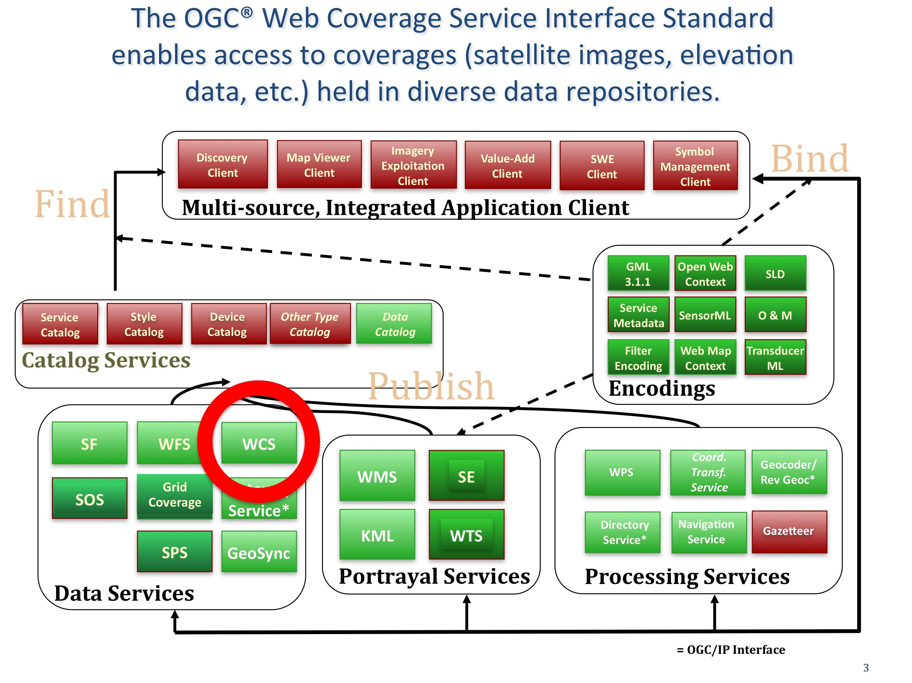

.. Writing Tip:
  Writing tips describe what content should be in the following section.

.. Writing Tip:
  Metadata about this document

:Author: OGC
:License: Creative Commons

.. Writing Tip: 
  Project logos are stored here:
    https://svn.osgeo.org/osgeo/livedvd/gisvm/trunk/doc/images/project_logos/
  and accessed here:
    ../../images/project_logos/<filename>
  A symbolic link to the images directory is created during the build process.

.. image:: ../../images/project_logos/logo-OGC-left.png
  :scale: 100 %
  :alt: Логотип OGC
  :align: right

.. image:: ../../images/project_logos/logo-OGC-right.png
  :scale: 100 %
  :alt: Логотип OGC
  :align: right

.. Writing Tip: Name of application

WCS (Web Coverage Service)
================================================================================

.. Writing Tip:
  1 paragraph or 2 defining what the standard is.

Стандарт `WCS <http://www.opengeospatial.org/standards/wcs>`_ (веб-сервис покрытий) определяет
интерфейсы и операции, позволяющие взаимодействовать с пространственными данными, называемыми
"покрытие". Этим термином описываются спутниковые снимки, результаты аэрофотосъёмки, цифровые
модели рельефа и другие данные, представленные значениями в каждой измеряемой точке.

WCS является сервисом предоставления данных. Он позволяет загружать покрытия, например, цифровые
модели рельефа, через HTTP-интерфейс. В ответ на запрос сервис вернёт метаданные и закодированные
в определённый формат, например, GeoTIFF или NetCDF, данные пикселей покрытия.

Как и для остальных стандартов OGC, для WCS cуществует много прекрасных примеров использования. 
`Один из таких <http://hfradar.ndbc.noaa.gov/>`_ — веб-сервис, предоставляющий данные с высокочастотного
радара национального центра данных береговых бакенов (NDBC, США). Данный сервис был разработан в
Национальном управлении океанических и атмосферных исследований (NOAA, США) и используется для
мониторинга морских течений. 
`Другой <http://idn.ceos.org/KeywordSearch/Metadata.do?Portal=webservices&KeywordPath=[Project%3A+Short_Name%3D%27EOS%27]&EntryId=NASA_GES_DISC_AIRS_Atmosphere_Data_Web_Coverage_Service&MetadataView=Full&MetadataType=1&lbnode=mdlb1>`_ пример — 
сервис предоставления данных с датчика Atmospheric Infrared Sounder (AIRS) Национального аэрокосмического
агентства (NASA, США). Это один из сервисов веб-покрытий, развёрнутых в "Центре данных и информационных
сервисов земных систем им. Годдарта" (GES DISC), предоставляющих информацию о наблюдении за атмосферой
Земли с датчика AIRs, расположенного на спутнике NASA-Aqua.

См. также
--------------------------------------------------------------------------------

.. Writing Tip:
  Describe Similar standard

* :doc:`wms_overview`
* :doc:`wfs_overview`
* Grid Coverage Service
* :doc:`sos_overview`
* :doc:`fe_overview`
