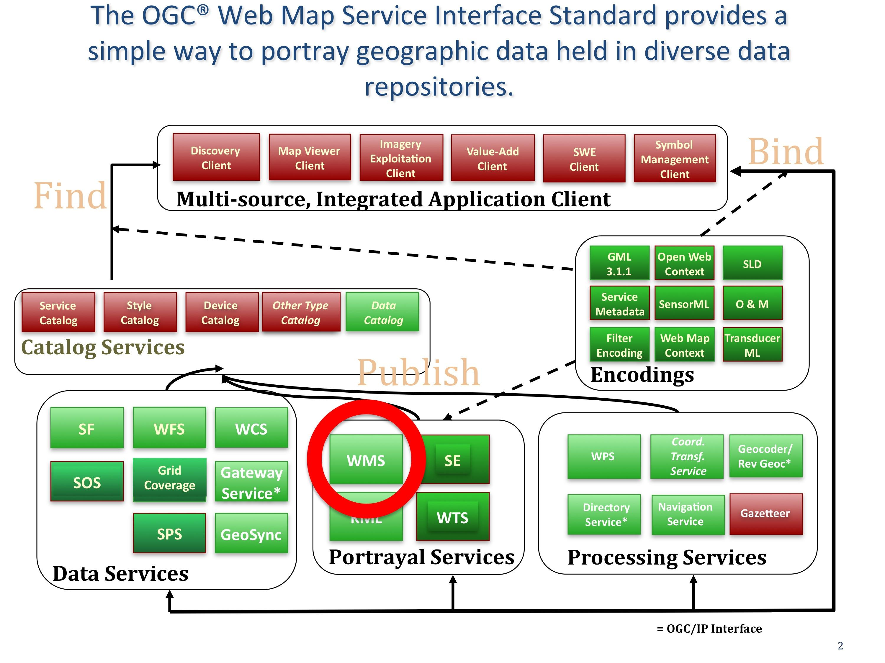

.. Writing Tip:
  Writing tips describe what content should be in the following section.

.. Writing Tip:
  Metadata about this document

:Author: OGC
:License: Creative Commons

.. Writing Tip: 
  Project logos are stored here:
    https://svn.osgeo.org/osgeo/livedvd/gisvm/trunk/doc/images/project_logos/
  and accessed here:
    ../../images/project_logos/<filename>
  A symbolic link to the images directory is created during the build process.

.. image:: ../../images/project_logos/logo-OGC-left.png
  :scale: 100 %
  :alt: Логотип OGC
  :align: right

.. image:: ../../images/project_logos/logo-OGC-right.png
  :scale: 100 %
  :alt: Логотип OGC
  :align: right

.. Writing Tip: Name of application

WMS (Web Map Service)
================================================================================

.. Writing Tip:
  1 paragraph or 2 defining what the standard is.

Стандарт OGC `WMS <http://www.opengeospatial.org/standards/wms>`_ (картографический веб-сервис)
предоставляет простой интерфейс http-запросов для получения геопривязанных изображений
карт нескольких распределённых пространственных баз данных. В ответе сервиса на запрос
будет одно или более изображений карты (в формате JPEG, PNG и др.), которые могут быть показаны
в браузере или настольном приложении.

Стандарт WMS определяет три операции: 

* GetCapabilities (обязательный) получает метаданные сервиса в машиночитаемом (и человекочитаемом) формате, описывающие контент WMS и допустимые параметры запросов.

* GetMap (обязательный) возвращает изображение карты с заданными размерами и геопространственной привязкой.

* GetFeatureInfo (необязательный) запрашивает информацию о конкретных пространственных объектах на карте.

Этот стандарт реализован в сотнях приложений, многие из них есть в списке 
по адресу http://www.opengeospatial.org/resource/products/compliant.

`NC OneMap <http://www.nconemap.com/>`_ — отличный пример портала с использованием стандарта WMS. 
NC OneMap основывется на WMS для объединения вместе данных из нескольких источников. Необходимые
веб-сервисы карт расположены на серверах партнёров NC OneMap. Этот стандарт OGC позволяет создавать
и хранить данные во многих проприетарных приложений (ESRI, MapInfo, Intergraph, и др.), но для просмотра
эти данные доступны всем.

См. также:
--------------------------------------------------------------------------------

.. Writing Tip:
  Describe Similar standard

"Кулинарная книга" OGC WMS и другие материалы для разработчиков доступны по 
адресу http://www.opengeospatial.org/resource/cookbooks. 

Другие стандарты OGC:

* :doc:`wfs_overview`
* :doc:`wcs_overview`
* Web Map Tile Service
* :doc:`gml_overview`
* :doc:`kml_overview`
* :doc:`sld_overview`
* Symbology Encoding
* :doc:`fe_overview`

