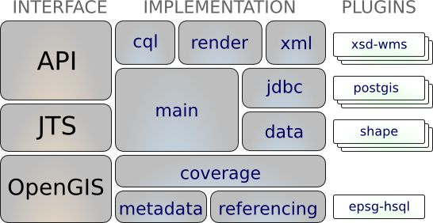

:Author: Jody Garnett
:Reviewer: Cameron Shorter, LISAsoft
:Version: osgeo-live5.5
:License: Creative Commons Attribution 3.0 Unported (CC BY 3.0)

.. image:: ../../images/project_logos/logo-GeoTools.png
  :scale: 60 %
  :alt: project logo
  :align: right
  :target: http://geotools.org/

.. image:: ../../images/logos/OSGeo_project.png
  :scale: 100 %
  :alt: OSGeo Project
  :align: right
  :target: http://www.osgeo.org/incubator/process/principles.html

GeoTools
================================================================================

GeoTools is an open source (LGPL) Java library which provides standards compliant methods for manipulating geospatial data, and uses data structures based on Open Geospatial Consortium (OGC) specifications.

GeoTools is used by a number of projects including web services, command line tools and desktop applications. OSGeo-Live applications which include GeoTools include: 
:doc:`52nSOS_overview`, :doc:`52nWPS_overview`, :doc:`atlasstyler_overview`, :doc:`geomajas_overview`, :doc:`geopublisher_overview`, :doc:`geoserver_overview`, and :doc:`udig_overview`.

Core Features
--------------------------------------------------------------------------------

* Definition of interfaces for key spatial concepts and data structures
  
  * Integrated Geometry support provided by `JTS Topology Suite (JTS) <http://tsusiatsoftware.net/jts/main.html>`_
  * Attribute and spatial filters using OGC Filter Encoding specification
  
* A clean data access API supporting feature access, transaction support and locking between threads
  
  * Access GIS data in many file formats and spatial databases
  * Coordinate reference system and transformation support
  * Work with an extensive range of map projections
  * filter and analyze data in terms of spatial and non-spatial attributes

* A stateless, low memory renderer, particularly useful in server-side environments.
  
  * compose and display maps with complex styling

* Powerful *schema assisted* parsing technology using XML Schema to bind to GML content
  
  * The parsing / encoding technology is provided with bindings for many OGC standards including GML, Filter, KML, SLD, and SE.
  
* GeoTools Plugins: open plug-in system allowing you to teach the library additional formats
  
  * Plug-ins for the ImageIO-EXT project allowing GeoTools to read additional raster formats from GDAL
 
* GeoTools Extensions

  * Provide additional capabilities built using the spatial facilites of the core library.
  
  .. image:: ../../images/screenshots/800x600/geotools-extension.png
     :alt: Extensions built using the GeoTools library

  * Extensions provide graph and networking support (for finding the shortest path), validation, a web map server client, bindings for xml parsing and encoding and color brewer.

* GeoTools Unsupported
  
  * GeoTools also operates as part of a wider community with a staging area used to foster new talent and promote experimentation.
  
  * Some highlights are swing support (used in geotools tutorials), swt, local and web process support, additional symbology, additional data formats, generation of grids and a couple of implementations of ISO Geometry.

Supported Formats
-----------------  

* raster formats and data access:
  
  arcsde, arcgrid, geotiff, grassraster, gtopo30, image (JPEG, TIFF, GIF, PNG), imageio-ext-gdal, imagemoasaic, imagepyramid, JP2K, matlab.
  
* Database "jdbc-ng" support:
  
  db2, h2, mysql, oracle, postgis, spatialite, sqlserver.

* Vector formats and data access:
  
  app-schema, arcsde, csv, dxf, edigeo, excel, geojson, org, property, shapefile, wfs.

* XML Bindings:

  Java data structures and bindings provided for the following:
  xsd-core (xml simple types), fes, filter, gml2, gml3, kml, ows, sld, wcs, wfs, wms, wps, vpf.
  
  Additional Geometry, Filter and Style parser/encoders available for DOM and SAX applications.
  
Implemented Standards
--------------------------------------------------------------------------------

Support of numerous Open Geospatial Consortium (OGC) standards:

* OGC Style Layer Descriptor / Symbology Encoding data structures and rendering engine
* OGC General Feature Model including Simple Feature support
* OGC Grid Coverage representation of raster information
* OGC Filter and Common Constraint Language (CQL)
* Clients for Web Feature Service (WFS), Web Map Service (WMS) and experimental support for Web Process Service (WPS)
* ISO 19107 Geometry

Details
--------------------------------------------------------------------------------
 
**Website:** http://geotools.org/

**Licence:** LGPL

**Software Version:** 8.0

**Supported Platforms:** Cross Platform Java

**API Interfaces:** Java

**Support:** `Communication and Support <http://docs.geotools.org/latest/userguide/welcome/support.html>`_

Quickstart
--------------------------------------------------------------------------------

* `Quickstart documentation <http://docs.geotools.org/latest/userguide/tutorial/quickstart/index.html>`_
