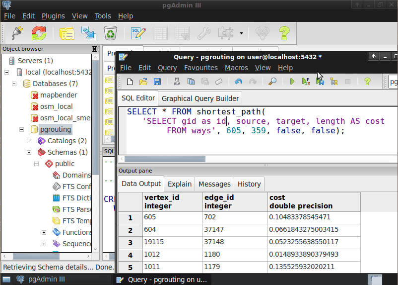

:Author: Daniel Kastl
:Reviewer: Cameron Shorter, LISAsoft
:Version: osgeo-live5.0
:License: Creative Commons Attribution 3.0 Unported (CC BY 3.0)

.. _pgrouting-overview:

.. image:: ../../images/project_logos/logo-pgRouting.png
  :scale: 100 %
  :alt: pgRouting logo
  :align: right
  :target: http://www.pgrouting.org/

pgRouting
================================================================================

GIS工具
~~~~~~~~~~~~~~~~~~~~~~~~~~~~~~~~~~~~~~~~~~~~~~~~~~~~~~~~~~~~~~~~~~~~~~~~~~~~~~~~

pgRouting扩展了地理空间数据库:doc:`PostGIS <postgis_overview>`/`PostgreSQL <http://www.postgresql.org>`_，提供了地理空间路径规划功能。
数据库路径规划的优点如下:

* 许多客户端应用程序例如doc:`Quantum GIS <qgis_overview>和:doc:`uDig <udig_overview>可以通过JDBC、ODBC或者直接用Pl/pgSQL修改数据和属性。客户端可以是PC或者移动设备。
* 路径搜索引擎可以瞬间反映数据变化，不需要预先计算。
* "cost"参数通过SQL动态计算，其数值可来自多个字段或表格

主要功能
--------------------------------------------------------------------------------

pgRouting提供以下功能:

* Shortest Path Dikstra: 非启发式路径规划算法
* Shortest Path A-Star: 启发式的大数据量路径规划算法
* Shortest Path Shooting-Star: 启发式的单向路径规划算法
* Traveling Salesperson Problem (TSP)：旅行商问题
* Driving Distance calculation (Isolines)：驾驶距离计算

.. 已实现的标准规范
   ---------------------

.. * 兼容OGC标准

详情请见
--------------------------------------------------------------------------------

**网站:** http://www.pgrouting.org

**版权:** GNU General Public License (GPL) version 2

**软件版本:** 1.05

**支持平台:** Linux, Windows, Mac

**API接口:** SQL

**商业支持:** http://www.pgrouting.org

快速入门
--------------------------------------------------------------------------------

* :doc:`Quickstart documentation <../quickstart/pgrouting_quickstart>`

