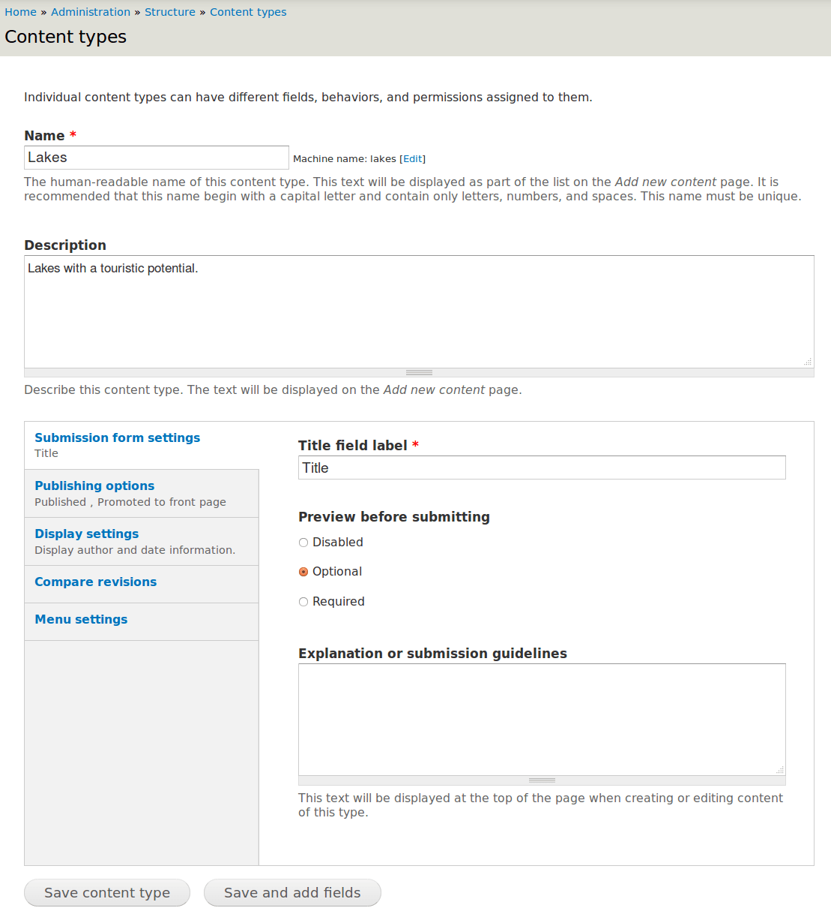
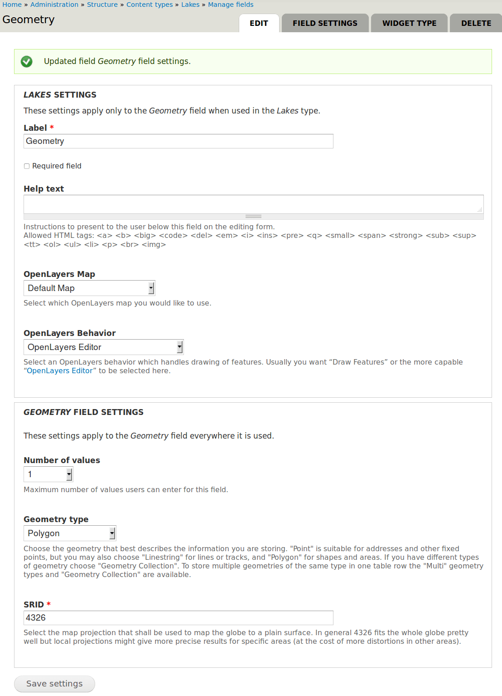
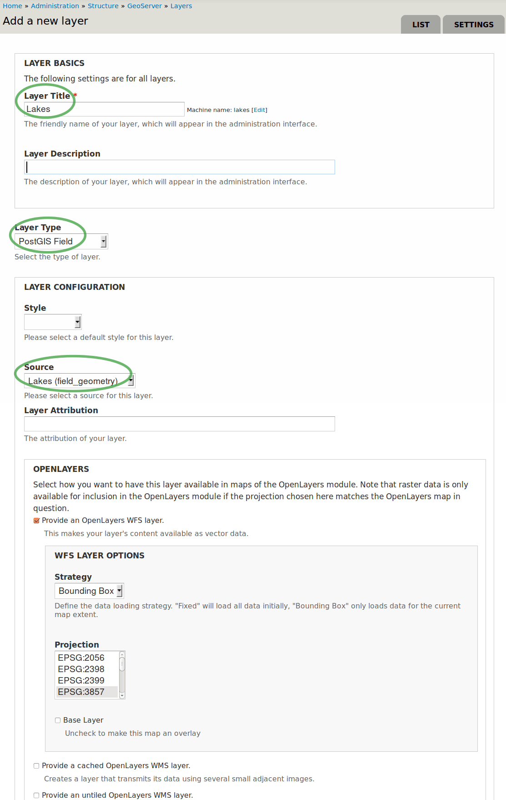
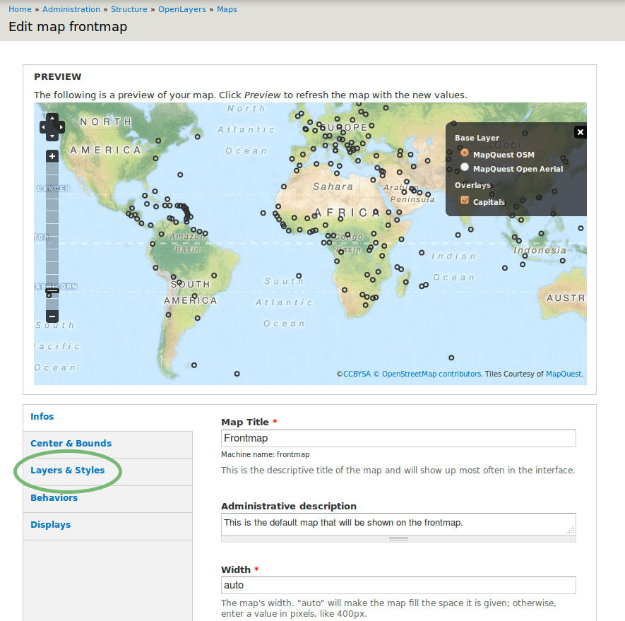
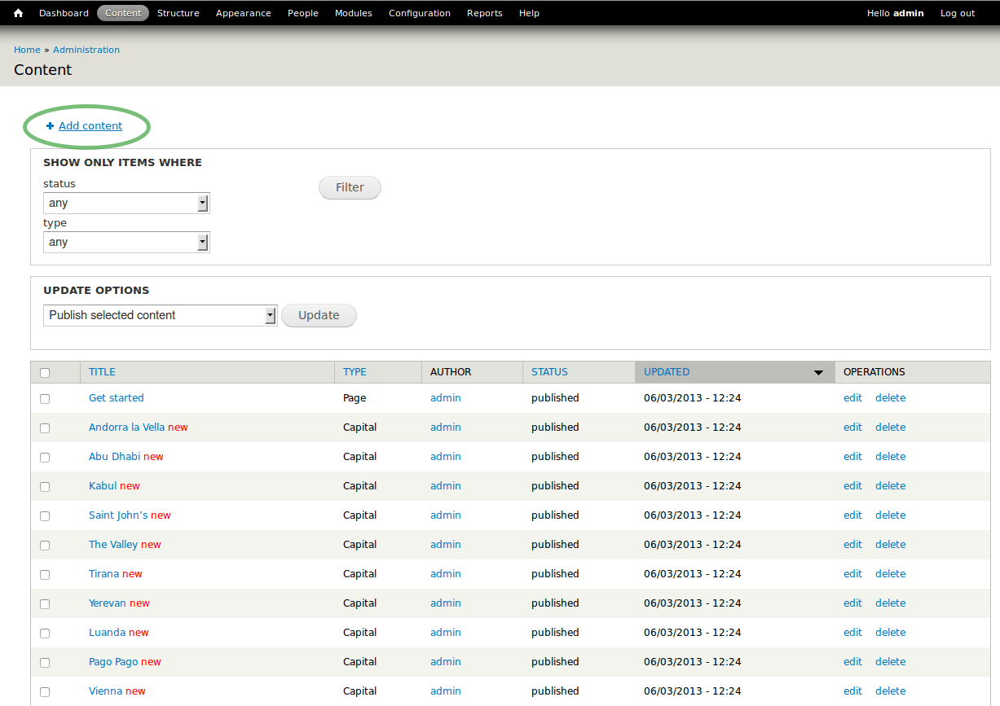
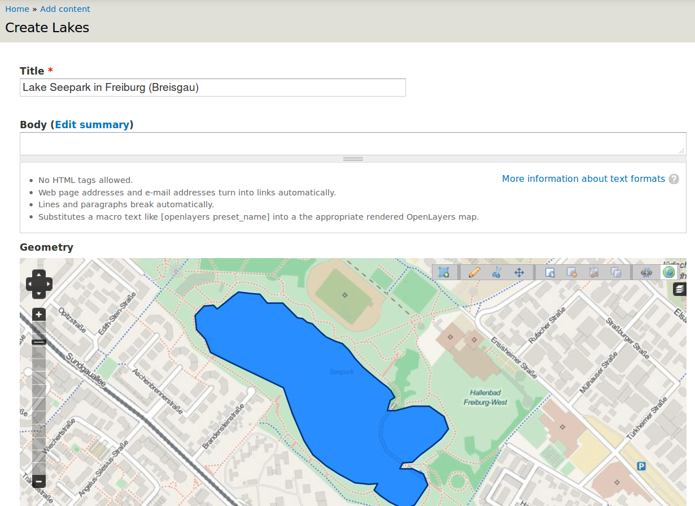

.. Writing Tip:
  This Quick Start should describe how to run a simple example, which
    covers one of the application's primary functions.
  The Quick Start should be able to be executed in around 5 minutes.
  The Quick Start may optionally include a few more sections
    which describes how to run extra functions.
  This document should describe every detailed step to get the application
    to work, including every screen shot involved in the sequence.
  Finish off with "Things to Try" and "What Next?" sections.
  Assume the user has very little domain expertise, so spell everything out.

:Author: Friedjoff Trautwein (http://www.geops.de)
:Author: Augustus Kling (http://www.geops.de)
:Author: Patric Hafner (http://www.geops.de)
:Tranlater: Bu Kun(bukun@osgeo.cn)
:Version: osgeo-live7.0draft
:License: Creative Commons Attribution-ShareAlike 3.0 Unported  (CC BY-SA 3.0)

.. image:: ../../images/project_logos/logo-cartaro.png
  :scale: 100 %
  :alt: project logo
  :align: right
  :target: http://cartaro.org

********************************************************************************
Cartaro快速入门
********************************************************************************

.. Cartaro is a geo-enabled Content Management System (CMS) to manage and publish geospatial and non-geospatial content. 
Cartaro是一个具有地理功能的内容管理系统（CMS），来管理与发布地理空间和非地理空间的内容。


.. This Quickstart will guide you through the following tasks:
本快速入门会引导你进行下面的任务。

.. #. Create a new geospatial content type
.. #. Configure Cartaro to display the new content type
.. #. Add new geospatial content 

#. 创建一种新的地理空间内容类型
#. 配置Cartaro来显示新的内容类型
#. 添加新的地理空间内容

.. All tasks will be performed using the example of a touristic web portal with the goal to map lakes.
所有的任务会使用一个来对湖泊制图的旅游门户网站示例开展。

.. contents:: 目录
  
开始Cartaro
================================================================================

.. Writing Tip:
  Describe steps to start the application
  This should include a graphic of the pull-down list, with a green circle
  around the application menu option.
  #. A hash numbers instructions. There should be only one instruction per
     hash.

#. 启动OSGeoLive DVD
#. 选择 :menuselection:`Geospatial --> Browser Clients --> Start Cartaro` 来开始Cartaro
#. 然后Cartaro web 页面 http://localhost/cartaro 会自动打开

.. Writing Tip:
  For images, use a scale of 50% from a 1024x768 display (preferred) or
  70% from a 800x600 display.
  Images should be stored here:
    https://github.com/OSGeo/OSGeoLive-doc/tree/master/images/screenshots/1024x768/


首页
================================================================================

.. When the Cartaro page is opened, you will see the screen below. The front page contains a global map with capital cities as an example.
当Cartaro页面打开后，你会看到下面的内容。首页包含了具备首都城市的世界地图作为示例。

.. image:: ../../images/screenshots/1024x768/cartaro_frontpage.png
    :scale: 60 %
    :align: center


.. * Please **Log in** on the upper right corner to access the administrative interface with *admin* as username and *geoserver* as password. You will now see the administration menu bar on top.

* 请在右上角处使用用户名 *admin*，密码 *geoserver*  **登录**，来访问管理界面。现在你可以页面的顶部看到管理菜单条。

.. image:: ../../images/screenshots/1024x768/cartaro_userpage.png
    :scale: 60 %
    :align: center
  
.. tip::  你可以在随时通过点击左上角的首页图标来返回到首页面。


创建一种新的内容类型
================================================================================

.. Content types and fields define the structure  of a specific content (e.g. the content type *Capital* contains the fields "name" and "location" to generate content elements for the respective capitals displayed on the map).
.. To create a new content type, follow the steps below.

内容类型及其字段定义了一种特定类型的结构（例如，内容类型 *Capital* 包含了字段“name”及“location”，来生成内容单元，在地图上显示相应的首都。）
创建一种新的内容类型，使用下面的步骤：

* 在菜单栏中选择 :menuselection:`结构 --> 内容类型` ，并点击 **添加内容类型** 

.. image:: ../../images/screenshots/1024x768/cartaro_addcontenttype.png
    :scale: 80 %
    :align: center

* 为新的内容类型输入名称，以及相应的描述信息



* 点击 **保存并添加字段**

.. * Add a new field for your content type by entering a descriptive name. We want to create a geospatial field with the name  *Geometry*. Select  *Geospatial data*  as field type and  *OpenLayers Map*  as widget.

* 通过输入描述性的名称，来为新的内容类型添加新的字段。我们希望使用名称 *Geometry* 来创建一个地理空间字段。
选择 *Geospatial data* 作为字段类型， *OpenLayers Map* 作为小组件。

.. image:: ../../images/screenshots/1024x768/cartaro2.png
    :scale: 70 %
    :align: center

* 点击 **Save**

.. * Choose your field settings in the new window: Select the geometry type that describes the kind of geospatial information you want to store. Choose *Polygon* to follow our example.

*  在新窗口中选择字段的设置：选择与你想存储的地理空间信息相匹配的几何类型。

.. image:: ../../images/screenshots/1024x768/cartaro3.png
    :scale: 70 % 
    :align: center

.. tip::  查看 *几何类型* 下拉框中的信息，来确定适合你需要的几何类型。


* 点击 **保存字段设置** 来关闭



* 点击 *保存设置* 来结束字段的创建

.. image:: ../../images/screenshots/1024x768/cartaro5.png
    :scale: 70 % 
    :align: center

* 在 *管理字段* 分页下面你可以创建更多的非地理空间字段。在本示例中，暂时不需要创建新的了。


配置 GeoServer
================================================================================

:doc:`GeoServer <../overview/geoserver_overview>` 通过 :doc:`Web要素服务 (WFS) <../standards/wfs_overview>` 与 :doc:`Web地图服务 (WMS) <../standards/wms_overview>` ，使用你刚才创建的内容类型中的地理空间字段来提供图层功能。

* 从菜单栏中选择 :menuselection:`结构 --> GeoServer` 来访问 GeoServer 配置页面

.. image:: ../../images/screenshots/1024x768/cartaro_geoserver_entry.png
    :scale: 70 %
    :align: center

在GeoServer中创建新的图层
``````````````````````````````````
* 使用GeoServer图层来发布你的地理空间数据
* 在菜单栏中选择 :menuselection:`结构 --> GeoServer` 来再次访问 GeoServer 配置页面
* 选择 :menuselection:`图层` 并点击 **添加** 来添加一个新的图层

.. image:: ../../images/screenshots/1024x768/cartaro_geoserver_addnewlayer.png
    :scale: 60 %
    :align: center

#. 键入合适的图层标题 (如，湖泊). 
#. 选择图层类型。为了进行高级的地理空间操作与地理数据存储， 我们选择 *PostGIS Field* 。
#. 作为数据源， 选择你创建的内容类型，来绑定你的新图层
#. 在 OpenLayers 部分勾选 *提供 OpenLayers WFS 图层*
#. 点击 **保存** 来完成配置




* 恭喜！ 你的新的GeoServer图层已经添加到GeoServer中。

.. tip:: 你还可以使用其他程序通过WFS或WMS来访问你的内容类型的地理空间字段 (例如， 使用 :doc:`QGis <../overview/qgis_overview>`) 

配置 OpenLayers ，以在地图中激活 GeoServer 图层
================================================================================

:doc:`OpenLayers <../overview/openlayers_overview>` 用来在地图上显示你的新图层。现在你可以在 OpenLayers 地图中绑定你的 GeoServer 图层。

* 打开 :menuselection:`Structure --> OpenLayers --> Maps`  来访问 OpenLayers 地图配置页面

* 找到 *frontmap* - 一个预生成的、缺省的地图，并在右边选择 **编辑**：

.. image:: ../../images/screenshots/1024x768/cartaro_openl_maps_frontmapedit.png
    :scale: 70 %
    :align: center

* 然后会出现如下所示的 frontmap 配置页面 



* 在左边选择 :menuselection:`图层与样式` 来添加你刚才创建的图层到 frontmap 中. 

* 打到你创建的  GeoServer 图层 (在我们的示例中是 'lakes' )
* 勾选上 *Enabled*, *Activated* 与 *In Switcher* ，来在你的地图中激活你的新图层

.. image:: ../../images/screenshots/1024x768/cartaro_openl_layersstylessettings.png
    :scale: 70 %
    :align: center

* 点击底部的 **保存** 完成配置

添加地理空间内容
================================================================================

.. After creating your content type and configuring GeoServer and OpenLayers 
  you can now add as many content elements of this type as you want.

创建完成内容类型，并且配置完成GeoServer与OpenLayers，你现在可以根据需要添加很多此种类型的内容单元。

* 在菜单栏上选择 :menuselection:`Content` ，在你安装的 Cartaro 程序中查看所有已经存在的内容单元 



* 选择 **添加内容** 来添加更多的内容，并且在出现的窗口中选择新的内容类型。在新的页面单元（在 Drupal 中称之为 node 的配置页面中，进行下面的设置：

.. Select **Add content** to add more content and choose your new content type in the appearing window (not shown). In the configuration page of your new content element (called node in Drupal language) make the following settings: 

#. 键入一个名字。
#. 你可以为你的内容单元画几何图形。在地图的右上角选择画图的符号。当鼠标停靠在工具条的图标上时会出现提示。在地图上点击来创建新的图形。通过鼠标双击来完成绘制。
#. **保存** 你的几何图形。

.. note:: 在我们的示例配置中，只可以为每个内容单元创建一个几何图形。创建另外的内容单元来添加更多的多边形。



* 你现在可以查看新的内容单元

.. image:: ../../images/screenshots/1024x768/cartaro_addedcontent_lakefr.png
    :scale: 50 %
    :align: center

* 在首页中查看你的新内容单元，在左上角点击房屋形状的图标

.. image:: ../../images/screenshots/1024x768/cartaro_addedcontent_frontmap.png
    :scale: 50 %
    :align: center

恭喜！你刚刚完成了快速入门教程。你的第一个内容单元现在已经完成了。想要添加新的内容单元，只需要重复执行这一部分的步骤。


尝试新的东西
================================================================================

* 使用 **Layer Assistant** 来加入外部的图层， :menuselection:`Structure --> Open Layers --> Layers --> Add using assistant`  
* 修改缺省地图的行为，来建立你自己的地图
* 尝试不同的几何类型，并建立更复杂的内容类型


下一步 ?
================================================================================

.. Writing tip
  The final heading should provide pointers to further tutorials,
  documentation or further things to try.
  Present a list of ideas for people to try out. Start off very specific
  with something most people can do based on the materials as presented.
  Continue on with a challenge that involves a small bit of research (it
  is recommended that research be limited to something that can be
  found in documentation packaged on OSGeo-Live, as users might not be
  connected to the Internet.


.. Writing tip
  Provide links to further tutorials and other documentation.

.. The quickstart has given a first impression about the possibilities of Cartaro to you. But there is a lot more to discover. 
这份快速入门给出了 Cartaro 功能的初步介绍。还有更多需要去挖掘。

.. Your next step may be to install Cartaro on your own servers. Just visit http://cartaro.org/documentation/getting-started to learn how.

你下一步应该是在你自己的服务器上安装 Cartaro 。访问 http://cartaro.org/documentation/getting-started 来学习如何进行。

与本快速入门相关的，查看我们的文档  `Layer Assistant <http://cartaro.org/blog/21-layer-creation-assistant/>`_ 
或者  `Styling <http://cartaro.org/blog/14-how-use-qgis-great-looking-symbols-cartaro/>`_ 。


.. In context to this quickstart, check our documentation about `Layer Assistant <http://cartaro.org/blog/21-layer-creation-assistant/>`_ or about `Styling <http://cartaro.org/blog/14-how-use-qgis-great-looking-symbols-cartaro/>`_

我们的文档页面在： http://cartaro.org/documentation ，官方网站为： http://cartaro.org
