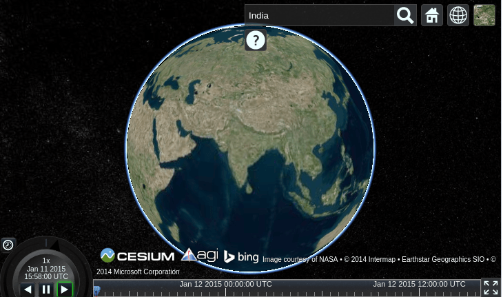
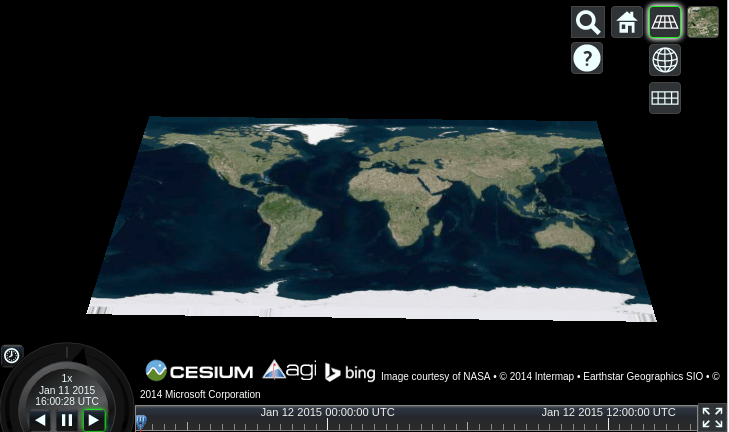
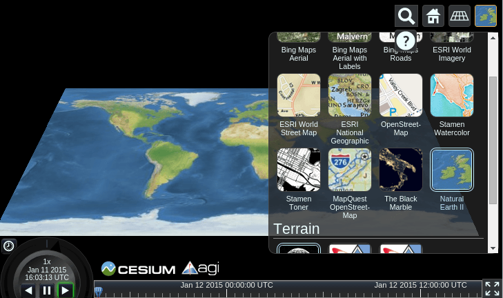

:Author: Balasubramaniam Natarajan
:Translator(Zh): Bu Kun (OSGeo ID: bukun)
:Reviewer: Cameron Shorter, Jirotech
:Version: osgeo-live8.5
:License: Creative Commons Attribution-ShareAlike 3.0 Unported  (CC BY-SA 3.0)

欢迎使用中文镜像 http://lab.osgeo.cn/osgeo-live/

********************************************************************************
Cesium 快速开始
********************************************************************************
.. This document shows how to use the Cesium with the 3D (Globe), 2.5D (Columbus View) and 2D (map).

这篇文档对如何在3维（全球），2.5维（Columbus视图）及2维（地图）模式下使用Cesium进行了说明。

启动 Cesium
===============

.. Open the browser and point it to http://localhost/cesium/Apps/HelloWorld.html

打开浏览器，并打开链接 http://localhost/cesium/Apps/HelloWorld.html

.. Searching for locations

查找位置
=======================

.. You can click on the magnifying glass and type in the location you are looking for.  In the following display, we look for India.

点击查找图标，并键入想要查找的位置。在下图中，我们来查找印度。

.. Switching between 3D, 2.5D and 2D

在3维，2.5维，2维之间进行切换
=================================
.. You can click on the wire framed globe icon to select your preferred view.  Here the 2.5D Columbus view has been selected.

通过点击地球图标，可以选择希望的视图模式。下图中选择了2.5维的Columbus视图。

.. Now the 2D map is selected.

下图是2维地图模式

.. image:: ../../images/screenshots/1024x768/cesium_3_2D.png
  :scale: 70 %
  :alt: Cesium 2维地图

选择影像图层
=========================
.. We can click on the last icon and select the type of image service we want.  Here the Natural Earth II is selected and you can see how the map's image layer has changed.

通过点击最后一个图标，可以选择希望的影像服务类型。下图中，选择了Natural Earth II，你可以看到地图的影像图层变化了。

.. TBD: There is room here for a couple more examples.

下一步
==========
* 这儿有一份视频教程 `点击打开 <https://www.youtube.com/playlist?list=PLBk_Dtk-_Tlm4STvXKFEdfUWylPemo-9V>`_.

* 在线Web教程 `点击打开 <http://cesiumjs.org/tutorials.html>`_.

* 通过这个`链接 <http://cesiumjs.org/Cesium/Apps/Sandcastle/index.html?src=Custom%20DataSource.html&label=Tutorials>`_. ，你可以使用 Sandcastle网站开发一些快速应用。

* 深入学习的文档可以从本地机器获取 `here <http://localhost/cesium/>`_.
