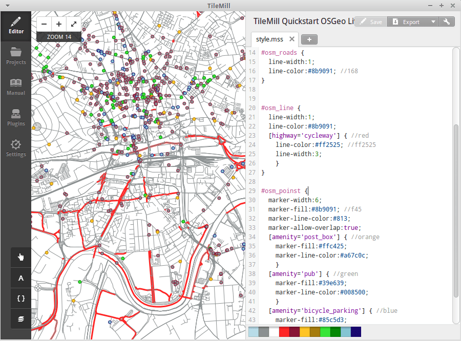
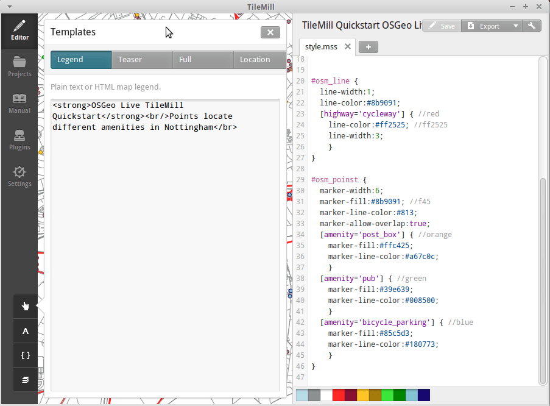

:Author: OSGeo-Live
:Author: Javier Sanchez
:Version: osgeo-live6.5d
:Translator: Zhengfan Lin
:License: Creative Commons Attribution-ShareAlike 3.0 Unported  (CC BY-SA 3.0)
:Thanks: tutorial from Ivan Sánchez Ortega and Pedro Ferrer Matoses from Spanish OSGeo Chapter

.. image:: ../../images/project_logos/logo-tilemill.png
  :scale: 75 %
  :alt: project logo
  :align: right

********************************************************************************
TileMill 快速入门
********************************************************************************

　　TileMill 让用户快速而轻松地创建网页地图服务。它使用强大的开源地图渲染函数库 Mapnik（Open Street Map 和 MapQuest 同样使用它）并以 CartoCSS 为样式配置语言。

　　本文演示：

  * 从 PostGIS 添加图层
  * 配置样式
  * 添加工具提示
  * 编辑图例
  * 输出地图

.. contents:: 目录
  
新建项目
================================================================================

1. 启动 TileMill 并选择 “New project” 新建项目。

.. image:: ../../images/screenshots/1024x768/tilemill_newproject.png
   :scale: 70 %

.. Writing Tip:
  For images, use a scale of 50% from a 1024x768 display (preferred) or
  70% from a 800x600 display.
  Images should be stored here:
    https://svn.osgeo.org/osgeo/livedvd/gisvm/trunk/doc/images/screenshots/1024x768/

2- 输入示例信息并点击 “Add”：

.. image:: ../../images/screenshots/1024x768/tilemill_projectinfo.png
   :scale: 70 %

**Filename:**	tilemill_quickstart

**Name:**	TileMill Quickstart OSGeo Live

**Description:**	Quickstart from OSGeo Live

**Default Data:**	Leave selected

3. 双击新项目打开。新建项目包含了一个默然图层  #countries 并以 CartoCSS 配置样式。

添加图层
================================================================================
　　TileMill 可以从文件、SQLite 和 PostGIS 读取图层。这里演示从 PostGIS 读取 OSM 数据。演示假设您已经熟悉 OSM 数据的结构。您可以通过 pgAdminIII 或 QGIS 、Open Jump 等桌面 GIS 系统了解 OSM 数据。

1. 从 PostGIS 导入数据。首先，点击图层按钮（|LAYER|）并选择 '+ Add layer' 添加图层。在 'Add layer' 中选择数据源类型为 PostGIS：

.. |LAYER| image:: ../../images/screenshots/1024x768/tilemill_layerbtn.png

.. image:: ../../images/screenshots/1024x768/tilemill_addpostgis.png
   :scale: 70 %

2. 从 PostGIS 添加道路（roads）图层。选择图层后点击 'Save & Style' 确认：

**ID:**	osm_roads

**Class:**	osmroads

**Connection:**	host=localhost port=5432 user=user password=user dbname=osm_local

**Table or subquery:**	planet_osm_roads

**Unique key field:**	osm_id

**Geometry field:**	way

**SRS:**	Select WGS84

3. 从 PostGIS 导入 osm_line 图层，选中后点击 'Save & Style' 确认：

**ID:**	osm_line

**Class:**	osmline

**Connection:**	host=localhost port=5432 user=user password=user dbname=osm_local

**Table or subquery:**	planet_osm_line

**Unique key field:**	osm_id

**Geometry field:**	way

**SRS:**	Select WGS84

4. 从 PostGIS 导入 osm_points 位置点图层，选中后点击 'Save & Style' 确认：

**ID:**	osm_points

**Class:**	osmpoints

**Connection:**	host=localhost port=5432 user=user password=user dbname=osm_local

**Table or subquery:**	(select osm_id, amenity, way from planet_osm_point where amenity is not null) AS amen

**Unique key field:**	osm_id

**Geometry field:**	way

**SRS:**	Select WGS84

　　在 osm_points 图层中只选择了来自 osm_local 的一个子集，以保证其环境（amenity）属性非空。

设置工程的默认渲染方式
================================================================================
　　点击 |TOOLS| 并移动到工程的目标区域设置中心点（center point）。在表格中也可以直接输入中心点和边界（bounds）坐标值。

.. |TOOLS| image:: ../../images/screenshots/1024x768/tilemill_confbtn.png

.. image:: ../../images/screenshots/1024x768/tilemill_project_settings.png
   :scale: 70 %

样式配置
================================================================================
　　TileMill 使用 CartoCSS 语言配置样式。颜色、尺寸、形状等均可由地图显示面板右侧相应的 CartoCSS 代码控制。有关 CartoCSS 语言的使用请参阅其教程。

　　点击 “Save & Style” 导入新的 PostGIS 图层后，若干项目会被自动添加默认值：

1. #osm_point
	目标图层名称
2. marker-width
	图标尺寸，单位为像素
3. marker-fill
	图标颜色，除了直接输入颜色代码，点击面板底部的颜料图标也可以编辑颜色

4. marker-line-color
	边界线颜色，编辑方法同上

5.- marker-allow-overlap
	允许标记叠置，若未设为否（false），叠置的标记可能被遮挡而不显示

　　所有这些属性均可以在保存工程后修改。

条件性样式
================================================================================
　　条件性样式是根据要素属性变化的样式。

Conditional CartoCSS styles allow you to change the appearance of the features on your map, based on data attributes. Here we will customize osm_points and osm_roads, in order to highlight some types of feature, given certain values.
We will apply different styles to points depending on whether they represent 'post_box', 'pub'or 'bicyle_parking', as we know in advance that those are given values in the field 'amenity' of the table.
We will define a different style to lines that represent 'cycleway', as we know in advance that 'cycleway' is a given value in the field 'highway' of the table.
This is our code after changing certain style values and coding some conditional styles:

::

	Map {
	  background-color: #b8dee6;
	}

	#countries {
	  ::outline {
	    line-color: #8b9091;
	    line-width: 2;
	    line-join: round;
	  }
	  polygon-fill: #fff;
	}
	
	#osm_roads {
	  line-width:1;
	  line-color:#8b9091; //168
	}
	
	
	#osm_line {
	  line-width:1;
	  line-color:#8b9091;
	  [highway='cycleway'] { //red
	    line-color:#ff2525; //ff2525
	    line-width:3;
	    }
	}
	
	#osm_poinst {
	  marker-width:6;
	  marker-fill:#8b9091; //f45
	  marker-line-color:#813;
	  marker-allow-overlap:true;
	  [amenity='post_box'] { //orange
	    marker-fill:#ffc425;
	    marker-line-color:#a67c0c;
	    }
	  [amenity='pub'] { //green
	    marker-fill:#39e639;
	    marker-line-color:#008500;
	    }
	  [amenity='bicycle_parking'] { //blue
	    marker-fill:#85c5d3;
	    marker-line-color:#180773;
	    }
	}
	
	

Tooltips
================================================================================

Tooltips allow you to make maps interactive with dynamic content that appears when a user hovers over or clicks on a map. They can contain HTML and are useful for revealing additional data, images, and other content.

1. Open the Templates  panel by clicking on the pointer button on the bottom left ( |POINTER|
) 

.. |POINTER| image:: ../../images/screenshots/1024x768/tilemill_pointerbtn.png

2. Click on the “Teaser” tab. Teaser content appears when you hover over a feature and Full content appears when you click on a feature. You can use the Location field to define a URL to be loaded when a feature is clicked.

3. Select the 'osm_point' layer to use it for interaction. TileMill only supports one interactive layer at a time.
4. The data fields for the layer are displayed wrapped in curly Mustache tags. These tags will be replaced by data when you interact with the map. Locate the fields you want to use.

5. Write your template using the Mustache tags. Paste the following code into the Teaser field and use the preview to make sure it looks good:

::

	Type:{{{amenity}}} 
	Name:{{{name}}}

.. image:: ../../images/screenshots/1024x768/tilemill_teaser_frm.png
   :scale: 70 %

6. Click “Save” to save your settings and refresh the map. Close the panel by clicking the close button (X) or by pressing the ESC key. Move your mouse over some points to see the tooltips.

.. image:: ../../images/screenshots/1024x768/tilemill_tooltip.png
   :scale: 70 %

Legends
================================================================================

A legend is permanently on a map and is useful for displaying titles, descriptions, and keys for what is being mapped. It can be styled using HTML, or it can simply contain an image.

Let’s add a legend that describes the theme of the map.

#. Open the Templates panel by clicking on the pointer button in the bottom left
#. The Legend tab is open by default.
#. Enter your legend text/html in the Legend field:

::

	<strong>OSGeo Live TileMill Quick Start</strong> Points locate different amenities in Nottingham 

#. Click save and close the panel. You will now see your legend in the bottom right corner of the map.

.. image:: ../../images/screenshots/1024x768/tilemill_legend.png
   :scale: 70 %

Exporting the map
================================================================================
TileMill can export maps to MBTiles, PNG, PDF, SVG, or Mapnik XML formats. A full listing and overview is in the `Exporting documentation <http://mapbox.com/tilemill/docs/manual/exporting/>`_

If you want to export to MBTiles:

#. Click the “Export” button. A drop down menu will appear.
#. Click “MBTiles”. The window will transition to the export tool.
#. Choose a “Filename”“. The name of the project will be placed here by default.
#. Select Zoom levels. Set the furthest zoom to 1 by dragging the left end to the right. Set the closest zoom to 6 by dragging the right end to the left.
#. Select the “Center” of the map. This determines the starting center and zoom level of the map when it is first loaded. You can manually enter these values or click a point in the map preview. Zoom to level three and click the center of the United States.
#. Select the map “Bounds”. This is the area of the map to be exported. By default the entire world is selected. If your map is allocated to a smaller region of the globe, you can save processing time and disk space by cropping to that area. This can be done by manually entering values in the Bounds fields, or by holding the SHIFT key and clicking and dragging on the map. Leave the default value.
#. Click “Export”.
#. When the export process is complete, the progress bar will be replaced by a Save button. This will save a copy of the file locally to a specified location.

.. image:: ../../images/screenshots/1024x768/tilemill_viewexports.png
   :scale: 70 %
   
You can return to the Welcome view at any time by selecting the :menuselection:`Help --> Welcome` from the menu bar.

Things to Try
================================================================================

Here are some additional challenges for you to try:

#. Try changing fixed or conditional styles on your own
#. Try importing data from other sources, like .CSV file or sqlite ( You can follow `on-line TileMill crashcourse documentation <http://mapbox.com/tilemill/docs/crashcourse/introduction/>`_)

What Next?
================================================================================

.. Writing tip
  Provide links to further tutorials and other documentation.

This is only the first step on the road to using TileMill. There is a lot more great material (and ability) left for you to discover:

* Get more help from the environment, click on help button (|HELP|)

.. |HELP| image:: ../../images/screenshots/1024x768/tilemill_helpbtn.png

* Learn more about cartocss languaje on `API Documentation <http://mapbox.com/carto/api/2.1.0/>`_

* Learno how to run `TileMill as an Ubuntu Service <http://mapbox.com/tilemill/docs/guides/ubuntu-service/>`_

