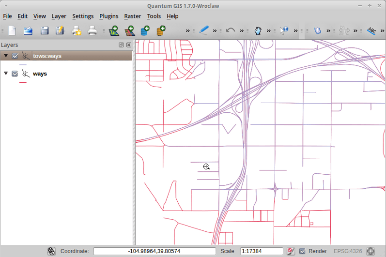

:Author: OSGeo-Live
:Author: Pirmin Kalberer
:Version: osgeo-live5.0
:License: Creative Commons Attribution-ShareAlike 3.0 Unported  (CC BY-SA 3.0)

.. _tinyows-quickstart:
 
.. image:: ../../images/project_logos/logo-TinyOWS.png
  :scale: 100 %
  :alt: project logo
  :align: right
  :target: http://www.tinyows.org/

********************************************************************************
TinyOWS Quickstart 
********************************************************************************

TinyOWS is a high performance, Transactional Web Feature Service (WFS-T) which is light weight and easy to deploy, using a CGI or FastCGI interface and using :doc:`PostGIS <../overview/postgis_overview>` for data storage.

This Quick Start describes how to:

  * display a WFS layer in QGIS
  * edit a WFS layer using WFS-T in QGIS

Display a WFS layer with QGIS
================================================================================

#. Click :menuselection:`Desktop --> Desktop GIS --> Quantum GIS`.

#. Click :menuselection:`Layer --> Add PostGIS Layer...`.

   * We display the original PostGIS layer first

#. Press :guilabel:`New`.

#. Fill in  **pgrouting** as Connection name and Database

#. Press :guilabel:`OK`.

#. Press :guilabel:`Connect`.

#. Select **ways** in the table list

#. Press :guilabel:`Add`.

#. Zoom in

#. Select :menuselection:`Plugins -> Manage Plugins -> WFS Plugin -> OK`

   * Enable the WFS Layer plugin.

#. Click :menuselection:`Layer --> Add WFS Layer...`.

   * Now we add a WFS layer based on the same table

#. Press :guilabel:`New`.

#. Fill in  **tinyows** as name **http://localhost/cgi-bin/tinyows** as URL

#. Press :guilabel:`OK`.

#. Press :guilabel:`Connect`.

#. Select **ows:ways** in the layer list

#. Check :guilabel:`Only request features overlapping the current view extent`.

#. Press :guilabel:`OK`.

   * WFS layer is now displayed:

Edit data with WFS-T
================================================================================

#. Click :menuselection:`Layer --> Toggle Editing`.

#. Click :menuselection:`Edit --> Node Tool`.

#. Move a vertex (cross) to another position

#. Click :menuselection:`Layer --> Save edits`.

#. Hide layer unchecking **tows:ways** in the layer list

   * You should see the edited way in an other color, coming directly from PostGIS.

What Next?
================================================================================

To learn more about TinyOWS, a starting point is the `User Documentation`_ on the TinyOWS homepage.

.. _`User Documentation`: http://tinyows.org/trac/wiki/UserDocumentation

