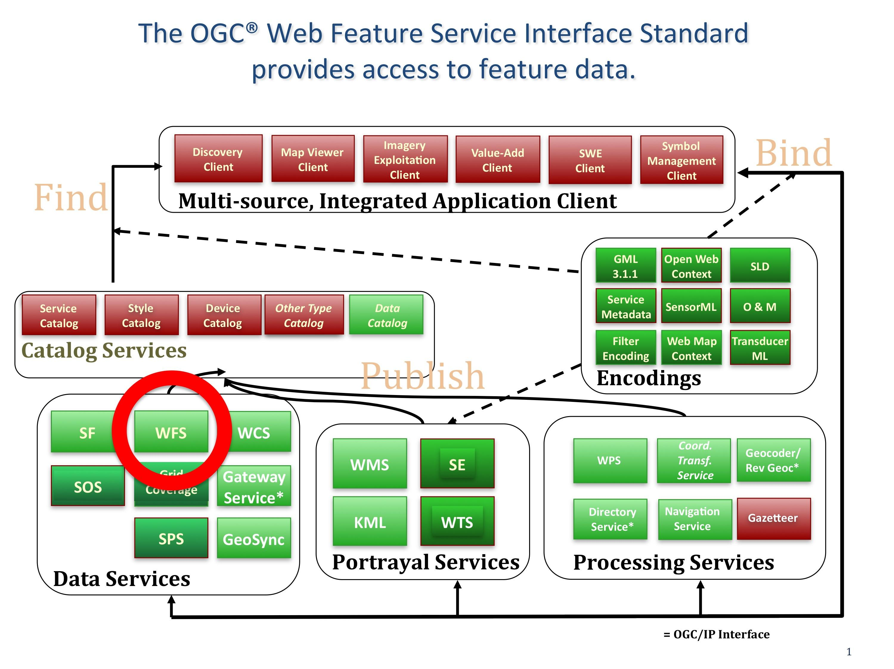

.. Writing Tip:
  Writing tips describe what content should be in the following section.

.. Writing Tip:
  Metadata about this document

:Author: OGC
:License: Creative Commons

.. Writing Tip: 
  Project logos are stored here:
    https://svn.osgeo.org/osgeo/livedvd/gisvm/trunk/doc/images/project_logos/
  and accessed here:
    ../../images/project_logos/<filename>
  A symbolic link to the images directory is created during the build process.

.. image:: ../../images/project_logos/logo-OGC-left.png
  :scale: 100 %
  :alt: OGC logo
  :align: right

.. image:: ../../images/project_logos/logo-OGC-right.png
  :scale: 100 %
  :alt: OGC logo
  :align: right

.. Writing Tip: Name of application

Web Feature Service (WFS)
================================================================================

.. Writing Tip:
  1 paragraph or 2 defining what the standard is.

The OGC® Web Feature Service Interface Standard (WFS) defines  web interface operations for querying and editing vector geographic features, such as roads or lake outlines.  (http://www.opengeospatial.org/standards/wfs)

The WFS standard defines operations that enable clients to:

* Discover which feature collections are available (GetCapabilities)
* Describe the attribute fields available for  features (DescribeFeatureType)
* Query a collection for a subset of features based on a provided filter (GetFeature)
* Add, edit or delete features (Transaction)

All WFSs support input and output data using Geography Markup Language (GML). Some WFSs also support other encodings, such as GeoRSS or shapefiles.

Users typically interact with WFSs through browser based or desktop geospatial clients, which allows them to access vector map layers from external agencies, over the Internet. An excellent example of using a WFS service to provide open and interoperable access to large amounts of geospatial content via a government portal is the USGS Framework Web Feature Services offered in support of the development of the National Spatial Data Infrastructure (NSDI) (http://frameworkwfs.usgs.gov/). Selected US Framework map layers are available as WFS layers and also available through a browser interface provided by the USGS.

See Also
--------------------------------------------------------------------------------

.. Writing Tip:
  Describe Similar standard

* :doc:`wms_overview`
* :doc:`wcs_overview`
* Grid Coverage Service
* :doc:`sos_overview`
* :doc:`gml_overview`
* :doc:`kml_overview`
* :doc:`sld_overview`
* Symbology Encoding
* :doc:`fe_overview`
